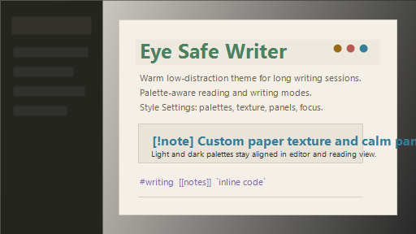

# Eye Safe Writer

Warm, low-distraction Obsidian theme for long writing sessions.



## Features

- Light and dark palettes tuned for eye comfort.
- Style Settings palette selector: Salvia, Gruvbox, AMOLED, Tokyo Night, Rose Pine, Solarized, Nord, Cappuccino. Every palette includes light and dark tokens.
- Palette tokens override full UI surface set, so selected palette controls workspace, text, accents, navigation, code, tables, callouts, and focus states.
- Customization controls for typography, line width, heading style, link style, UI density, panel shape, panel shadows, writing focus intensity, and texture.
- Stable sidebar/ribbon layout without extra CSS snippets.
- Reduced-motion, high-contrast, forced-colors, print, and small-screen support.
- Paper texture controls: grain type, grain amount, fiber amount, grain scale, and fiber spacing.

## Install

1. Copy `Eye Safe Writer` into `.obsidian/themes/`.
2. Enable theme in Obsidian Appearance settings.
3. Optional: install Style Settings plugin to change palette, typography, panels, focus mode, and texture controls.

## Style Settings

Eye Safe Writer exposes customization without editing CSS manually:

- Palette: full light/dark variants for Salvia, Gruvbox, AMOLED, Tokyo Night, Rose Pine, Solarized, Nord, Cappuccino.
- Manual colors: link, link hover, button accent, bold, italic, tags, and H1-H6.
- Heading style: colored, monochrome, accent-only, or muted.
- Link style: clean, underlined, or high contrast.
- Typography: text size, line height, line width, H1 size, H2 size.
- UI density: compact, comfortable, spacious.
- Panels: paper, flat, framed, or soft shadow.
- Texture: paper grain, fine dust, linen weave, speckles, diagonal fibers, or none.
- Texture amount: grain opacity, fiber opacity, grain scale, fiber spacing.
- Writing focus: calm, deep focus, or no dimming, plus opacity sliders.

## Palette Notes

Preferred: use Style Settings plugin and keep `eye-safe-palette-*` snippets disabled.

Fallback: if Style Settings is not installed, enable exactly one `eye-safe-palette-*` snippet. Palette snippets are generated from same tokens as `theme.css`, so Gruvbox, Tokyo Night, Nord, and other choices override full UI color set.

## QA Checklist

- Obsidian desktop on Windows, macOS, Linux.
- Obsidian mobile or narrow desktop under 700px.
- Light and dark mode for every palette.
- Sidebar open, collapsed, resized, and stacked tabs.
- File explorer, search, backlinks, graph, canvas, settings, command palette, modals, popovers.
- Zoom 80%, 100%, 150%.
- Keyboard navigation and visible focus rings.
- Reduced motion, high contrast, forced colors, print/export.

## Release

- Update `manifest.json` version.
- Add entry to `CHANGELOG.md`.
- Test checklist above.
- Add screenshots for light and dark palettes before public release.

## Community Theme Submission

Suggested entry for `obsidianmd/obsidian-releases`:

```json
{
  "name": "Eye Safe Writer",
  "author": "Nicola",
  "repo": "screamkface/eye-safe-writer"
}
```

Use a dedicated GitHub repo with `theme.css`, `manifest.json`, `README.md`, `LICENSE.md`, and `screenshot.png` at repository root.
