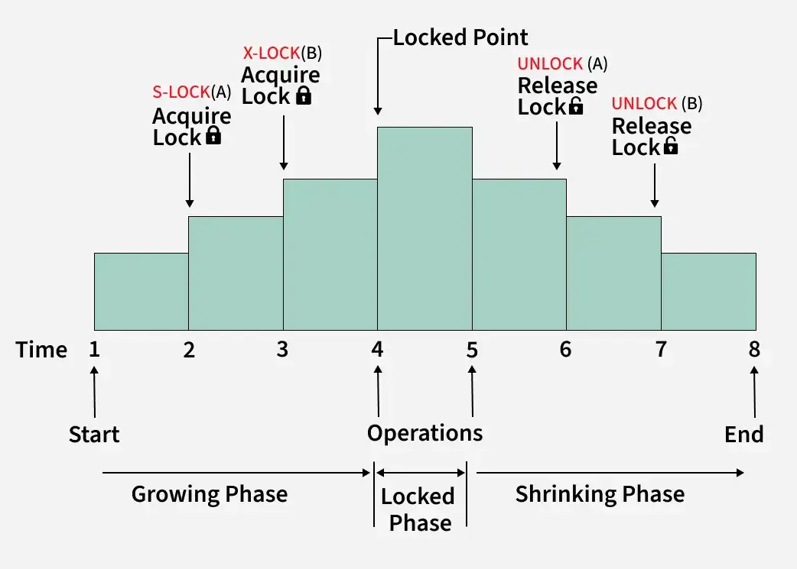

**Two-Phase Locking**, abbreviato **2PL**, è una delle parti più importanti perché collega i lock alla **conflict-serializability**.

L’idea base è questa:

> I lock da soli non bastano. Serve una regola che impedisca alle transazioni di rilasciare un lock e poi prenderne un altro dopo.

Infatti uno schedule può essere **well-formed** e **legal**, ma comunque non serializzabile, come nel caso della ghost update. Per questo si introduce il protocollo 2PL. Nelle slide viene definito proprio come il protocollo in cui, per ogni transazione, tutte le operazioni di lock devono precedere tutte le operazioni di unlock.

---

# 1. Definizione intuitiva

Una transazione segue il **Two-Phase Locking** se ha due fasi:

```text
1. Growing phase
   prende lock, ma non rilascia lock

2. Shrinking phase
   rilascia lock, ma non può più prenderne altri
```




Quindi dentro una transazione deve valere:

```text
tutti i lock prima di tutti gli unlock
```

Appena una transazione fa il suo **primo unlock**, entra nella shrinking phase. Da quel momento in poi non può più acquisire nessun nuovo lock.

---

# 2. Esempio di transazione 2PL

Questa transazione è 2PL:

```text
l1(A) r1(A) w1(A) l1(B) r1(B) w1(B) u1(A) u1(B)
```

Perché tutti i lock sono prima degli unlock:

```text
l1(A) l1(B)     u1(A) u1(B)
  lock phase    unlock phase
```

Quindi:

```text
T1 prende A
T1 usa A
T1 prende B
T1 usa B
T1 rilascia A
T1 rilascia B
```

Va bene.

---

# 3. Esempio di transazione NON 2PL

Questa invece non è 2PL:

```text
l1(A) r1(A) u1(A) l1(B) r1(B) u1(B)
```

Perché `T1` fa:

```text
u1(A)
```

e dopo prende un altro lock:

```text
l1(B)
```

Quindi ha fatto:

```text
lock A
unlock A
lock B
```

Questo viola 2PL.

Da ricordare:

```text
Dopo il primo unlock, non puoi più fare lock.
```

---

# 4. Perché 2PL è importante?

Il teorema fondamentale è:

```text
Ogni schedule generato da un 2PL scheduler è conflict-serializable.
```

Quindi:

```text
2PL => conflict-serializable
```


> [!DANGER] Attenzione
> Attenzione però: il contrario non vale sempre. Esistono schedule conflict-serializable che non possono essere generati da un protocollo 2PL. Nei tuoi appunti è scritto proprio questo: ogni schedule generato da 2PL **è conflict-serializable, ma non ogni schedule conflict-serializable è producibile da 2PL.**


Questa è una frase da esame:

```text
2PL is a sufficient condition for conflict-serializability, but it is not necessary.
```

In italiano:

```text
Il 2PL garantisce la conflict-serializability, ma non cattura tutti gli schedule conflict-serializable.
```

---

# 5. 2PL non significa schedule seriale

Questo è importante.

Uno schedule 2PL può essere comunque **interleaved**.

Esempio:

```text
l1(A) r1(A) w1(A)
l2(B) r2(B) w2(B)
l1(C) r1(C) w1(C)
u1(A) u1(C)
u2(B)
```

Qui `T1` e `T2` sono intrecciate, quindi lo schedule non è seriale.

Però se ogni transazione rispetta la regola:

```text
prima tutti i lock, poi tutti gli unlock
```

allora lo schedule è 2PL e quindi conflict-serializable.

---

# 6. Ordine seriale indotto dal 2PL

Nei tuoi appunti c’è una regola molto utile:

> uno schedule 2PL è conflict-equivalent allo schedule seriale ottenuto ordinando le transazioni in base al loro primo unlock.

Cioè:

```text
prima viene la transazione che fa il primo unlock,
poi quella che fa il primo unlock tra le rimanenti,
e così via.
```

Esempio:

```text
l1(A) l2(B) r1(A) r2(B) u2(B) u1(A)
```

Primi unlock:

```text
T2 fa u2(B) prima di T1
```

Quindi l’ordine seriale equivalente sarà:

```text
T2 -> T1
```

Questa cosa è utile quando ti chiedono:

```text
Se è 2PL, qual è l’ordine seriale equivalente?
```

---

# 7. 2PL con soli lock esclusivi

All’inizio si considera spesso solo il lock esclusivo:

```text
li(A) = T_i prende lock esclusivo su A
ui(A) = T_i rilascia A
```

Con lock esclusivi:

```text
se T1 ha lock su A,
nessun'altra transazione può prendere lock su A.
```

Quindi ogni read e ogni write richiede un lock esclusivo.

Esempio:

```text
l1(A) r1(A) w1(A) u1(A)
l2(A) r2(A) w2(A) u2(A)
```

È legale perché `T2` prende `A` solo dopo che `T1` lo ha rilasciato.

Però è molto restrittivo, perché anche due semplici letture non possono avvenire insieme.

---

# 8. Shared lock ed exclusive lock

Per migliorare la concorrenza si usano due tipi di lock:

```text
sli(A) = shared lock su A, per leggere
xli(A) = exclusive lock su A, per scrivere
ui(A)  = unlock su A
```

Regola:

```text
read(A)  richiede shared lock
write(A) richiede exclusive lock
```

La tabella di compatibilità è:

|Held / Requested|S|X|
|---|--:|--:|
|**S**|yes|no|
|**X**|no|no|

Quindi:

```text
più shared lock sullo stesso dato possono coesistere;
un exclusive lock non è compatibile con nessun altro lock.
```

Nei tuoi appunti è indicato proprio che i lock esclusivi sono troppo restrittivi perché due letture dello stesso item non confliggono; per questo si introducono shared lock ed exclusive lock.

---

# 9. 2PL con shared/exclusive locks

La regola 2PL resta identica:

```text
per ogni transazione,
tutti i lock, shared o exclusive, devono venire prima di tutti gli unlock.
```

Quindi questa è 2PL:

```text
sl1(A) r1(A) xl1(B) w1(B) u1(A) u1(B)
```

Perché:

```text
sl1(A), xl1(B)    prima
u1(A), u1(B)      dopo
```

Questa invece non è 2PL:

```text
sl1(A) r1(A) u1(A) xl1(B) w1(B) u1(B)
```

Perché dopo `u1(A)` prende `xl1(B)`.

---

# 10. Lock upgrade

Può succedere che una transazione **prima legga un dato e poi voglia scriverlo.**

Allora può fare:

```text
sl1(A) r1(A) xl1(A) w1(A) u1(A)
```

Il passaggio:

```text
sl1(A) -> xl1(A)
```

si chiama **lock upgrade** o **lock conversion**.

Significa:

```text
prima avevo un lock condiviso per leggere,
poi lo trasformo in lock esclusivo per scrivere.
```


> [!DANGER] ATTENZIONE
> Però attenzione: l’upgrade è possibile solo se nessun’altra transazione ha un lock incompatibile su `A`.

---

# 11. 2PL può causare deadlock

Il 2PL garantisce conflict-serializability, ma non evita i deadlock.

Esempio classico:

```text
xl1(A)
xl2(B)
xl1(B)
xl2(A)
```

Succede:

```text
T1 ha A e vuole B
T2 ha B e vuole A
```

Quindi:

```text
T1 aspetta T2
T2 aspetta T1
```

Deadlock.

Nelle slide è scritto chiaramente che, anche con 2PL e shared/exclusive locks, il rischio di deadlock resta presente.

Quindi frase importante:

```text
2PL guarantees conflict-serializability, but it does not prevent deadlocks.
```

> La probabilita' di un Deadlock cresce **linearmente** col numero di transazioni e **quadraticamente** col numero di richieste di lock nelle transazioni

---

# 12. Come verificare se uno schedule è 2PL

Negli esercizi devi fare così.

Supponi di avere uno schedule con lock:

```text
xl1(A) r1(A) xl1(B) w1(B) u1(A) u1(B)
```

Controlla ogni transazione separatamente.

Per `T1`:

```text
xl1(A)
xl1(B)
u1(A)
u1(B)
```

Tutti i lock vengono prima degli unlock, quindi `T1` rispetta 2PL.

Se invece hai:

```text
xl1(A) r1(A) u1(A) xl1(B) w1(B) u1(B)
```

Per `T1`:

```text
xl1(A)
u1(A)
xl1(B)
```

C’è un lock dopo un unlock, quindi non è 2PL.

---

# 13. Caso tipico da esame

Nel Problem 2 delle ultime tracce chiedono una cosa simile:

```text
Determine whether S is a 2PL schedule with exclusive locks.
If it is not, determine whether adding shared locks would make it a 2PL schedule.
```

Questo significa che devi provare due versioni:

## Prima versione: solo exclusive locks

Con soli lock esclusivi, anche le read richiedono `xl`.

Quindi se hai:

```text
r1(y) r2(x) w1(y) r1(x) w2(y)
```

potresti dover mettere:

```text
xl1(y) r1(y)
xl2(x) r2(x)
...
```

Il problema nasce quando, per far proseguire un’altra transazione, una transazione dovrebbe rilasciare un lock e poi più avanti prendere un altro lock. Questo viola 2PL.

## Seconda versione: shared + exclusive locks

Le read possono usare `sl`.

Quindi due letture non si bloccano tra loro. Questo può permettere di costruire uno schedule 2PL che con soli exclusive locks non era possibile.

Da ricordare:

```text
exclusive-only 2PL è più restrittivo;
shared/exclusive 2PL permette più concorrenza.
```

---

# 14. Strict 2PL

Il **Strict 2PL** aggiunge una regola:

```text
la transazione deve tenere tutti gli exclusive locks fino a commit o abort.
```

Quindi, se `T1` scrive `A`, non può rilasciare il lock esclusivo su `A` prima del commit.

Esempio strict 2PL:

```text
xl1(A) w1(A) xl1(B) w1(B) c1 u1(A) u1(B)
```

Qui gli exclusive locks vengono rilasciati dopo il commit.

Proprietà:

```text
Strict 2PL => strict schedule
Strict 2PL => conflict-serializable
```

Le slide definiscono Strict 2PL proprio come il protocollo 2PL in cui tutti gli exclusive locks sono mantenuti fino a commit o rollback, e indicano che ogni schedule Strict 2PL è strict e conflict-serializable.

---

# 15. Strong Strict 2PL

Il **Strong Strict 2PL**, chiamato anche **SS2PL**, è ancora più forte.

Regola:

```text
tutti i lock, sia shared sia exclusive, sono mantenuti fino a commit o abort.
```

Quindi non solo gli exclusive locks, ma anche gli shared locks restano fino alla fine.

Proprietà:

```text
Strong Strict 2PL => rigorous schedule
Strong Strict 2PL => conflict-serializable
```

Le slide indicano che Strong Strict 2PL mantiene tutti i lock fino a commit o rollback, e che **ogni schedule Strong Strict 2PL è rigorous**.

---

# 16. Differenza tra 2PL, Strict 2PL e Strong Strict 2PL

|Protocollo|Regola|Garantisce|
|---|---|---|
|**2PL**|Dopo il primo unlock non puoi più prendere lock|Conflict-serializable|
|**Strict 2PL**|Come 2PL + tieni gli exclusive locks fino a commit/abort|Strict + conflict-serializable|
|**Strong Strict 2PL**|Come 2PL + tieni tutti i lock fino a commit/abort|Rigorous + conflict-serializable|

Schema mentale:

```text
2PL:
lock... lock... unlock... unlock...

Strict 2PL:
gli exclusive lock si rilasciano solo dopo commit/abort

Strong Strict 2PL:
tutti i lock si rilasciano solo dopo commit/abort
```

---

# 17. Riassunto da esame

Questa è la versione da memorizzare:

```text
The Two-Phase Locking protocol requires that, for each transaction, all lock operations precede all unlock operations. Therefore each transaction has a growing phase, in which it can acquire locks but cannot release them, and a shrinking phase, in which it can release locks but cannot acquire new ones. Every schedule generated by a 2PL scheduler is conflict-serializable. However, 2PL does not prevent deadlocks.
```

In italiano:

```text
Il protocollo 2PL impone che, per ogni transazione, tutte le operazioni di lock precedano tutte le operazioni di unlock. Ogni transazione ha quindi una fase crescente, in cui acquisisce lock, e una fase decrescente, in cui rilascia lock. Ogni schedule generato da un 2PL scheduler è conflict-serializable, ma il 2PL non elimina il rischio di deadlock.
```

---

# 18. Mini-esercizio veloce

Dimmi se questa transazione rispetta 2PL:

Questa rispetta

```text
xl1(A) r1(A) xl1(B) w1(B) u1(A) r1(B) u1(B)
```

Poi dimmi anche se questa rispetta 2PL:

Questa no
```text
xl1(A) r1(A) u1(A) xl1(B) w1(B) u1(B)
```

---

Qui per **management techniques** stiamo parlando delle tecniche per gestire i **deadlock** nei protocolli basati su lock, tipo 2PL.

Prima ricordiamo il problema:

```text
Deadlock = due o più transazioni si aspettano a vicenda,
quindi nessuna riesce più a procedere.
```

Esempio classico:

```text
xl1(A)
xl2(B)
xl1(B)
xl2(A)
```

Succede:

```text
T1 ha A e vuole B
T2 ha B e vuole A
```

Quindi:

```text
T1 aspetta T2
T2 aspetta T1
```

Il 2PL garantisce la **conflict-serializability**, ma **non elimina il rischio di deadlock**. Nei tuoi appunti vengono indicate tre tecniche principali: **timeout**, **wait-for graph** e **wait-die**.

---

## 1. Timeout

La tecnica del **timeout** è la più semplice.

Idea:

```text
Se una transazione resta bloccata troppo a lungo,
il sistema la abortisce.
```

Esempio:

```text
T1 aspetta un lock su A
passa troppo tempo
il sistema abortisce T1
```

Quando `T1` viene abortita, rilascia i suoi lock e le altre transazioni possono continuare.

Vantaggio:

```text
è molto semplice da implementare
```

Svantaggi:

```text
timeout troppo alto  -> il deadlock viene risolto tardi
timeout troppo basso -> abort inutili anche quando non c'è deadlock
```

Quindi il timeout non “capisce” davvero se c’è un deadlock. Fa una scelta pratica: se aspetti troppo, probabilmente qualcosa non va.

Da esame:

```text
Timeout:
if a transaction waits too long, it is aborted.
```

---

## 2. Wait-for graph

Questa è la tecnica più precisa.

Il sistema mantiene un grafo chiamato **wait-for graph**.

```text
nodi = transazioni
arco Ti -> Tj = Ti sta aspettando un lock detenuto da Tj
```

Esempio:

```text
T1 vuole B, ma B è bloccato da T2
```

Allora aggiungo:

```text
T1 -> T2
```

Se poi:

```text
T2 vuole A, ma A è bloccato da T1
```

aggiungo:

```text
T2 -> T1
```

Il grafo diventa:

```text
T1 -> T2
T2 -> T1
```

C’è un ciclo, quindi c’è deadlock.

Regola fondamentale:

```text
Wait-for graph con ciclo    => deadlock
Wait-for graph senza ciclo  => no deadlock rilevato
```

Quando il sistema trova un ciclo, sceglie una transazione del ciclo e la abortisce.

Esempio:

```text
T1 -> T2 -> T3 -> T1
```

Il sistema può abortire `T2`, così `T2` rilascia i lock e il ciclo si rompe.

Da esame:

```text
The wait-for graph has transactions as nodes.
There is an edge Ti -> Tj if Ti is waiting for a lock held by Tj.
If the graph contains a cycle, there is a deadlock.
```

---

## 3. Wait-die

La tecnica **wait-die** è diversa: non aspetta che il deadlock si formi. Cerca di **prevenirlo**.

A ogni transazione viene assegnata una priorità, spesso basata sull’età della transazione. Nei tuoi appunti: se `Ti` chiede un lock detenuto da `Tj`, allora `Ti` può aspettare solo se ha priorità più alta; altrimenti viene abortita.

Regola:

```text
Ti richiede un lock detenuto da Tj.

Se priority(Ti) > priority(Tj):
    Ti può aspettare

Altrimenti:
    Ti viene abortita
```

Quindi:

```text
priorità più alta -> wait
priorità più bassa -> die
```

Da qui il nome:

```text
wait-die
```

---

## Esempio wait-die

Supponiamo:

```text
pr(T1) = 30
pr(T2) = 20
```

Quindi `T1` ha priorità più alta di `T2`.

Se:

```text
T1 vuole un lock detenuto da T2
```

allora `T1` può aspettare:

```text
T1 waits for T2
```

Perché `T1` ha priorità più alta.

Invece, se:

```text
T2 vuole un lock detenuto da T1
```

allora `T2` viene abortita:

```text
T2 dies
```

Perché `T2` ha priorità più bassa.

---

## Perché wait-die previene i deadlock?

Perché permette gli archi di attesa solo in una direzione: da transazioni con priorità maggiore verso transazioni con priorità minore.

Quindi nel wait-for graph non si possono formare cicli.

Esempio:

```text
T1 può aspettare T2 solo se pr(T1) > pr(T2)
T2 può aspettare T3 solo se pr(T2) > pr(T3)
```

Avremmo:

```text
pr(T1) > pr(T2) > pr(T3)
```

Per avere un ciclo servirebbe anche:

```text
T3 -> T1
```

ma questo richiederebbe:

```text
pr(T3) > pr(T1)
```

impossibile, perché prima avevamo `pr(T1) > pr(T3)`.

Quindi il ciclo non si forma.

Da esame puoi dire:

```text
Wait-die prevents deadlocks because it prevents cycles in the wait-for graph.
```

---

## Differenza tra le tre tecniche

|Tecnica|Tipo|Idea|Pro|Contro|
|---|---|---|---|---|
|**Timeout**|Rilevamento grossolano|Se aspetti troppo, abort|Semplice|Può abortire inutilmente|
|**Wait-for graph**|Detection|Costruisce grafo e cerca cicli|Preciso|Più costoso|
|**Wait-die**|Prevention|Usa priorità per decidere wait/abort|Evita cicli|Può abortire transazioni|

---

## Detection vs Prevention

Questa distinzione è importante.

### Deadlock detection

Il sistema lascia che il deadlock possa formarsi, poi lo rileva.

Esempio:

```text
wait-for graph
```

Si costruisce il grafo, si cerca un ciclo, e se c’è ciclo si abortisce una transazione.

### Deadlock prevention

Il sistema impedisce a priori che il deadlock si formi.

Esempio:

```text
wait-die
```

La transazione può aspettare solo se la regola di priorità non crea rischio di ciclo.

---

## Frasi da ricordare per l’esame

```text
A deadlock occurs when two or more transactions wait for each other and none can proceed.
```

```text
Timeout aborts a transaction if it waits too long.
```

```text
The wait-for graph has transactions as nodes and edges Ti -> Tj when Ti waits for a lock held by Tj. A cycle means deadlock.
```

```text
Wait-die assigns priorities to transactions. A transaction may wait only for a transaction with lower priority; otherwise it is aborted. This prevents cycles in the wait-for graph.
```

---

## Collegamento con 2PL

La cosa da ricordare è:

```text
2PL guarantees conflict-serializability,
but it does not prevent deadlocks.
```

Quindi dopo aver introdotto 2PL, ha senso parlare di management techniques perché servono a gestire il problema pratico dei deadlock.