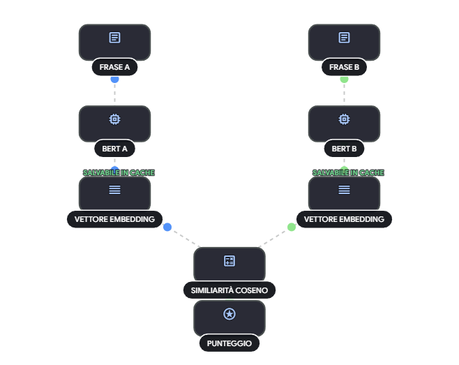

Per capire la differenza tra **Bi-encoder** e **Cross-encoder**, è utile pensare a come affronteresti il compito di confrontare due libri per capire se parlano dello stesso argomento. SBERT (Sentence-BERT) è nato esattamente per risolvere i limiti di velocità del Cross-encoder introducendo un'architettura Bi-encoder altamente efficiente.

Ecco una spiegazione dettagliata delle due architetture.

### 1. Cross-Encoder: Il Perfezionista Lento (BERT Standard)

Nel Cross-encoder, le due frasi (Frase A e Frase B) vengono unite in un'unica stringa di testo, separate da un token speciale (solitamente `[SEP]`), e passate **insieme** all'interno della rete neurale (es. BERT).

- **Come funziona:** La rete processa l'input combinato (Frase A + `[SEP]` + Frase B). Grazie al meccanismo di _self-attention_, ogni parola della Frase A può "guardare" e interagire direttamente con ogni parola della Frase B in ogni singolo strato della rete.
    
- **Vantaggi:** Precisione elevatissima. Il modello comprende le sfumature e le relazioni incrociate tra le due frasi in modo molto profondo.
    
- **Svantaggi:** È estremamente lento e non scalabile. Non puoi pre-calcolare nulla. Se hai un database di 10.000 documenti e vuoi cercare la risposta a una query, devi far passare la query combinata con _ciascuno_ dei 10.000 documenti attraverso l'intera e pesante rete BERT. Per raggruppare (clustering) 10.000 frasi, richiederebbe circa 50 milioni di inferenze, impiegando decine di ore.
    

### 2. Bi-Encoder: Il Pragmatico Veloce (SBERT)

**SBERT (Sentence-BERT)** è la risposta a questa inefficienza. Utilizza un'architettura a rete "Siamese" (Bi-encoder).

- **Come funziona:** La Frase A e la Frase B vengono passate **separatamente** e in modo indipendente attraverso la rete BERT (o due reti BERT identiche che condividono i pesi). Alla fine, SBERT applica un'operazione di _pooling_ (es. fa la media di tutti i vettori delle parole) per trasformare l'intera frase in un singolo vettore matematico a dimensione fissa, chiamato **Embedding**. Per capire quanto sono simili, calcola semplicemente la distanza geometrica tra i due vettori usando la similarità del coseno:
    
    $$cos(\theta) = \frac{A \cdot B}{\|A\| \|B\|}$$
    
- **Vantaggi:** Velocità fulminea e scalabilità. Dato che le frasi sono processate in isolamento, puoi **pre-calcolare (mettere in cache)** i vettori di embedding per tutti i tuoi 10.000 documenti offline. Quando arriva una nuova query, passi solo quella attraverso la rete per ottenere il suo vettore, e poi usi un calcolo matematico istantaneo per confrontarlo con i 10.000 vettori in memoria. Il clustering di 10.000 frasi passa da decine di ore a pochi millisecondi.
    
- **Svantaggi:** Leggera perdita di precisione. Poiché le parole della Frase A non interagiscono direttamente con quelle della Frase B all'interno dei layer transformer, si perdono alcune relazioni semantiche complesse.
    

---

### Il compromesso: L'architettura "Retrieve & Rerank"

Nella pratica industriale moderna (come nei motori di ricerca avanzati o nei sistemi RAG - Retrieval-Augmented Generation), si usano **entrambi**:

1. **Fase 1 (Retrieval con Bi-encoder / SBERT):** Usi SBERT per cercare istantaneamente tra milioni di documenti e recuperare i 100 più pertinenti.
    
2. **Fase 2 (Reranking con Cross-encoder):** Prendi solo quei 100 documenti e li passi insieme alla query attraverso un Cross-encoder per ottenere un punteggio di similarità perfetto e riordinarli con massima precisione.
    

Per aiutarti a visualizzare come i dati fluiscono in queste due architetture, ho creato questo schema interattivo:

.png)

