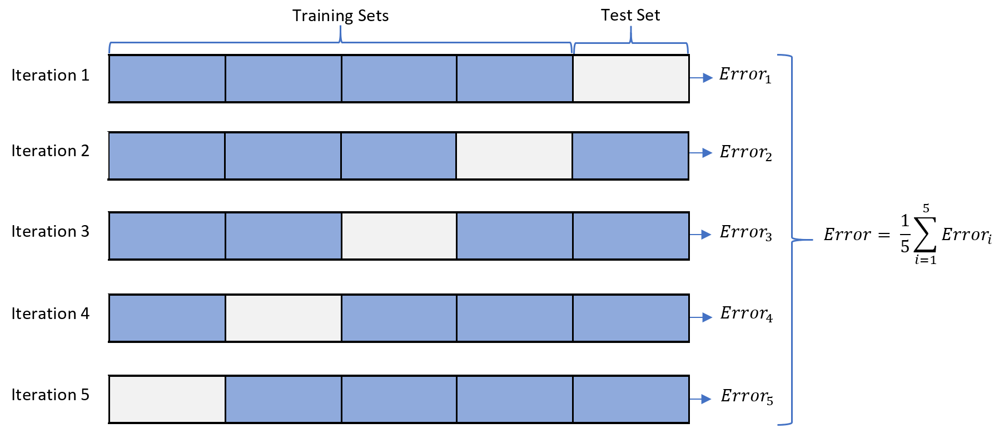
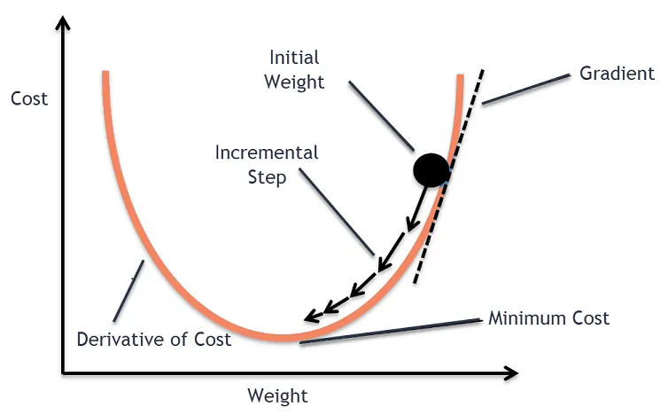

\begin{titlepage}
    \centering
    \vspace*{2cm}
    
    {\scshape\LARGE La Sapienza \par}
    \vspace{1cm}
    {\scshape\Large Facoltà di Ingegneria Informatica e Statistica \par}
    \vspace{1.5cm}
    
    % Se hai un logo, togli il % dalla riga sotto e metti il nome dell'immagine corretta
    % \includegraphics[width=0.4\textwidth]{images/logo_uni.png}\par\vspace{1.5cm}
    
    {\huge\bfseries Machine Learning \par}
    \vspace{0.5cm}
    {\Large Machine Learning Notes \par}
    \vspace{2cm}
    
    {\Large\itshape Autore: Nicola Moscufo \par}
    \vfill
    
    Docente:\par
    \textbf{Prof. Federico Fusco}
    \textbf{Prof. Fabio Patrizi}
    
    \vspace{2cm}
    {\large Anno Accademico 2025/2026 \par}
\end{titlepage}


\newpage


\newpage

# The Statistical Learning Framework

The Statistical Learning Framework provides the formal mathematical foundation for machine learning. It defines the components of the learning problem, the assumptions made about data generation, and the criteria used to evaluate the success of a learning algorithm.

## 1. The Learner's Input

In the basic statistical learning setting (specifically Supervised Learning), the learner has access to the following components:

### A. The Domain Set ($\mathcal{X}$)
The set of all possible objects that we wish to classify or label. This is often represented as a vector space of features. 

*   **Notation:** $\mathcal{X}$
*   **Example:** In an image classification task, $\mathcal{X}$ is the set of all possible images (e.g., $\mathbb{R}^{d}$ where $d$ is the number of pixels).

### B. The Label Set ($\mathcal{Y}$)
The set of all possible outcomes or labels for the objects in the domain.

*   **Notation:** $\mathcal{Y}$
*   **Example:**
    *   Binary Classification: $\mathcal{Y} = \{0, 1\}$ or $\{-1, +1\}$.
    *   Regression: $\mathcal{Y} = \mathbb{R}$.

### C. Training Data ($S$)
A finite sequence of labeled examples given to the learner.

*   **Notation:** $S = \{(x_1, y_1), (x_2, y_2), \dots, (x_m, y_m)\}$
*   **Structure:** Each pair consists of an input $x_i \in \mathcal{X}$ and a label $y_i \in \mathcal{Y}$.
*   **Sample Size:** The number of examples $m$ is called the sample size.


## 2. The Data Generation Model (Hidden Components)

A crucial aspect of the framework is that the learner does not see the full picture. The data is generated by processes unknown to the learner.

### A. The Underlying Distribution ($\mathcal{D}$)
There exists a probability distribution $\mathcal{D}$ over the domain set $\mathcal{X}$.

*   **Role:** It determines how likely we are to encounter different instances in the real world.
*   **Assumption:** The marginal distribution is unknown to the learner.

### B. The Labeling Function ($f$)
There is a "true" target function that assigns the correct label to every point in the domain.

*   **Notation:** $f: \mathcal{X} \to \mathcal{Y}$
*   **Assumption:** For any $x_i$ in the training data, $y_i = f(x_i)$.
*   **Blindness:** The learner is blind to both $\mathcal{D}$ and $f$. The learner's goal is to discover or approximate $f$.

### C. The i.i.d. Assumption
We assume that the training data $S$ is generated by sampling points $x$ independently and identically distributed (i.i.d.) according to $\mathcal{D}$, and then labeling them using $f$.
$$ S \sim \mathcal{D}^m \quad \text{and} \quad y_i = f(x_i) $$


## 3. The Learner's Output

The learner processes the training data $S$ to produce a model.

### The Prediction Rule ($h$)
The output is a function $h: \mathcal{X} \to \mathcal{Y}$.

*   **Terminology:** This function is variously called a **predictor**, a **hypothesis**, or a **classifier**.
*   **Purpose:** The predictor is used to predict the label of new domain points $x$ that were not present in the training set.
*   **Hypothesis Class ($\mathcal{H}$):** Often, the learner selects $h$ from a predefined set of functions $\mathcal{H}$ (e.g., the set of all linear classifiers).


## 4. Measure of Success

To evaluate a classifier, we quantify how well it performs on the entire domain $\mathcal{X}$, weighted by the probability of seeing each instance.

### The Generalization Error (True Risk)
We define the **error** (or risk) of a classifier $h$ as the probability that it predicts the incorrect label for a random data point generated by the underlying distribution $\mathcal{D}$.

**Formal Definition ($L_{\mathcal{D}}(h)$):**
$$ L_{\mathcal{D}, f}(h) \overset{\text{def}}{=} \mathbb{P}_{x \sim \mathcal{D}} [h(x) \neq f(x)] $$

Mathematically, using the indicator function $\mathbb{1}$:
$$ L_{\mathcal{D}}(h) = \mathbb{E}_{x \sim \mathcal{D}} [\mathbb{1}_{\{h(x) \neq f(x)\}}] $$

*   **Intuition:** This represents the expected failure rate on *unseen* data from the real world.
*   **Goal:** The learner aims to find $h$ such that $L_{\mathcal{D}}(h)$ is minimized.


### Empirical Error (Training Error)
Since $\mathcal{D}$ is unknown, the learner cannot calculate the True Risk directly. Instead, it can calculate the error on the training data $S$.

**Formal Definition ($L_S(h)$):**
$$ L_S(h) \overset{\text{def}}{=} \frac{1}{m} \sum_{i=1}^{m} \mathbb{1}_{\{h(x_i) \neq y_i\}} $$

*   **Relationship:** In Empirical Risk Minimization (ERM), we hope that minimizing $L_S(h)$ (which we can see) leads to a low $L_{\mathcal{D}}(h)$ (which we cannot see).


## Key Takeaways

1.  **Inputs:** Domain $\mathcal{X}$, Label set $\mathcal{Y}$, Training set $S$.
2.  **Hidden World:** Probability distribution $\mathcal{D}$ and Labeling function $f$ are fixed but unknown.
3.  **Output:** A hypothesis $h$ that approximates $f$.
4.  **Goal:** Minimize the **Generalization Error** (True Risk), which is the probability of error on new data sampled from $\mathcal{D}$.
5.  **Challenge:** The learner must generalize from a finite sample $S$ to the entire domain $\mathcal{X}$ without knowing $\mathcal{D}$.

\newpage


# Empirical Risk Minimization (ERM)

The ultimate goal of a learning algorithm is to find a hypothesis $h$ that minimizes the **True Risk** (Generalization Error) with respect to the unknown distribution $\mathcal{D}$ and labeling function $f$:
$$ L_{\mathcal{D},f}(h) = \mathbb{P}_{x \sim \mathcal{D}}[h(x) \neq f(x)] $$

Since the learner does not know $\mathcal{D}$ or $f$, the true error is **not directly available**. The learner cannot minimize what it cannot calculate. However, a useful notion that *can* be calculated is the **Training Error** (or Empirical Error)—the error the classifier incurs over the available training sample $S$.

### Definition: Empirical Risk ($L_S(h)$)
Given a training set $S = \{(x_1, y_1), \dots, (x_m, y_m)\}$, the empirical risk (or error) of a hypothesis $h$ is the average error over the sample:

$$ L_S(h) \overset{\text{def}}{=} \frac{1}{m} \sum_{i=1}^{m} \mathbb{1}_{\{h(x_i) \neq y_i\}} $$
Where $\mathbb{1}_{\{\cdot\}}$ is the indicator function (1 if the condition is true, 0 otherwise).

### The ERM Rule
The Empirical Risk Minimization (ERM) rule is a learning strategy that instructs the learner to select a hypothesis $h_S$ that minimizes the empirical error on the training set $S$.

$$ h_S \in \underset{h}{\text{argmin}} \ L_S(h) $$

**Intuition:** Since the training data is a "window" into the true distribution $\mathcal{D}$, we hope that a predictor performing well on $S$ will also perform well on $\mathcal{D}$.


## The Danger of Overfitting

While ERM is intuitive, blindly minimizing $L_S(h)$ can lead to failure. This phenomenon is called **Overfitting**.

**Definition:** Overfitting occurs when the ERM rule outputs a hypothesis $h$ such that:

1.  The empirical error $L_S(h)$ is very small (or zero).
2.  The true error $L_{\mathcal{D}}(h)$ is large.

**Why does this happen?**
Without constraints, a learner might "memorize" the training data rather than learning the underlying pattern. Consider a predictor that simply stores the training set:
$$ h(x) = \begin{cases} y_i & \text{if } x = x_i \in S \\ 0 & \text{otherwise} \end{cases} $$
This predictor has $L_S(h) = 0$ (perfect training accuracy), but on any new data point not in $S$, it outputs a default label, likely resulting in high generalization error.


## ERM with Inductive Bias

To prevent overfitting, we must restrict the learner from choosing *any* possible function. We require the learner to choose a predictor from a specific, predefined set.

### Hypothesis Class ($\mathcal{H}$)
The learner chooses in advance a set of **candidate predictors**, denoted by $\mathcal{H}$. This is the "search space" of the algorithm.

*   Examples of $\mathcal{H}$: The set of all linear classifiers, the set of decision trees of depth 3, etc.

### Constrained ERM Formula
The ERM learner restricts the search to $\mathcal{H}$:

$$ ERM_{\mathcal{H}}(S) \in \underset{h \in \mathcal{H}}{\text{argmin}} \ L_S(h) $$

### Inductive Bias
The restriction to a specific class $\mathcal{H}$ is called an **Inductive Bias**.

*   **Bias:** We are "biased" toward believing the truth lies within $\mathcal{H}$.
*   **Trade-off:**
    *   A **stronger** bias (smaller $\mathcal{H}$) **reduces the risk of overfitting** but *increases the risk that the true target function* $f$ is not in $\mathcal{H}$ (underfitting).
    *   A **weaker** bias (larger $\mathcal{H}$) increases the capacity to approximate complex functions but increases the risk of overfitting.


## Finite Hypothesis Class

The simplest type of inductive bias is assuming that the hypothesis class $\mathcal{H}$ has a finite number of elements.

$$ |\mathcal{H}| < \infty $$

### The Realizability Assumption
To analyze performance in this setting, we often make the **Realizability Assumption**:
We assume that the true labeling function $f$ actually exists within our hypothesis class (or effectively, that there is some $h^* \in \mathcal{H}$ that makes no errors).
$$ \exists h^* \in \mathcal{H} \text{ such that } L_{\mathcal{D}}(h^*) = 0 $$
Note that this implies $L_S(h^*) = 0$ as well.

### Why Finite Classes Help
**If $\mathcal{H}$ is finite, the learner cannot "invent" a complex function to memorize noise**.
*   If $|\mathcal{H}|$ is small and the sample size $m$ is large enough, it becomes statistically unlikely that a "bad" hypothesis (one with high true error) will accidentally classify all training examples perfectly.
*   Therefore, if we find an $h \in \mathcal{H}$ with $L_S(h) = 0$, it is likely that $L_{\mathcal{D}}(h)$ is also low.

### Theoretical Guarantee (Preview)
For a finite hypothesis class $\mathcal{H}$, the sample size $m$ required to guarantee a generalization error of at most $\epsilon$ (with probability $1-\delta$) grows logarithmically with the size of the class:
$$ m \propto \log(|\mathcal{H}|) $$

## Key Takeaways

1.  **ERM Principle:** We minimize Training Error ($L_S$) because True Error ($L_{\mathcal{D}}$) is unknown.
2.  **Overfitting:** Perfect performance on training data does not guarantee good performance on unseen data.
3.  **Inductive Bias:** We must restrict the search space to a specific Hypothesis Class $\mathcal{H}$ to enable generalization.
4.  **Finite $\mathcal{H}$:** Restricting $\mathcal{H}$ to a finite set is a basic form of inductive bias that makes learning theoretically feasible under the Realizability Assumption.

\newpage


# The No-Free Lunch Theorem

The **No-Free Lunch (NFL) Theorem** is a fundamental impossibility result in statistical learning theory. It asserts that no learning algorithm can be universally good. It provides the formal justification for why **inductive bias** is necessary for learning.

## Formal Statement
Let $\mathcal{A}$ be any learning algorithm for the task of binary classification with respect to the 0-1 loss over a domain $\mathcal{X}$. Let the training set size be $m < |\mathcal{X}|/2$.

**Theorem:**
For every learning algorithm $\mathcal{A}$, there exists a distribution $\mathcal{D}$ over $\mathcal{X} \times \{0,1\}$ and a target labeling function $f$ such that:

1.  **High Error:** The generalization error of the hypothesis $h_S$ returned by the algorithm is high (specifically, at least 1/4).
    $$ \mathbb{E}_{S \sim \mathcal{D}^m} [L_{\mathcal{D}}(h_S)] \geq \frac{1}{4} $$
2.  **Learnability:** There exists *another* algorithm that could have learned this specific task with zero error.

## Intuition: The Limits of Data
The theorem addresses the fundamental problem of induction: **How can we know the label of a point we have never seen?**

1.  **Unseen Data is Arbitrary:** Suppose the learner observes a training set $S$ covering half the domain. For the remaining half of the domain (unseen points), the true labels could be *anything*.
2.  **No Pattern Without Assumptions:** Without prior assumptions (inductive bias), all possible labelings of the unseen points are equally likely.
3.  **Random Guessing:** Therefore, on the unseen points, any algorithm $\mathcal{A}$ is effectively guessing. Averaged over all possible target functions, the error rate on unseen data will be 0.5 (like a coin toss).

This implies that purely data-driven learning (without assumptions about the shape or structure of $f$) is impossible.

## Relative Superiority of Learners

> "For every learner, there exists a task on which it fails, even though that task can be successfully learned by another learner."

This means:

*   There is no "Master Algorithm" that is superior to all other algorithms on all possible distributions.
*   If Algorithm A outperforms Algorithm B on a certain set of tasks (e.g., image recognition), there must exist a different set of tasks (e.g., noise patterns) where Algorithm B outperforms Algorithm A.
*   **Success depends on the fit between the algorithm's inductive bias and the actual task structure.**

## Mathematical Sketch
Consider a finite domain $\mathcal{X}$.

1.  We fix a training set $S$.
2.  We consider the set of all possible target functions $F = \{f : \mathcal{X} \to \{0,1\}\}$.
3.  For any point $x \notin S$, exactly half of the functions in $F$ label $x$ as 1, and the other half label it as 0.
4.  Regardless of what hypothesis $h$ the algorithm outputs based on $S$, $h(x)$ will disagree with exactly 50% of the possible target functions.
5.  Therefore, averaged over all possible target functions, the error is high.

## Key Takeaways

1.  **Universal Learning is Impossible:** We cannot learn a model that guarantees good performance on *every* possible problem.
2.  **Inductive Bias is Mandatory:** To learn successfully, we must make assumptions about the data (e.g., "the data is linearly separable" or "the data is smooth").
3.  **Context Matters:** We cannot say an algorithm is "good" in isolation; we can only say it is good for a specific class of problems (e.g., Convolutional Neural Networks are good for *images*, not necessarily for *tabular financial data*).
4.  **No Free Lunch:** You cannot get a low error rate "for free" (without leveraging specific properties of the target distribution).

\newpage

# Error Decomposition

To understand the performance of a learning algorithm, it is useful to **decompose** the generalization error (True Risk) into distinct components. This decomposition helps diagnose whether a model is suffering from underfitting or overfitting.

Let $h_S$ be the hypothesis returned by an ERM algorithm operating on a sample $S$ using hypothesis class $\mathcal{H}$.
Let $h^*$ be the best possible hypothesis within that class (the one that minimizes the true risk):
$$ h^* \in \underset{h \in \mathcal{H}}{\text{argmin}} \ L_{\mathcal{D}}(h) $$

We can decompose the error of our learned hypothesis $L_{\mathcal{D}}(h_S)$ as follows:

$$ L_{\mathcal{D}}(h_S) = \underbrace{L_{\mathcal{D}}(h^*)}_{\text{Approximation Error}} + \underbrace{(L_{\mathcal{D}}(h_S) - L_{\mathcal{D}}(h^*))}_{\text{Estimation Error}} $$


## 1. The Approximation Error ($\epsilon_{\text{app}}$)

The Approximation Error measures how much risk we incur because we restricted ourselves to a specific hypothesis class $\mathcal{H}$, rather than searching the entire universe of possible functions.

$$ \epsilon_{\text{app}} = L_{\mathcal{D}}(h^*) $$
*(Note: If the true labeling function $f$ is deterministic and noise-free, the ideal error is 0. Thus, this term represents the gap between the best possible model in $\mathcal{H}$ and the truth.)*

*   **Cause:** This error arises from the **Inductive Bias**. If $\mathcal{H}$ is not "rich" or complex enough to contain the true target function $f$, even the best possible hypothesis $h^*$ will have non-zero error.
*   **Intuition:** This corresponds to **Underfitting**. If you try to separate a circular pattern using only straight lines (linear classifiers), you will have high approximation error regardless of how much data you have.
*   **Dependency:** It depends on the choice of the hypothesis class $\mathcal{H}$, but it is **independent** of the training data size $m$.

## 2. The Estimation Error ($\epsilon_{\text{est}}$)

The Estimation Error measures the additional risk incurred because we do not know the true distribution $\mathcal{D}$ and must rely on a finite training sample $S$ to choose our hypothesis.

$$ \epsilon_{\text{est}} = L_{\mathcal{D}}(h_S) - L_{\mathcal{D}}(h^*) $$

*   **Cause:** Because the training set $S$ is a random sample, the empirical error $L_S(h)$ is only an *estimate* of the true error $L_{\mathcal{D}}(h)$. The ERM algorithm minimizes the estimate, not the true value. Consequently, $h_S$ is likely strictly worse than $h^*$.
*   **Intuition:** This corresponds to **Overfitting** (or variance). We chose $h_S$ because it looked good on the training data, but it might not be the true best predictor.
*   **Dependency:** This error decreases as the sample size $m$ increases (by the Law of Large Numbers). However, it generally increases as the complexity of $\mathcal{H}$ increases (more complex classes are harder to estimate).


## The Bias-Complexity Tradeoff

| Property | Small / Simple $\mathcal{H}$ | Large / Complex $\mathcal{H}$ |
| :------- | :-------------------------------------------------- | :-------------------------------------------------- |
| **Example** | Linear Models, Shallow Trees | Deep Neural Networks, High-degree Polynomials |
| **Approximation Error** | **High** (Underfitting) \newline The model is too rigid to capture reality. | **Low** \newline The model is flexible enough to fit $f$. |
| **Estimation Error** | **Low** \newline Easy to find the best $h$ with few samples. | **High** (Overfitting) \newline Hard to distinguish signal from noise. |
| **Total Error** | Dominated by Bias | Dominated by Variance |

### Summary of the Tradeoff

*   **If $\mathcal{H}$ is too small:** We fail to learn the pattern ($\epsilon_{\text{app}}$ is large).
*   **If $\mathcal{H}$ is too large:** We memorize the noise in the specific sample $S$ ($\epsilon_{\text{est}}$ is large).
*   **Goal:** The goal of model selection is to find the "sweet spot" for $\mathcal{H}$ that minimizes the sum $\epsilon_{\text{app}} + \epsilon_{\text{est}}$.


## Key Takeaways

1.  **Approximation Error:** The limit of your chosen model class. Fixed by design choices.
2.  **Estimation Error:** The penalty for having finite data. Reduces with more data.
3.  **Decomposition:** Total Error = (How far the best model is from the truth) + (How far your learned model is from the best model).
4.  **Optimization Note:** In practice, there is often a third term, **Optimization Error**, if the algorithm fails to find the exact minimum of the training error (e.g., getting stuck in a local minimum during Gradient Descent).
    $$ L_{\mathcal{D}}(h_{\text{final}}) = \epsilon_{\text{app}} + \epsilon_{\text{est}} + \epsilon_{\text{opt}} $$

\newpage


# The VC-Dimension

Our current goal is to determine which hypothesis classes $\mathcal{H}$ are PAC learnable. Previously, we established that finite classes are learnable with a sample complexity depending on $\log(|\mathcal{H}|)$. However, most practical classes (e.g., linear classifiers, neural networks) contain an infinite number of hypotheses.

## 1. Why Infinite Classes Can Be Learnable

It may seem intuitive that if $\mathcal{H}$ is infinite, learning is impossible because the search space is unbounded. However, this is incorrect. The "size" (cardinality) of the class is a crude measure of its complexity. What matters is the class's **expressive power** on a finite set of data points.

### The Concept of "Effective" Size
Consider the class of threshold functions on the **real line**: $h_t(x) = 1$ if $x > t$, else $0$.
*   There are infinitely many real numbers $t$, so $|\mathcal{H}| = \infty$.
*   However, given a dataset of $m$ points, there are at most $m+1$ ways to label them using this class (placing the threshold between points).
*   Even though the *parameters* are continuous, the number of distinct **behaviors** (dichotomies) on a finite sample is small and finite.

This insight leads to the Vapnik-Chervonenkis (VC) theory: we measure complexity not by counting functions, but by measuring how "shatterable" data is.


## 2. Shattering

To define VC-Dimension, we first need the concept of **Shattering**.

Let $C = \{c_1, \dots, c_m\}$ be a finite set of instances from the domain $\mathcal{X}$.
The restriction of $\mathcal{H}$ to $C$, denoted $\mathcal{H}_C$, is the set of all possible labelings that hypotheses in $\mathcal{H}$ can assign to $C$.

**Definition:**
A set $C$ is **shattered** by $\mathcal{H}$ if $\mathcal{H}$ can realize *all possible* label configurations on $C$.
$$ |\mathcal{H}_C| = 2^{|C|} $$

**Intuition:**
If a set of points is shattered, it means the hypothesis class is "rich" enough to classify these specific points in any arbitrary way (e.g., all 0s, all 1s, alternating, random noise, etc.).


## 3. The VC-Dimension Definition

The **VC-Dimension** of a hypothesis class $\mathcal{H}$, denoted as $\text{VCdim}(\mathcal{H})$, is the size of the largest finite subset of $\mathcal{X}$ that can be shattered by $\mathcal{H}$.

**Formal Definition:**
$$ \text{VCdim}(\mathcal{H}) = \sup \{ |C| : C \subset \mathcal{X} \text{ and } C \text{ is shattered by } \mathcal{H} \} $$

**To show that $\text{VCdim}(\mathcal{H}) = d$, you must prove two things:**
1.  **Lower Bound:** There **exists** at least one set of size $d$ that is shattered by $\mathcal{H}$.
2.  **Upper Bound:** **No** set of size $d+1$ can be shattered by $\mathcal{H}$.

If $\mathcal{H}$ can shatter sets of arbitrarily large size, then $\text{VCdim}(\mathcal{H}) = \infty$.


## 4. Intuitive Meaning of VC-Dimension

The VC-Dimension measures the **capacity** or **complexity** of a learning model.

### "Falsifiability" and Generalization
*   If $\text{VCdim}(\mathcal{H})$ is high, the model is very flexible. It can fit complex patterns, but it can also fit pure noise.
*   If $\text{VCdim}(\mathcal{H})$ is low, the model is rigid (strong inductive bias).

**The Combinatorial Cliff:**
Imagine the VC-dimension is $d$.
*   For $m \le d$ points, the model can essentially "memorize" any labeling. We cannot distinguish between true learning and memorization here.
*   For $m > d$ points, the model **cannot** fit every possible labeling. The "growth function" (number of possible behaviors) stops growing exponentially ($2^m$) and starts growing polynomially ($m^d$)—this is known as Sauer's Lemma.
*   **Crucial Insight:** Once the number of data points exceeds the VC-dimension, the model is *forced* to find structure because it lacks the capacity to just memorize random labels. This restriction is what enables generalization.


## 5. Examples

| Hypothesis Class | Domain | VC-Dimension | Explanation |
| : | : | : | : |
| **Thresholds** | $\mathbb{R}$ | **1** | Can shatter 1 point (can be 0 or 1). Cannot shatter 2 points (cannot label them $1, 0$ if $x_1 < x_2$). |
| **Intervals** | $\mathbb{R}$ | **2** | Can capture $[a,b]$. Can shatter 2 points. Cannot shatter 3 points (cannot label $1, 0, 1$). |
| **Linear Classifiers** | $\mathbb{R}^2$ | **3** | Can shatter 3 non-collinear points. Cannot shatter 4 points (the XOR problem requires non-linear bounds). |
| **Linear Classifiers** | $\mathbb{R}^d$ | **d + 1** | In general, hyperplanes in $d$ dimensions have VC-dim $d+1$. |
| **Sine Function** | $\mathbb{R}$ | **$\infty$** | $h_\theta(x) = \text{sign}(\sin(\theta x))$. Can oscillate infinitely fast to fit any binary sequence. |


## Key Takeaways

1.  **Infinite Classes:** Learnability depends on the "effective" combinatorial complexity, not the number of parameters.
2.  **Shattering:** The ability to classify a set of points in all $2^m$ possible ways.
3.  **VC-Dimension:** The maximum number of points the class can shatter.
4.  **Fundamental Theorem of Statistical Learning:** A hypothesis class $\mathcal{H}$ is PAC learnable **if and only if** its VC-dimension is finite.
5.  **Sample Complexity:** The number of samples required to learn is proportional to the VC-dimension: $m \propto \frac{d + \log(1/\delta)}{\epsilon}$.

\newpage


# Perceptron for Halfspaces

The Perceptron, introduced by Frank Rosenblatt in 1958, is one of the earliest and most fundamental algorithms for Supervised Learning. It is an iterative algorithm designed to learn a **Linear Classifier** (or Halfspace) for binary classification tasks where $\mathcal{Y} = \{-1, +1\}$.

## 1. The Setting: Halfspaces

We focus on the hypothesis class of **Linear Halfspaces** in $\mathbb{R}^d$.
A hypothesis $h_w$ is parameterized by a weight vector $w \in \mathbb{R}^d$ and (optionally) a bias term $b$.
$$ h_{w,b}(x) = \text{sign}(\langle w, x \rangle + b) $$
*Note: We often use the "bias trick" by appending a 1 to the input vector $x \to [x, 1]$ and absorbing $b$ into $w$, reducing the problem to learning a homogeneous halfspace passing through the origin: $h_w(x) = \text{sign}(\langle w, x \rangle)$.*

**Goal:** Find a vector $w$ that separates the data perfectly (if possible). This is equivalent to finding a $w$ such that for all training examples $(x_i, y_i)$:
$$ y_i \langle w, x_i \rangle > 0 $$

## 2. The Perceptron Algorithm

The Perceptron is an implementation of **Empirical Risk Minimization (ERM)** for linearly separable data. It attempts to find a separating hyperplane by iteratively correcting errors.

### The Algorithm Steps
1.  **Initialization:** Start with the all-zero vector $w^{(1)} = (0, \dots, 0)$.
2.  **Iterative Updates:** At each step $t$, the algorithm looks for a sample $(x_i, y_i)$ that is **mislabeled** by the current weight vector $w^{(t)}$.
    *   Condition for misclassification: $\text{sign}(\langle w^{(t)}, x_i \rangle) \neq y_i$ (or equivalently $y_i \langle w^{(t)}, x_i \rangle \leq 0$).
3.  **Update Rule:** If such a point is found, update the weight vector:
    $$ w^{(t+1)} \leftarrow w^{(t)} + y_i x_i $$

### Intuition of the Update
*   If $y_i = +1$ and we predicted $-1$, we add $x_i$ to $w$. This rotates $w$ *towards* $x_i$, increasing the dot product $\langle w, x_i \rangle$.
*   If $y_i = -1$ and we predicted $+1$, we subtract $x_i$. This rotates $w$ *away* from $x_i$, decreasing the dot product.

![[Pasted image 20260215181640.png | 400]]


## 3. The Batch Perceptron Pseudo-Code

While the "Online Perceptron" processes data one by one from a stream, the **Batch Perceptron** iterates over a fixed training set $S$ until convergence.

```markdown
Algorithm: Batch Perceptron

Input: 
  - Training data S = {(x_1, y_1), ..., (x_m, y_m)} where x_i \in R^d, y_i \in {-1, +1}
  - Max epochs T (optional, to prevent infinite loops if data is not separable)

Initialize:
  w ← (0, 0, ..., 0)  // Zero vector of dimension d
  t ← 0

Loop:
  mistake_found ← FALSE
  
  For i = 1 to m:
    // Check if x_i is misclassified
    If y_i * (dot_product(w, x_i)) <= 0:
      
      // Update rule
      w ← w + y_i * x_i
      
      mistake_found ← TRUE
      t ← t + 1
      
  // Termination condition
  If mistake_found == FALSE:
    Break Loop (Convergence reached: all points correctly classified)

Output: w
```

### Convergence Theorem (Novikoff)
If the training data $S$ is linearly separable with a margin $\gamma$ (i.e., there exists a $w^*$ such that $y_i \langle w^*, x_i \rangle \ge \gamma$ for all $i$), then the Perceptron is guaranteed to converge in a finite number of steps, specifically at most $(R/\gamma)^2$ updates, where $R = \max_i \|x_i\|$.


## 4. VC Dimension of Halfspaces

To understand the learnability of linear classifiers, we analyze their VC-Dimension.

### Theorem
The VC-dimension of the class of Affine Halfspaces in $\mathbb{R}^d$ is **$d + 1$**.
$$ \text{VCdim}(\mathcal{H}_{\text{halfspaces}}) = d + 1 $$
*(Note: If we restrict to homogeneous halfspaces passing through the origin, VC-dim is $d$.)*

### Intuitive Proof Sketch

1.  **Lower Bound (Why $\ge d+1$):**
    We need to show there exists a set of $d+1$ points that can be shattered.
    Consider the set of basis vectors in $\mathbb{R}^d$ plus the origin (e.g., in 2D, a triangle of points). It is geometrically possible to draw a line separating any subset of these points from the others. Thus, we can realize all $2^{d+1}$ labelings.

2.  **Upper Bound (Why $< d+2$):**
    We need to show that **no** set of $d+2$ points can be shattered.
    This relies on Radon's Theorem or linear dependence. In a $d$-dimensional space, any set of $d+2$ points must be linearly dependent.
    
    *Example in $\mathbb{R}^2$ (2D Plane):*
    Take any 4 points ($d+2$).
    *   Case A: One point is inside the triangle formed by the other three. If we label the outer points $+1$ and the inner point $-1$, no linear line can separate them (XOR problem).
    *   Case B: The points form a convex quadrilateral. If we label diagonal opposites as $+1$ and the other pair as $-1$, no line can separate them.
    Since there is at least one labeling we *cannot* achieve, the set is not shattered.

### Key Takeaways

*   **Perceptron:** A simple, guaranteed algorithm for finding linear separators if they exist.
*   **Complexity:** The complexity of learning linear models is controlled by the dimension of the input space $d$.
*   **Sample Complexity:** Since $\text{VCdim} = d+1$, the number of samples needed to learn a linear classifier grows linearly with the number of features $d$.

\newpage


# Linear Regression

## 1. Introduction

Linear Regression is a fundamental supervised learning algorithm used to predict a **continuous** target variable $y \in \mathbb{R}$ based on a feature vector $x \in \mathbb{R}^d$. This contrasts with classification, where the target is discrete.

### The Hypothesis Class
We assume the relationship between input and output is linear (or affine). The hypothesis class $\mathcal{H}_{reg}$ consists of functions of the form:
$$ h_w(x) = \langle w, x \rangle + b $$
where $w \in \mathbb{R}^d$ is the weight vector and $b \in \mathbb{R}$ is the bias.
To simplify notation, we use the "bias trick": append a 1 to each $x$ ($x \to [x, 1]$) and include $b$ in $w$ ($w \to [w, b]$). Then:
$$ h_w(x) = \langle w, x \rangle $$

### The Loss Function: Squared Error
To evaluate how well a hypothesis fits the data, we need a loss function that *penalizes deviations* from the true value. The most common choice is the **Squared Error Loss**:
$$ \ell(h_w(x), y) = (h_w(x) - y)^2 = (\langle w, x \rangle - y)^2 $$

### Empirical Risk Minimization (ERM)
The goal of Linear Regression is to find the vector $w$ that minimizes the Empirical Risk (Mean Squared Error) over the training set $S = \{(x_1, y_1), \dots, (x_m, y_m)\}$.

$$ L_S(h_w) = \frac{1}{m} \sum_{i=1}^{m} (\langle w, x_i \rangle - y_i)^2 $$

$$ w^* = \underset{w}{\text{argmin}} \ L_S(h_w) $$


## 2. Least Squares (Matrix Form)

To solve the minimization problem efficiently, we can rewrite the objective function using matrix notation. This formulation is often called **Ordinary Least Squares (OLS)**.

### Matrix Definitions
Let $m$ be the number of samples and $d$ be the number of features.

1.  **Design Matrix ($X$):** An $m \times d$ matrix where each row $i$ is the feature vector $x_i^\top$.
    $$ X = \begin{pmatrix} x_1^\top \\ x_2^\top \\ \vdots \\ x_m^\top \end{pmatrix} \in \mathbb{R}^{m \times d} $$

2.  **Target Vector ($y$):** An $m \times 1$ column vector containing all target values.
    $$ y = \begin{pmatrix} y_1 \\ y_2 \\ \vdots \\ y_m \end{pmatrix} \in \mathbb{R}^m $$

3.  **Weight Vector ($w$):** A $d \times 1$ column vector of parameters.
    $$ w = \begin{pmatrix} w_1 \\ \vdots \\ w_d \end{pmatrix} \in \mathbb{R}^d $$

### The Objective in Matrix Form
The vector of **predictions for all training points** is given by $Xw$.
The error vector (residuals) is $Xw - y$.
The sum of squared errors can be written as the **squared Euclidean norm** of the residual vector:

$$ L_S(w) = \frac{1}{m} \| Xw - y \|^2 = \frac{1}{m} (Xw - y)^\top (Xw - y) $$

We want to find $w$ that minimizes $\| Xw - y \|^2$.


## 3. Derivation of the Normal Equation

To find the minimum, we take the gradient of the objective function with respect to $w$ and set it to zero.

### Gradient Derivation
Let $f(w) = \| Xw - y \|^2 = (Xw - y)^\top (Xw - y)$.
Expand the terms:
$$ f(w) = (w^\top X^\top - y^\top)(Xw - y) $$
$$ f(w) = w^\top X^\top X w - w^\top X^\top y - y^\top X w + y^\top y $$
Since $w^\top X^\top y$ is a scalar, it is equal to its transpose $(w^\top X^\top y)^\top = y^\top X w$.
$$ f(w) = w^\top (X^\top X) w - 2 (X^\top y)^\top w + y^\top y $$

Now, calculate the gradient $\nabla_w f(w)$:
1.  The derivative of $w^\top A w$ with respect to $w$ is $2Aw$ (assuming A is symmetric, which $X^\top X$ is).
2.  The derivative of $b^\top w$ with respect to $w$ is $b$.

$$ \nabla_w f(w) = 2 X^\top X w - 2 X^\top y $$

### Setting Gradient to Zero
To find the optimum $w^*$:
$$ 2 X^\top X w^* - 2 X^\top y = 0 $$
$$ X^\top X w^* = X^\top y $$

This is known as the **Normal Equation**.

### The Solution
Assuming $X^\top X$ is invertible (which requires full rank, i.e., features are linearly independent):
$$ w^* = (X^\top X)^{-1} X^\top y $$


## 4. Geometric Interpretation: The Projection Theorem

The least squares solution has a beautiful geometric interpretation.

1.  **Column Space:** The vector of predictions $\hat{y} = Xw$ is a linear combination of the columns of $X$. Thus, $\hat{y}$ must lie in the **Column Space** (Range) of $X$, denoted $\text{Col}(X)$.
2.  **Target Vector:** The true target vector $y$ generally does not lie in $\text{Col}(X)$ (due to noise or model mismatch).
3.  **Closest Point:** We want to find the point $\hat{y} \in \text{Col}(X)$ that is closest to $y$ in Euclidean distance.


**The Orthogonality Principle:**
The distance $\| \hat{y} - y \|$ is minimized when the residual vector $r = y - \hat{y}$ is **orthogonal** (perpendicular) to the subspace $\text{Col}(X)$.
This means the residual must be orthogonal to every column of $X$.

Mathematically:
$$ X^\top (y - Xw) = 0 $$
$$ X^\top y - X^\top X w = 0 $$
$$ X^\top X w = X^\top y $$

This recovers the Normal Equation!

**Intuition:** The optimal prediction $\hat{y} = Xw^*$ is the **Orthogonal Projection** of the observed vector $y$ onto the subspace spanned by the features $X$. The matrix $P = X(X^\top X)^{-1}X^\top$ is essentially a projection matrix.


## Key Takeaways

1.  **Model:** Linear function $h(x) = \langle w, x \rangle$.
2.  **Loss:** Squared Loss (convex and differentiable).
3.  **Solution:** Closed-form solution exists via the Normal Equation: $w^* = (X^\top X)^{-1} X^\top y$.
4.  **Geometry:** Least Squares projects $y$ onto the column space of $X$ to minimize the residual norm.
5.  **Uniqueness:** The solution is unique if $X^\top X$ is invertible. If features are collinear, regularization (like Ridge Regression) is needed.

\newpage


# Regularized Linear Regression

Standard Linear Regression (Ordinary Least Squares - OLS) minimizes the empirical risk $L_S(w) = \|Xw - y\|^2$. However, OLS often suffers from **overfitting**, particularly when:
1.  The number of features $d$ is large relative to the number of samples $m$ ($d \approx m$ or $d > m$).
2.  The features are highly correlated (multicollinearity), causing the matrix $X^\top X$ to be close to singular, which makes the weights $w$ unstable and very large.

To address this, we apply **Regularization**, which constrains the magnitude of the weight vector. This introduces a **Bias-Variance Tradeoff**: we accept a small amount of bias (deviation from the training data) to significantly reduce variance (sensitivity to noise), thereby lowering the total Generalization Error.


## 1. Ridge Regression (L2 Regularization)

Ridge Regression adds an L2 penalty term to the Squared Error loss.

### The Objective Function
$$ \min_{w} \ J(w) = \| Xw - y \|^2 + \lambda \| w \|_2^2 $$
$$ J(w) = \sum_{i=1}^{m} (\langle w, x_i \rangle - y_i)^2 + \lambda \sum_{j=1}^{d} w_j^2 $$
where $\lambda \ge 0$ is the regularization hyperparameter.

### Closed-Form Solution
Unlike Logistic Regression, Ridge Regression has an exact analytic solution.
We take the gradient of $J(w)$ with respect to $w$ and set it to zero:
$$ \nabla_w J(w) = 2 X^\top (Xw - y) + 2 \lambda w = 0 $$
$$ X^\top X w + \lambda I w = X^\top y $$
$$ (X^\top X + \lambda I) w = X^\top y $$

The solution is:
$$ w_{\text{ridge}} = (X^\top X + \lambda I)^{-1} X^\top y $$

### Key Properties
1.  **Invertibility:** The matrix $(X^\top X + \lambda I)$ is **always invertible** for $\lambda > 0$, even if $X^\top X$ is singular (non-invertible). This mathematically solves the problem of multicollinearity.
2.  **Weight Shrinkage:** As $\lambda \to \infty$, the penalty dominates, and $\|w\| \to 0$. As $\lambda \to 0$, we recover the OLS solution.
3.  **Probabilistic View:** Ridge corresponds to MAP estimation assuming a Gaussian Prior on weights: $w \sim \mathcal{N}(0, \tau^2 I)$.


## 2. Lasso Regression (L1 Regularization)

Lasso (Least Absolute Shrinkage and Selection Operator) adds an L1 penalty term.

### The Objective Function
$$ \min_{w} \ J(w) = \| Xw - y \|^2 + \lambda \| w \|_1 $$
$$ J(w) = \sum_{i=1}^{m} (\langle w, x_i \rangle - y_i)^2 + \lambda \sum_{j=1}^{d} |w_j| $$

### Solution and Sparsity
1.  **No Closed Form:** Because $|w_j|$ is not differentiable at 0, there is no simple formula like $(X^\top X + \lambda I)^{-1}$. We must use iterative optimization algorithms (e.g., Coordinate Descent or Subgradient Descent).
2.  **Feature Selection:** Just like in Logistic Regression, Lasso drives many coefficients to **exactly zero**.
    *   This implies that Lasso performs **automatic feature selection**.
    *   If $w_j = 0$, the feature $j$ is effectively removed from the model.
3.  **Geometric Interpretation:** The constraint region $\sum |w_j| \le C$ is a polytope (diamond shape in 2D). The elliptical contours of the Squared Error loss function often hit the "corners" of this diamond first. At the corners, one or more coordinates are zero.


## 3. Data Normalization (Crucial Step)

Before applying Regularization (L1 or L2), it is **mandatory** to normalize or standardize the features (e.g., subtract mean, divide by standard deviation).
$$ x_{ij} \leftarrow \frac{x_{ij} - \mu_j}{\sigma_j} $$

**Reason:** The penalty term $\lambda \|w\|$ treats all weights equally. If features have different scales (e.g., "Age" in years vs. "Income" in dollars), their corresponding weights $w_j$ will have vastly different natural scales. Without normalization, the regularization will heavily penalize the weights for small-scale features (which require large $w$ to have effect) while ignoring large-scale features.


| Feature | Ridge Regression (L2) | Lasso Regression (L1) |
| :------ | :--------------------------------------- | :--------------------------------------- |
| **Formula** | $\|Xw-y\|^2 + \lambda \|w\|^2$ | $\|Xw-y\|^2 + \lambda \|w\|_1$ |
| **Solution** | Closed-form: $(X^\top X + \lambda I)^{-1} X^\top y$ | Iterative optimization (no formula) |
| **Sparsity** | Dense (all $w_j \neq 0$) | **Sparse** (many $w_j = 0$) |
| **Use Case** | Multicollinearity; Better prediction when all features matter. | Feature Selection; Interpretability. |
| **Prior** | Gaussian Prior | Laplace Prior |


## Key Takeaways

1.  **Bias-Variance Tradeoff:** Regularization increases Bias (training error) but decreases Variance (generalization error).
2.  **Singularity:** Ridge Regression makes the normal equation solvable even when features are correlated.
3.  **Sparsity:** Lasso produces sparse models, identifying the most important features.
4.  **Hyperparameter $\lambda$:** Must be tuned using Cross-Validation.
    *   Too small $\to$ Overfitting (OLS).
    *   Too large $\to$ Underfitting (Constant predictor $w=0$).


\newpage


# 9 Logistic Regression
Logistic Regression is a discriminative probabilistic model used for classification. Unlike Linear Regression, which outputs continuous values, Logistic Regression outputs a probability score between 0 and 1, representing the likelihood that a sample belongs to a particular class (usually the "positive" class).

## 9.1 The Sigmoid Function
To map the output of a linear function $\langle w, x \rangle$ (which ranges from $-\infty$ to $+\infty$) to a probability (which must be in $[0, 1]$), we use the Sigmoid function (also known as the Logistic function).

### 9.1.1 Definition
$$\sigma(z) = \frac{1}{1 + e^{-z}}$$

### 9.1.2 Properties
* **Range:** $\sigma(z) \in (0, 1)$ for all $z \in \mathbb{R}$.
* **Symmetry:** $\sigma(-z) = 1 - \sigma(z)$.
* **Asymptotes:** $\lim_{z \to \infty} \sigma(z) = 1$ and $\lim_{z \to -\infty} \sigma(z) = 0$.
* **Derivative:** The derivative can be expressed in terms of the function itself (useful for gradient descent):
$$\sigma'(z) = \sigma(z)(1 - \sigma(z))$$

### 9.1.3 The Model
We model the conditional probability of the label $Y=1$ given input $x$ as:
$$P(Y=1 | x; w) = h_w(x) = \sigma(\langle w, x \rangle) = \frac{1}{1 + e^{-\langle w, x \rangle}}$$
Consequently, $P(Y=0 | x; w) = 1 - h_w(x)$.

## 9.2 ERM for Logistic Regression
We cannot use the Squared Error loss for classification because it is non-convex when applied to the sigmoid function, leading to local minima. Instead, we use the Logistic Loss (or Log-Loss / Cross-Entropy Loss).

### 9.2.1 The Loss Function
For a single example $(x, y)$ where $y \in \{0, 1\}$:
$$\ell(h_w(x), y) = -y \log(h_w(x)) - (1-y) \log(1 - h_w(x))$$
* **Case y=1:** Loss is $-\log(h_w(x))$. We want $h_w(x) \approx 1$. If $h_w(x) \to 0$, $\text{Loss} \to \infty$.
* **Case y=0:** Loss is $-\log(1 - h_w(x))$. We want $h_w(x) \approx 0$. If $h_w(x) \to 1$, $\text{Loss} \to \infty$.

### 9.2.2 The Empirical Risk
The ERM rule seeks to minimize the average loss over the training set $S$:
$$L_S(w) = -\frac{1}{m} \sum_{i=1}^{m} \left[ y_i \log(h_w(x_i)) + (1-y_i) \log(1 - h_w(x_i)) \right]$$
This function is convex, ensuring that gradient-based optimization (like Gradient Descent) will converge to the global minimum.

## 9.3 Equivalence to Maximum Likelihood Estimation (MLE)
Why do we choose the Log-Loss? It arises naturally from the principle of Maximum Likelihood Estimation.

### 9.3.1 The Likelihood Function
Assume the training labels $y_i$ are independent samples from a Bernoulli distribution parameterized by $h_w(x_i)$.

The probability of observing a single label $y_i$ is:
$$P(y_i | x_i; w) = h_w(x_i)^{y_i} (1 - h_w(x_i))^{1 - y_i}$$

The Likelihood of observing the entire training set labels $Y = (y_1, \dots, y_m)$ given $X$ is the product of individual probabilities:
$$\mathcal{L}(w) = \prod_{i=1}^{m} P(y_i | x_i; w) = \prod_{i=1}^{m} h_w(x_i)^{y_i} (1 - h_w(x_i))^{1 - y_i}$$

### 9.3.2 Maximizing Log-Likelihood
To make the math easier (turning products into sums) and avoid numerical underflow, we maximize the Log-Likelihood $\ell(w)$:
$$\log(\mathcal{L}(w)) = \sum_{i=1}^{m} \left[ y_i \log(h_w(x_i)) + (1-y_i) \log(1 - h_w(x_i)) \right]$$

Notice that:
$$\log(\mathcal{L}(w)) = -m \cdot L_S(w)$$

Therefore:
$$\underset{w}{\text{argmax}} \ \mathcal{L}(w) \iff \underset{w}{\text{argmin}} \ L_S(w)$$
**Conclusion:** Minimizing the Logistic Loss (ERM) is mathematically equivalent to Maximizing the Likelihood of the data under the assumed Bernoulli model.

## 9.4 Connection to KL Divergence
The Log-Loss can also be interpreted through the lens of Information Theory, specifically using the Kullback-Leibler (KL) Divergence.

### 9.4.1 KL Divergence Definition
The KL Divergence measures the "distance" between two probability distributions $P$ (true distribution) and $Q$ (approximated distribution).
$$D_{KL}(P \| Q) = \sum_{x} P(x) \log \left( \frac{P(x)}{Q(x)} \right) = \mathbb{E}_{x \sim P} [\log P(x) - \log Q(x)]$$

### 9.4.2 Relation to Logistic Regression
In our context:
* $P$ is the "true" label distribution. For a specific example $x_i$, $P(y=1) = y_i$ (deterministic).
* $Q$ is the model's prediction. $Q(y=1) = h_w(x_i)$.

The KL Divergence for a single sample is:
$$D_{KL}(y_i \| h_w(x_i)) = y_i \log \frac{y_i}{h_w(x_i)} + (1-y_i) \log \frac{1-y_i}{1-h_w(x_i)}$$

Since $y_i \in \{0, 1\}$, the numerator terms $y_i \log y_i$ represent the entropy of the true label, which is $0$ (since it's deterministic). The expression simplifies to:
$$D_{KL} = - \left[ y_i \log h_w(x_i) + (1-y_i) \log (1-h_w(x_i)) \right]$$
This is exactly the Cross-Entropy Loss.
Minimizing the Log-Loss is equivalent to minimizing the KL Divergence between the empirical distribution of labels and the model's predicted distribution.

## 9.5 Properties of KL Divergence
Although often called a "distance," the KL Divergence is not a true metric in the mathematical sense.

* **Non-Negativity (Gibbs' Inequality):**
$$D_{KL}(P \| Q) \ge 0$$
The divergence is $0$ if and only if $P = Q$ almost everywhere. This confirms that minimizing Log-Loss drives our predictions $Q$ toward the truth $P$.
* **Asymmetry:**
$$D_{KL}(P \| Q) \neq D_{KL}(Q \| P)$$
The cost of approximating $P$ with $Q$ is different from approximating $Q$ with $P$. In Logistic Regression, we specifically minimize $D_{KL}(\text{Truth} \| \text{Prediction})$.
* **Triangle Inequality Fails:** It does not satisfy $D_{KL}(P \| R) \le D_{KL}(P \| Q) + D_{KL}(Q \| R)$.

## 9.6 Key Takeaways
* **Sigmoid:** Maps linear outputs to probabilities $(0, 1)$.
* **Loss:** We minimize Cross-Entropy (Log-Loss) because it is convex.
* **MLE:** ERM on Log-Loss is equivalent to finding the Maximum Likelihood Estimate for a Bernoulli distribution.
* **KL Divergence:** Minimizing Log-Loss is equivalent to minimizing the information distance between the true labels and predicted probabilities.

---

# 10 Regularization in Logistic Regression
While minimizing the Empirical Risk (Log-Loss) is a powerful strategy, it can lead to Overfitting, especially when the data is linearly separable. In such cases, the algorithm can drive the norm of the weight vector $\|w\| \to \infty$ to push the predicted probabilities $h_w(x)$ arbitrarily close to 0 or 1.

To prevent this and control the model complexity, we add a Regularization Term $R(w)$ to the loss function. This technique is known as Regularized Empirical Risk Minimization.

The new objective function becomes:
$$\min_{w} \ J(w) = L_S(w) + \lambda R(w)$$
where $\lambda > 0$ is a hyperparameter that controls the trade-off between fitting the data (low $L_S$) and keeping the model simple (low $R$).

## 10.1 L2 Regularization (Ridge)
L2 Regularization adds a penalty equal to the square of the magnitude of coefficients. This is the most common form of regularization.

### 10.1.1 The Objective
$$J(w) = -\frac{1}{m} \sum_{i=1}^{m} \log P(y_i | x_i; w) + \lambda \|w\|_2^2$$
where $\|w\|_2^2 = \sum_{j=1}^{d} w_j^2$.

### 10.1.2 Effects and Properties
* **Weight Decay:** The gradient of the regularization term is $2\lambda w$. In gradient descent, this term constantly subtracts a fraction of the weight vector at each step ($w \leftarrow w(1 - 2\eta\lambda) - \eta \nabla L_S$). This shrinks weights toward zero but rarely makes them exactly zero.
* **Prevents Divergence:** It ensures the optimization problem has a unique, finite solution even if the data is perfectly separable.
* **Probabilistic Interpretation (MAP):** L2 regularization is equivalent to finding the Maximum A Posteriori (MAP) estimate where we assume a Gaussian Prior on the weights:
$$w_j \sim \mathcal{N}(0, \sigma^2)$$
Minimizing $J(w)$ corresponds to maximizing the posterior $P(w | S) \propto P(S | w) P(w)$.

## 10.2 L1 Regularization (Lasso)
L1 Regularization adds a penalty equal to the sum of the absolute values of the coefficients.

### 10.2.1 The Objective
$$J(w) = -\frac{1}{m} \sum_{i=1}^{m} \log P(y_i | x_i; w) + \lambda \|w\|_1$$
where $\|w\|_1 = \sum_{j=1}^{d} |w_j|$.

### 10.2.2 Effects and Properties
* **Sparsity (Feature Selection):** The key feature of L1 is that it forces many weight coefficients to become exactly zero. This performs automatic feature selection, resulting in a sparse model that is easier to interpret.
* **Geometric Intuition:** The constraint region for L1 ($\|w\|_1 \le C$) is a "diamond" (polytope) with corners on the axes. The contours of the loss function $L_S(w)$ are likely to touch the diamond at a corner first, where some coordinates are zero. In contrast, the L2 constraint is a sphere, and touching points usually happen away from the axes.
* **Probabilistic Interpretation (MAP):** L1 regularization is equivalent to MAP estimation with a Laplacian Prior on the weights:
$$P(w_j) = \frac{1}{2b} \exp\left(-\frac{|w_j|}{b}\right)$$
The sharp peak of the Laplace distribution at zero encourages sparsity.

## 10.3 Comparison and Key Takeaways


| Feature               | L2 Regularization (Ridge)                     | L1 Regularization (Lasso)                          |
| :-------------------- | :-------------------------------------------- | :------------------------------------------------- |
| **Penalty Term**      | $\lambda \sum w_j^2$                          | $\lambda \sum$                                     |
| **Solution**          | Non-sparse (weights are small but $\neq 0$)   | Sparse (many weights = $0$)                        |
| **Feature Selection** | No (keeps all features)                       | Yes (removes irrelevant features)                  |
| **Differentiability** | Differentiable everywhere.                    | Non-differentiable at $0$ (requires subgradients). |
| **Outliers**          | More sensitive to outliers (due to squaring). | More robust.                                       |
| **Prior Belief**      | Weights are normally distributed.             | Weights are Laplace distributed.                   |

### Key Takeaways

* **Necessity:** Regularization is crucial in Logistic Regression to prevent weights from exploding ($\infty$) on separable data.
* **L2 (Ridge):** Use for general performance improvement and handling collinear features. Smooths the weights.
* **L1 (Lasso):** Use when you suspect only a few features are relevant (sparse signal) or need an interpretable model.
* **$\lambda$ Selection:** The regularization strength $\lambda$ is a hyperparameter usually tuned via Cross-Validation.
    * Small $\lambda$: High variance (Overfitting).
    * Large $\lambda$: High bias (Underfitting).


\newpage


# Boosting and Bagging

**Boosting** and **Bagging** are *ensemble* learning techniques. Instead of trying to learn one single, highly complex predictor, these methods combine multiple simple predictors (hypotheses) to form a stronger aggregate predictor.

## 1. What is Boosting?

Boosting is a general method for converting rough rules of thumb into highly accurate prediction rules.
*   **Concept:** It trains a sequence of "weak" classifiers iteratively. Each new classifier focuses on the examples that **the previous classifiers got wrong**.
*   **Aggregation:** The final prediction is a **weighted majority vote** of all the weak classifiers.
*   **Goal:** Primarily to reduce **Bias** (and also Variance). It can turn a model that slightly underfits into one that fits the data well.


## 2. Weak Learnability

To formalize boosting, we must define what a "weak" learner is.

**Definition (Strong Learnability - PAC):**
A concept class is strongly learnable if there exists an algorithm that can achieve arbitrarily low error $\epsilon$ with high probability, for any distribution $\mathcal{D}$.

**Definition (Weak Learnability):**
A concept class is weakly learnable if there exists an algorithm that can produce a hypothesis $h$ whose error **is slightly better than random guessing**.
$$ L_{\mathcal{D}}(h) \leq \frac{1}{2} - \gamma $$
where $\gamma > 0$ is a small constant (called the "edge").

**The Fundamental Question:**
*   *Does Weak Learnability imply Strong Learnability?*
*   **Answer:** Yes. (Proven by Schapire in 1990).
*   **Implication:** If we can consistently find a rule just slightly better than a coin toss, we can combine enough of them to create an arbitrarily accurate classifier. Boosting is the constructive proof of this theorem.


## 3. AdaBoost (Adaptive Boosting)

The most popular boosting algorithm is **AdaBoost** (Freund & Schapire, 1995). It solves the problem of how to force the weak learner to focus on difficult examples.

### The Algorithm

**Input:** Training set $S = \{(x_1, y_1), \dots, (x_m, y_m)\}$; Weak learning algorithm $\mathcal{A}$.

**Initialization:** Set observation weights $D_1(i) = \frac{1}{m}$ for all $i=1, \dots, m$.

**For $t = 1, \dots, T$:**
1.  **Train:** Call weak learner $\mathcal{A}$ using distribution (weights) $D_t$. Get hypothesis $h_t: \mathcal{X} \to \{-1, +1\}$.
2.  **Calculate Error:** Compute the weighted error of $h_t$:
    $$ \epsilon_t = \sum_{i=1}^{m} D_t(i) \mathbb{1}_{\{h_t(x_i) \neq y_i\}} $$
3.  **Compute Importance ($\alpha_t$):** Calculate the weight of this classifier in the final vote:
    $$ \alpha_t = \frac{1}{2} \ln \left( \frac{1 - \epsilon_t}{\epsilon_t} \right) $$
    *(Note: If $\epsilon_t \approx 0$, $\alpha_t$ is large. If $\epsilon_t \approx 0.5$, $\alpha_t \approx 0$.)*
4.  **Update Weights:** Update distribution for the next iteration:
    $$ D_{t+1}(i) = \frac{D_t(i) \exp(-\alpha_t y_i h_t(x_i))}{Z_t} $$
    where $Z_t$ is a normalization factor to ensure $\sum D_{t+1}(i) = 1$.
    *   If $y_i = h_t(x_i)$ (Correct): Weight decreases (multiplied by $e^{-\alpha} < 1$).
    *   If $y_i \neq h_t(x_i)$ (Incorrect): Weight increases (multiplied by $e^{\alpha} > 1$).

**Output:** The final hypothesis is a weighted sign vote:
$$ H(x) = \text{sign} \left( \sum_{t=1}^{T} \alpha_t h_t(x) \right) $$

### Intuition
1.  **Reweighting:** Samples that are hard to classify get higher weights. The next weak learner is forced to focus on them to minimize the weighted error.
2.  **Combination:** Accurate classifiers get more say ($\alpha_t$) in the final decision.
3.  **Exponential Loss:** It can be shown that AdaBoost minimizes the exponential loss function $L(H) = \sum e^{-y_i H(x_i)}$ via coordinate descent.


## 4. Bagging (Bootstrap Aggregating)

**Bagging** is a different ensemble approach designed to reduce **Variance**. It is particularly useful for unstable learners like Decision Trees (which are prone to overfitting).

### The Algorithm
1.  **Bootstrap Sampling:** Given a training set $S$ of size $m$, create $T$ new datasets $S_1, \dots, S_T$. Each $S_t$ is created by sampling $m$ items from $S$ uniformly at random **with replacement**.
    *   *Note:* Each $S_t$ contains about $63.2\%$ of the original unique examples; the rest are duplicates.
2.  **Parallel Training:** Train a base learner (e.g., a deep Decision Tree) independently on each $S_t$ to obtain $h_1, \dots, h_T$.
3.  **Aggregation:**
    *   **Classification:** Majority Vote: $H(x) = \text{mode}\{h_1(x), \dots, h_T(x)\}$.
    *   **Regression:** Average: $H(x) = \frac{1}{T} \sum h_t(x)$.

### Why it Works (Variance Reduction)
If we have independent random variables $Z_1, \dots, Z_T$ each with variance $\sigma^2$, the variance of their mean $\bar{Z}$ is $\frac{\sigma^2}{T}$.
While the models $h_t$ are not perfectly independent (they share the original dataset $S$), Bagging simulates this effect. By averaging many "overfitted" (high variance) models, the noise cancels out, yielding a stable predictor.

**Famous Example:** **Random Forest** is essentially Bagging applied to Decision Trees, with an extra trick (random feature selection) to further decorrelate the trees.


## Comparison: Boosting vs. Bagging

| Feature | **Boosting** (e.g., AdaBoost, XGBoost) | **Bagging** (e.g., Random Forest) |
| :------ | :--------------------------------------- | :--------------------------------------- |
| **Goal** | Reduces **Bias** (and Variance) | Reduces **Variance** |
| **Base Learner** | Must be **Weak** (high bias, low variance, e.g., shallow tree/stump) | Must be **Strong/Complex** (low bias, high variance, e.g., deep tree) |
| **Training** | **Sequential** (Model $t$ depends on Model $t-1$) | **Parallel** (Independent training) |
| **Weights** | Examples are re-weighted based on difficulty. | All examples effectively have equal weight (via resampling). |
| **Outliers** | Sensitive (tries hard to fix errors). | Robust (averages them out). |
| **Overfitting** | Can overfit if $T$ is too large (though often robust). | Harder to overfit; adding more trees usually helps. |

## Key Takeaways

1.  **Weak Learnability:** A concept is learnable if we can perform slightly better than random guessing.
2.  **AdaBoost:** An iterative algorithm that focuses on "hard" examples, turning weak learners into a strong one.
3.  **Bagging:** Uses bootstrap sampling and averaging to stabilize high-variance models.
4.  **Trade-off:** Use Boosting to improve underfitting models; use Bagging to improve overfitting models.


    \newpage


# Model Selection and Performance Evaluation

Model selection is the process of choosing the best machine learning model from a set of candidate models, which may differ in terms of algorithm (e.g., SVM vs. Logistic Regression) or hyperparameters (e.g., polynomial degree $d$, regularization strength $\lambda$).

The primary goal is to estimate the **Generalization Error**—the error on unseen data—rather than optimizing the Training Error, to avoid overfitting.


## 1. Train-Test Split (Hold-out Method)

The simplest method for evaluating a model's performance is to split the available dataset $\mathcal{D}$ into two mutually exclusive subsets: a **Training Set** and a **Test Set**.

### 1.1 Methodology

1. **Shuffle** the dataset $\mathcal{D}$ randomly to remove any ordering bias.
    
2. **Split** $\mathcal{D}$ into $\mathcal{D}_{train}$ and $\mathcal{D}_{test}$ based on a split ratio (e.g., 70/30 or 80/20).
    
    - $|\mathcal{D}_{train}| \approx (1 - \alpha) |\mathcal{D}|$
        
    - $|\mathcal{D}_{test}| \approx \alpha |\mathcal{D}|$
        
3. **Train** the model $h_\theta$ on $\mathcal{D}_{train}$ to find optimal parameters $\theta^*$.
    
4. **Evaluate** $h_{\theta^*}$ on $\mathcal{D}_{test}$ to estimate generalization performance.
    

### 1.2 Mathematical Formulation

Let $L(y, \hat{y})$ be the loss function (e.g., Squared Error for regression, 0-1 Loss for classification).

- **Training Error:**
    
    $$E_{train}(\theta) = \frac{1}{|\mathcal{D}_{train}|} \sum_{(x, y) \in \mathcal{D}_{train}} L(y, h_\theta(x))$$
    
- **Test Error (Hold-out Estimate):**
    
    $$E_{test}(\theta) = \frac{1}{|\mathcal{D}_{test}|} \sum_{(x, y) \in \mathcal{D}_{test}} L(y, h_\theta(x))$$
    

The hold-out estimate $E_{test}$ provides an unbiased estimate of the true generalization error, provided the test set is never used during training or hyperparameter tuning.

### 1.3 Validation Set Extension

If we need to perform **Model Selection** (hyperparameter tuning), a simple Train-Test split is insufficient because using the Test set to select the best model biases the error estimate. We introduce a third set:

- **Training Set:** Used to learn parameters $\theta$.
    
- **Validation Set:** Used to tune hyperparameters and select the best model structure.
    
- **Test Set:** Used _only once_ at the very end to estimate the generalization error of the final chosen model.
    

### 1.4 Pros and Cons

| **Pros** | **Cons** |
| :--------------------------------------- | :--------------------------------------- |
| Computationally efficient (trains only once). | High variance: Performance estimate depends heavily on exactly which points end up in the test set. |
| Simple to implement and interpret. | Wasteful: A significant portion of data is withheld from training. |
| Suitable for very large datasets where $N$ is massive. | Problematic for small datasets (insufficient training data). |


## 2. k-fold Cross-Validation (CV)

To address the variance and data-wastage issues of the Hold-out method, particularly for smaller datasets, we use $k$-fold Cross-Validation.

### 2.1 Methodology

1. Randomly partition the dataset $\mathcal{D}$ into $k$ equal-sized disjoint subsets (folds) $\mathcal{F}_1, \mathcal{F}_2, \dots, \mathcal{F}_k$.
    
2. For each iteration $i = 1$ to $k$:
    
    - **Train** the model on all folds except $\mathcal{F}_i$ (i.e., $\mathcal{D}_{train}^{(i)} = \mathcal{D} \setminus \mathcal{F}_i$).
        
    - **Validate** the model on the held-out fold $\mathcal{F}_i$ to obtain error $E_i$.
        
3. **Average** the $k$ error estimates to get the final Cross-Validation Error.




### 2.2 Mathematical Formulation

The Cross-Validation Score (CV Error) is defined as:

$$CV_{(k)} = \frac{1}{k} \sum_{i=1}^{k} E_i$$

where $E_i$ is the validation error on fold $\mathcal{F}_i$.

To estimate the standard error of the mean (uncertainty of the estimate):

$$SE_{CV} = \frac{\sigma}{\sqrt{k}} \quad \text{where} \quad \sigma = \sqrt{\frac{1}{k-1}\sum_{i=1}^k (E_i - CV_{(k)})^2}$$

### 2.3 Choosing $k$

- **$k=5$ or $k=10$:** Standard choices. Offers a good trade-off between bias and variance.
    
- **$k=N$ (Leave-One-Out CV - LOOCV):**
    
    - **Description:** Each data point is used as a single test set once.
        
    - **Pros:** Unbiased estimate of the true expected error (uses almost all data for training). Deterministic (no random splitting variance).
        
    - **Cons:** Computationally expensive ($N$ training runs). High variance in the error estimator itself (training sets are very highly correlated).
        

### 2.4 Properties

- **Robustness:** Uses all data points for both training and validation (in different iterations).
    
- **Model Selection:** Commonly used to select hyperparameters. We compute $CV_{(k)}$ for each hyperparameter combination and choose the one with the lowest average error.
    
- **Final Model:** After selecting the best hyperparameters via CV, the final model is typically retrained on the **entire** dataset $\mathcal{D}$ before deployment.
    


## 3. Learning Curves

Learning curves are diagnostic plots that visualize the model's performance (Training Error and Validation Error) as a function of the **Training Set Size** ($m$). They help diagnose **Bias (Underfitting)** vs. **Variance (Overfitting)**.

### 3.1 Structure of the Plot

- **X-axis:** Number of training examples ($m$).
    
- **Y-axis:** Error (Loss).
    
- **Curves:** Two curves are plotted:
    
    1. $J_{train}(\theta)$: Average error on the training set.
        
    2. $J_{val}(\theta)$ (or $J_{cv}(\theta)$): Average error on the validation/CV set.
        

### 3.2 Diagnosing Bias vs. Variance

#### Case A: High Bias (Underfitting)

The model is too simple to capture the underlying structure of the data (e.g., fitting a line to quadratic data).

- **Behavior as $m \to \infty$:**
    
    - **Training Error:** Increases rapidly and plateaus at a high value. (The model cannot even fit the training data well).
        
    - **Validation Error:** Decreases initially but plateaus at a similarly high value.
        
    - **Gap:** The gap between Training and Validation error is **small** or non-existent.
        
- **Solution:** Increase model complexity (add features, increase polynomial degree), decrease regularization. Adding more data **will not** help.


#### Case B: High Variance (Overfitting)

The model is too complex and fits the noise in the training data (e.g., high-degree polynomial).

- **Behavior as $m \to \infty$:**
    
    - **Training Error:** Remains very low (model memorizes training data).
        
    - **Validation Error:** Remains high (poor generalization).
        
    - **Gap:** A **large gap** exists between Training and Validation error.
        
- **Solution:** Get more training data (helps validation error converge to training error), reduce model complexity (feature selection), increase regularization.
    

### 3.3 Ideal Learning Curve

- Both errors converge to a low value.
    
- The gap between $J_{train}$ and $J_{val}$ is small.
    
- This indicates the model has low bias and low variance.
    


### Key Takeaways

- **Train-Test Split:** Fast and simple, but sensitive to how the data is split. Good for large $N$.
    
- **k-fold CV:** The gold standard for model selection on small-to-medium datasets. Reduces variance of the error estimate.
    
- **Hold-out for Selection vs. Assessment:** Use a Validation set (or CV) for _selecting_ the model, and a separate independent Test set for the final _assessment_.
    
- **Learning Curves:** Essential for debugging.
    
    - High Error + Small Gap $\rightarrow$ **High Bias**.
        
    - Low Train Error + High Val Error + Large Gap $\rightarrow$ **High Variance**.

    \newpage


# Gradient Descent Optimization

Gradient Descent (GD) is an iterative optimization algorithm used to minimize a function. In Machine Learning, it is the primary method used to minimize the **Cost Function** $J(\theta)$ (also called Loss Function) by iteratively adjusting the model parameters $\theta$.

The goal is to find the optimal parameters $\theta^*$ such that:

$$\theta^* = \underset{\theta}{\text{argmin}} \ J(\theta)$$


## 1. The Gradient (Vector of Partial Derivatives)

To understand how to minimize the cost function, we first define the **Gradient**.

### 1.1 Mathematical Definition

For a model with $n$ parameters $\theta = [\theta_0, \theta_1, \dots, \theta_n]^T$, the cost function $J(\theta)$ is a function of $\mathbb{R}^{n+1} \to \mathbb{R}$.

The gradient, denoted by $\nabla_\theta J(\theta)$, is a **vector** containing the partial derivatives of the cost function with respect to _each_ parameter.

$$\nabla_\theta J(\theta) = \begin{bmatrix} \frac{\partial J}{\partial \theta_0} \\ \frac{\partial J}{\partial \theta_1} \\ \vdots \\ \frac{\partial J}{\partial \theta_n} \end{bmatrix}$$

### 1.2 Intuitive Meaning

- **Direction:** The gradient vector points in the direction of the **steepest ascent** (greatest increase) of the function $J$.
    
- **Magnitude:** The magnitude $||\nabla J||$ indicates the steepness of the slope.
    
- **Goal:** Since we want to _minimize_ $J$, we must move in the direction **opposite** to the gradient (negative gradient).




## 2. The Update Rule

The core of the algorithm is the update rule, which adjusts the parameters $\theta$ step-by-step.

### 2.1 The Algorithm

1. **Initialization:** Start with random values for $\theta$ (e.g., $\theta = \vec{0}$ or small random numbers).
    
2. **Iteration:** Repeat the update step until convergence (when $J(\theta)$ stops decreasing significantly or $\nabla J \approx 0$).
    

### 2.2 The General Update Formula (Vectorized)

$$\theta := \theta - \alpha \nabla_\theta J(\theta)$$

Where:

- $\theta$: The parameter vector.
    
- $\alpha$: The **Learning Rate** (a positive scalar hyperparameter).
    
- $\nabla_\theta J(\theta)$: The gradient vector.
    
- $:=$: Assignment operator (update the old value with the new one).
    

### 2.3 Component-wise Update

If we expand the vectors, the update for the specific $j$-th parameter $\theta_j$ is:

$$\theta_j := \theta_j - \alpha \frac{\partial}{\partial \theta_j} J(\theta)$$

This update is performed **simultaneously** for all $j = 0, \dots, n$ in a single iteration.


## 3. The Learning Rate ($\alpha$)

The learning rate $\alpha$ controls the **step size** of the iteration. It is a critical hyperparameter.

- **If $\alpha$ is too small:**
    
    - The algorithm makes tiny steps.
        
    - Convergence is slow and computationally expensive.
        
- **If $\alpha$ is too large:**
    
    - The algorithm may overshoot the minimum.
        
    - It may fail to converge or even diverge (move away from the minimum).
        


## 4. Concrete Example: Linear Regression

To make this concrete, let's apply GD to Linear Regression with the Mean Squared Error (MSE) cost function.

**Hypothesis:** $h_\theta(x) = \theta_0 + \theta_1 x$

**Cost Function:** $J(\theta_0, \theta_1) = \frac{1}{2m} \sum_{i=1}^{m} (h_\theta(x^{(i)}) - y^{(i)})^2$

### 4.1 Deriving the Partial Derivatives

We calculate the derivative of $J$ with respect to a specific weight $\theta_j$:

$$\frac{\partial}{\partial \theta_j} J(\theta) = \frac{1}{m} \sum_{i=1}^{m} (h_\theta(x^{(i)}) - y^{(i)}) \cdot x_j^{(i)}$$

### 4.2 Specific Update Rules

Substituting the derivative back into the general update rule:

- **For Bias ($\theta_0$):** (Note that $x_0 = 1$)
    
    $$\theta_0 := \theta_0 - \alpha \frac{1}{m} \sum_{i=1}^{m} (h_\theta(x^{(i)}) - y^{(i)})$$
    
- **For Weight ($\theta_1$):**
    
    $$\theta_1 := \theta_1 - \alpha \frac{1}{m} \sum_{i=1}^{m} (h_\theta(x^{(i)}) - y^{(i)}) \cdot x^{(i)}$$
    


## 5. Variations of Gradient Descent

| **Variant** | **Data used per step** | **Gradient Accuracy** | **Speed per step** | **Convergence** |
| :--- | :-------------------------- | :--- | :--- | :------------------------------- |
| **Batch GD** | Entire dataset ($m$) | Exact | Slow | Stable, direct path to minima |
| **Stochastic GD (SGD)** | Single random example | Noisy approximation | Very Fast | Fluctuates around minima |
| **Mini-Batch GD** | Small batch (e.g., 32, 64) | Good approximation | Fast | Stable (Best of both worlds) |


### Key Takeaways

- **Gradient Vector ($\nabla J$):** A vector of partial derivatives pointing in the direction of steepest increase.
    
- **Descent:** We subtract the gradient to move down the "error mountain."
    
- **Update Rule:** $\theta_{new} = \theta_{old} - \alpha \cdot \text{gradient}$.
    
- **Convergence:** Occurs when the gradient becomes zero (flat slope at the minimum).
    
- **Convexity:** If $J(\theta)$ is a convex function (like MSE), Gradient Descent is guaranteed to find the Global Minimum (provided $\alpha$ is not too large). For non-convex functions (like Neural Networks), it may get stuck in Local Minima.

    \newpage


# Subgradients and Non-Differentiable Optimization

In standard Gradient Descent, we rely on the gradient $\nabla f(x)$ to point us toward the minimum. However, many important Machine Learning loss functions are **non-differentiable** (non-smooth) at certain points.

To optimize these functions, we generalize the concept of the derivative to the **Subgradient**.


## 1. The Problem: Non-Differentiability

A function is non-differentiable if it has "kinks" or sharp corners where a unique tangent plane cannot be defined.

### Common Examples in ML

1. **L1 Regularization (Lasso):** $f(w) = ||w||_1 = \sum |w_i|$. The absolute value function $|x|$ has a sharp corner at $x=0$.
    
2. **Hinge Loss (SVM):** $L(y, f(x)) = \max(0, 1 - y \cdot f(x))$. This function has a "kink" at the point where $1 - y \cdot f(x) = 0$.
    
3. **ReLU Activation:** $f(x) = \max(0, x)$. Non-differentiable at $x=0$.
    

At these points, the gradient $\nabla f(x)$ is undefined. The **Subgradient Method** allows us to run optimization algorithms like SGD on these functions.


## 2. The Subgradient

### 2.1 Formal Definition

Let $f: \mathbb{R}^n \to \mathbb{R}$ be a **convex** function. A vector $g \in \mathbb{R}^n$ is a **subgradient** of $f$ at point $x$ if for all $z \in \mathbb{R}^n$:

$$f(z) \geq f(x) + g^T (z - x)$$


### 2.2 Intuitive Explanation

- **Geometric Interpretation:** In standard calculus, the derivative defines a _unique_ tangent line that touches the curve at $x$ and stays below the convex function.
    
- **Subgradient Interpretation:** At a "kink," there isn't just one tangent line; there are infinitely many lines that pass through $x$ and stay below the function $f(z)$.
    
- **The Subdifferential ($\partial f(x)$):** This is the **set** of all possible subgradients at point $x$. If the function is differentiable at $x$, the set contains only one vector: **the gradient itself.**
    

### 2.3 Example: Absolute Value

Consider $f(x) = |x|$.

- If $x > 0$, the slope is unique: $g = 1$.
    
- If $x < 0$, the slope is unique: $g = -1$.
    
- If $x = 0$, any line with a slope between $-1$ and $1$ stays below the graph.
    
    $$\partial f(0) = [-1, 1]$$
    
    Therefore, any value $g \in [-1, 1]$ is a valid subgradient at $x=0$.
    


## 3. The Subgradient Method

The Subgradient Method is a generalization of Gradient Descent.

### 3.1 The Update Rule

To minimize a non-differentiable convex function $J(\theta)$, we iterate:

$$\theta^{(k+1)} = \theta^{(k)} - \alpha_k \cdot g^{(k)}$$

Where:

- $g^{(k)}$ is **any** subgradient chosen from the set $\partial J(\theta^{(k)})$.
    
- $\alpha_k$ is the step size.
    

### 3.2 Key Differences from Gradient Descent

1. **Direction:** A subgradient $g$ is not necessarily the direction of _steepest_ descent. It merely makes an angle less than 90 degrees with the direction toward the minimum.
    
2. **No Monotonicity:** In standard GD, proper step sizes guarantee $J(\theta^{(k+1)}) < J(\theta^{(k)})$. In the subgradient method, the objective function value **may increase** temporarily, even with small steps. We usually keep track of the best value seen so far ($J_{best}$).
    
3. **Convergence:** The method converges, but generally slower than GD on smooth functions ($O(1/\sqrt{k})$ vs $O(1/k)$).
    


## 4. Importance for Stochastic Gradient Descent (SGD)

The concept of the subgradient is crucial for SGD because **Online Learning** and large-scale algorithms often rely on loss functions that are sparse (L1) or margin-based (SVM).

### 4.1 Case Study: SGD for Support Vector Machines (Pegasos)

The classic algorithm for training linear SVMs on massive datasets is essentially **SGD with Subgradients**.

**Objective (Primal SVM with Regularization):**

$$J(w) = \frac{\lambda}{2} ||w||^2 + \frac{1}{m} \sum_{i=1}^m \max(0, 1 - y_i w^T x_i)$$

When we pick a random example $(x_i, y_i)$ for SGD, we need the gradient of the Hinge Loss term $L_i(w) = \max(0, 1 - y_i w^T x_i)$.

The subgradient of $L_i(w)$ with respect to $w$ is:

- **If $y_i w^T x_i < 1$ (Misclassified or within margin):** The function is linear with slope $-y_i x_i$.
    
    $$g = -y_i x_i$$
    
- **If $y_i w^T x_i > 1$ (Correctly classified):** The function is flat (0).
    
    $$g = 0$$
    
- **If $y_i w^T x_i = 1$ (Exactly on the margin):** The subgradient is undefined in the classical sense, but we can choose any vector in the convex hull. Usually, we simplify and choose $g = -y_i x_i$ or $0$.
    

**SGD Update Rule for SVM:**

$$w := w - \alpha \left( \lambda w - \mathbb{I}[y_i w^T x_i < 1] \cdot y_i x_i \right)$$

Without the theory of subgradients, we mathematically could not justify applying gradient-based updates to the "kink" in the Hinge Loss.

### 4.2 L1 Regularization and Sparsity

When using L1 regularization ($J(\theta) + \lambda ||\theta||_1$), the gradient at $\theta_j = 0$ is technically undefined.

Using subgradients allows the algorithm to theoretically "land" on exactly zero. (Note: In practice, proximal gradient methods are often preferred for L1 to enforce exact sparsity, but subgradients provide the theoretical basis for why the descent works).


### Key Takeaways

- **Subgradient:** A generalized derivative for non-differentiable convex functions. It is a vector defining a plane that supports the function from below.
    
- **Subdifferential:** The set of all valid subgradients at a point (e.g., at a sharp corner).
    
- **Necessity:** We cannot train SVMs (Hinge Loss) or L1-regularized models using standard calculus because the gradient is undefined at the "kinks."
    
- **Convergence:** Subgradient methods are robust but slower than differentiable methods. They require a diminishing step size (e.g., $\alpha_k \propto 1/k$) to guarantee convergence to the global minimum.

    \newpage


# Variations of Gradient Descent

The standard Gradient Descent algorithm updates parameters based on the gradient of the cost function $J(\theta)$. However, calculating the gradient requires summing errors over data points. The difference between Batch, Stochastic, and Mini-Batch lies in **how many data points** are used to compute the gradient in a single update step.


## 1. Batch Gradient Descent (BGD)

This is the "standard" theoretical version of the algorithm.

### 1.1 Mechanism

It computes the gradient using the **entire training dataset** ($m$ examples) for every single step.

$$\theta_{new} = \theta_{old} - \alpha \cdot \frac{1}{m} \sum_{i=1}^{m} \nabla_\theta L(h_\theta(x^{(i)}), y^{(i)})$$

### 1.2 Characteristics

- **Path to Minimum:** Moves directly downhill. The path is smooth and deterministic.
    
- **Convergence:** Guaranteed to converge to the global minimum (for convex surfaces) or a local minimum (non-convex).
    
- **Computational Cost:** extremely high. If $m = 10,000,000$, we must process 10 million examples just to take _one_ tiny step.
    
- **Memory:** Requires loading the entire dataset into memory (RAM/VRAM), which is often impossible for Big Data.
    


## 2. Stochastic Gradient Descent (SGD)

At the other extreme, SGD updates the parameters using **a single training example** $(x^{(i)}, y^{(i)})$ chosen uniformly at random.

### 2.1 Mechanism

$$\theta_{new} = \theta_{old} - \alpha \cdot \nabla_\theta L(h_\theta(x^{(i)}), y^{(i)})$$

### 2.2 Characteristics

- **Path to Minimum:** extremely noisy. The gradient of a single example is a poor approximation of the true gradient. The path "zig-zags" violently.
    
- **Convergence:** It does not converge to the exact minimum but wanders around it. (Convergence requires a diminishing learning rate schedule, e.g., $\alpha_k \propto 1/k$).
    
- **Computational Cost:** Very low per step.
    
- **Efficiency:** Bad for hardware. Processors (CPUs/GPUs) are optimized for vector operations (SIMD), not sequential scalar operations.
    


## 3. Mini-Batch Gradient Descent

This is the "sweet spot" between Batch and Stochastic GD. It processes data in small groups called **batches**.

### 3.1 Mechanism

We split the training set into small batches of size $b$ (typically a power of 2: 32, 64, 128, 256).

$$\theta_{new} = \theta_{old} - \alpha \cdot \frac{1}{b} \sum_{i=k}^{k+b} \nabla_\theta L(h_\theta(x^{(i)}), y^{(i)})$$

### 3.2 Terminology

- **Batch Size ($b$):** The number of examples per update (hyperparameter).
    
- **Iteration:** One update step (processing one batch).
    
- **Epoch:** One complete pass through the entire dataset.
    
    - _Example:_ If $m=1000$ and $b=100$, one epoch consists of 10 iterations.
        

### 3.3 Characteristics

- **Path:** Less noisy than SGD, but faster than Batch GD.
    
- **Efficiency:** Highly efficient. GPUs are massive parallel matrix multipliers. Computing the gradient for 64 examples simultaneously takes roughly the same time as for 1 example, but provides a much more accurate gradient.
    


## 4. Comparative Analysis

| **Feature** | **Batch GD** | **Stochastic GD (SGD)** | **Mini-Batch GD** |
| :--- | :----------------------- | :----------------------- | :----------------------- |
| **Dataset Usage** | Entire dataset ($m$) | 1 example | Batch size ($b \approx 32-512$) |
| **Update Frequency** | Once per epoch | $m$ times per epoch | $m/b$ times per epoch |
| **Speed per Step** | Very Slow | Very Fast | Fast |
| **Convergence** | Stable, Smooth | Noisy, Oscillating | Stable enough |
| **Memory Usage** | High | Low | Moderate (User defined) |
| **Vectorization** | Good | Poor | **Excellent** |


## 5. What is Used in Production Today?

In modern Machine Learning and Deep Learning production environments, **Mini-Batch Gradient Descent is the standard.**

However, it is rarely used in its "vanilla" (plain) form. It is almost always combined with **optimization algorithms** that accelerate convergence.

### 5.1 Why Mini-Batch Dominates

1. **Hardware Architecture:** Modern hardware (NVIDIA GPUs, Google TPUs) relies on **SIMD (Single Instruction, Multiple Data)**. They are designed to multiply large matrices. Mini-batches allow us to utilize the full parallel processing power of the GPU. Pure SGD leaves the GPU idle; Batch GD exceeds GPU memory (VRAM).
    
2. **Regularization Effect:** The slight noise introduced by mini-batches (compared to full batch) acts as a form of regularization, helping the model escape sharp local minima or saddle points, which Batch GD might get stuck in.
    

### 5.2 The "Real" Production Algorithms

When a Data Scientist selects "SGD" in a framework like PyTorch or TensorFlow, they are actually running **Mini-Batch SGD**.

In practice, we use advanced variations of Mini-Batch GD:

#### A. Mini-Batch with Momentum

Instead of using only the current gradient, we use a moving average of past gradients to "gain speed" in relevant directions and dampen oscillations.


$$v_t = \gamma v_{t-1} + \eta \nabla J(\theta)$$

$$\theta = \theta - v_t$$

#### B. Adaptive Learning Rate Methods (Adam)

**Adam (Adaptive Moment Estimation)** is currently the default optimizer for most Deep Learning applications (LLMs, Computer Vision).

- It computes individual adaptive learning rates for different parameters.
    
- It combines the benefits of Momentum and RMSProp.
    
- It requires less tuning of the learning rate hyperparameter $\alpha$.
    


### Key Takeaways

- **Batch GD** is theoretically pure but computationally impractical for Big Data.
    
- **SGD** (single sample) is fast but noisy and computationally inefficient on GPUs.
    
- **Mini-Batch GD** is the industry standard because it balances gradient accuracy with hardware efficiency (Vectorization).
    
- **Production Reality:** We use Mini-Batch GD wrapped in sophisticated optimizers like **Adam** or **SGD with Momentum**.
    
- **Note on Frameworks:** In code (e.g., `torch.optim.SGD`), the term "SGD" almost always refers to Mini-Batch GD, where the batch size is determined by the Data Loader, not the optimizer itself.


    \newpage


# Support Vector Machines (SVM) - Part 1: Foundations

Support Vector Machines (SVM) are a powerful class of supervised learning algorithms for classification and regression. Developed by Vladimir Vapnik and colleagues (1963, 1990s) at AT&T Bell Labs, they are rooted in **Statistical Learning Theory** (VC Theory).

Unlike heuristics that just "find a line that separates data," SVMs are based on a rigorous mathematical framework to maximize generalization performance.


## 1. Vapnik's Idea: The Geometric Intuition

In a binary classification problem, we have a dataset $\mathcal{D} = \{(x_i, y_i)\}_{i=1}^N$, where $x_i \in \mathbb{R}^d$ and $y_i \in \{-1, +1\}$.

We assume the data is **linearly separable** (for now).

There are infinite hyperplanes that can separate the two classes with zero training error. Which one is the best?

### 1.1 The Margin

Vapnik's key insight is the **Margin**: the smallest distance between the decision boundary (hyperplane) and any of the training samples.

- **Intuition:** A larger margin implies "safer" classification. If we place the boundary as far as possible from the data points, the model is more robust to noise in future unseen data.
    
- **Goal:** Find the hyperplane that separates the classes and **maximizes the margin**.
    

### 1.2 Support Vectors

Not all data points matter. The position of the optimal hyperplane is determined _only_ by the data points closest to it.

- These critical points are called **Support Vectors**.
    
- If we remove all other data points and keep only the support vectors, the optimal hyperplane remains exactly the same.
    
- This property makes SVMs memory efficient (the solution is sparse in the dual space).
    


## 2. Mathematical Formulation

### 2.1 The Hyperplane

A hyperplane is defined by a normal vector $w$ (weights) and a bias term $b$:

$$h(x) = w^T x + b = 0$$

The decision rule for a new point $x$ is:

$$f(x) = \text{sign}(w^T x + b)$$

### 2.2 Canonical Hyperplanes

The distance from a point $x_i$ to the hyperplane $(w, b)$ is given by:

$$\text{dist}(x_i, w, b) = \frac{|w^T x_i + b|}{||w||}$$

Since we want to classify correctly, $y_i(w^T x_i + b) \geq 0$ for all $i$.

To fix the scale of $w$ and $b$ (which are scale-invariant), we introduce the **Canonical constraints**:

We require that for the _closest_ points (support vectors), the functional margin is exactly 1.

$$y_i (w^T x_i + b) \geq 1 \quad \forall i=1, \dots, N$$

- For Support Vectors: $y_i (w^T x_i + b) = 1$.
    
- For all other points: $y_i (w^T x_i + b) > 1$.
    

### 2.3 The Geometric Margin

With the canonical constraint, the distance of the closest point (margin $\gamma$) becomes:

$$\gamma = \frac{1}{||w||}$$

Therefore, maximizing the margin $\gamma$ is equivalent to **minimizing the norm $||w||$**.


## 3. The Primal Optimization Problem (ERM)

We now have a constrained optimization problem. This is a convex quadratic programming (QP) problem.

### 3.1 Hard Margin SVM (Linearly Separable)

To maximize the margin $\frac{1}{||w||}$, we minimize $||w||^2$:

$$\begin{aligned} & \underset{w, b}{\text{minimize}} & & \frac{1}{2} ||w||^2 \\ & \text{subject to} & & y_i (w^T x_i + b) \geq 1, \quad i = 1, \dots, N \end{aligned}$$

- **Objective:** Minimize the complexity (norm) of the model (structural risk).
    
- **Constraints:** Ensure every single training point is correctly classified (empirical risk = 0).
    

### 3.2 Soft Margin SVM (Non-Separable)

Real-world data is rarely perfectly separable (noise, outliers). We introduce **Slack Variables** $\xi_i \geq 0$ to allow some misclassification.

$$y_i (w^T x_i + b) \geq 1 - \xi_i$$

The optimization problem becomes:

$$\begin{aligned} & \underset{w, b, \xi}{\text{minimize}} & & \frac{1}{2} ||w||^2 + C \sum_{i=1}^N \xi_i \\ & \text{subject to} & & y_i (w^T x_i + b) \geq 1 - \xi_i, \quad \forall i \\ & & & \xi_i \geq 0, \quad \forall i \end{aligned}$$

- **$\frac{1}{2}||w||^2$:** Regularization term (Max Margin).
    
- **$\sum \xi_i$:** Hinge Loss (Empirical Error).
    
- **$C$:** Hyperparameter controlling the trade-off.
    
    - High $C$: Strict penalty for errors (Low Bias, High Variance).
        
    - Low $C$: Wider margin, tolerates errors (High Bias, Low Variance).
        

This formulation is exactly **Regularized Empirical Risk Minimization (ERM)** with Hinge Loss.


## 4. The Lagrangian Formulation

To solve this constrained optimization efficiently (and to allow for Kernels later), we switch to the **Dual Problem** using Lagrange Multipliers.

### 4.1 The Primal Lagrangian

We introduce Lagrange multipliers $\alpha_i \geq 0$ for each inequality constraint $g_i(w, b) = 1 - y_i(w^T x_i + b) \leq 0$.

The Lagrangian $\mathcal{L}(w, b, \alpha)$ is:

$$\mathcal{L}(w, b, \alpha) = \underbrace{\frac{1}{2} ||w||^2}_{\text{Objective}} - \sum_{i=1}^N \alpha_i \underbrace{[y_i (w^T x_i + b) - 1]}_{\text{Constraint}}$$

We want to minimize $\mathcal{L}$ with respect to the primal variables ($w, b$) and maximize it with respect to the dual variables ($\alpha_i$).

$$\min_{w, b} \max_{\alpha \geq 0} \mathcal{L}(w, b, \alpha)$$

### 4.2 Deriving the Dual

To find the minimum w.r.t $w$ and $b$, we set the gradients to zero:

1. **Gradient w.r.t $w$:**
    
    $$\nabla_w \mathcal{L} = w - \sum_{i=1}^N \alpha_i y_i x_i = 0 \implies w = \sum_{i=1}^N \alpha_i y_i x_i$$
    
    _Note: The weight vector $w$ is a linear combination of the training data!_
    
2. **Gradient w.r.t $b$:**
    
    $$\nabla_b \mathcal{L} = - \sum_{i=1}^N \alpha_i y_i = 0 \implies \sum_{i=1}^N \alpha_i y_i = 0$$
    

### 4.3 The Dual Optimization Problem

Substitute these results back into the Primal Lagrangian. The primal variables $w$ and $b$ vanish, leaving only $\alpha$.

$$\begin{aligned} & \underset{\alpha}{\text{maximize}} & & \sum_{i=1}^N \alpha_i - \frac{1}{2} \sum_{i=1}^N \sum_{j=1}^N \alpha_i \alpha_j y_i y_j (x_i^T x_j) \\ & \text{subject to} & & \alpha_i \geq 0, \quad \forall i \\ & & & \sum_{i=1}^N \alpha_i y_i = 0 \end{aligned}$$

_(For Soft Margin, the constraint becomes $0 \leq \alpha_i \leq C$)_.


### Key Takeaways

- **Vapnik's Idea:** Generalization improves by maximizing the **Margin** (distance to nearest points).
    
- **Support Vectors:** Only the difficult points (on the margin) determine the model. $w$ is a weighted sum of these support vectors.
    
- **Primal Problem:** Minimize $||w||^2$ subject to constraints. Intuitive but depends on dimension $d$.
    
- **ERM connection:** SVM minimizes Regularization ($||w||^2$) + Loss (Hinge Loss).
    
- **Dual Problem:** Maximizing $\alpha$ depends only on dot products $x_i^T x_j$. This is the key to the **Kernel Trick**.\

    \newpage


# Non-Linear SVMs and The Kernel Trick

Standard SVMs (Linear SVMs) are powerful, but they have a fatal flaw: they assume the data is **linearly separable**. In the real world, data is rarely linear (e.g., the XOR problem, concentric circles).

To handle non-linear data, we use the **Kernel Trick**, a method that allows linear algorithms to learn non-linear decision boundaries efficiently.


## 1. The Intuition: Feature Mapping ($\phi$)

### 1.1 The Problem

Imagine a dataset in 1D space ($\mathbb{R}^1$) where:

- Class $-1$ points are near the origin (e.g., $x \in [-2, 2]$).
    
- Class $+1$ points are far away (e.g., $x < -5$ or $x > 5$).
    

A single linear threshold (a point in 1D) cannot separate these classes. We need two cuts, which a linear classifier cannot provide.

### 1.2 The Solution: Higher Dimensions

If we map the input data into a **higher-dimensional feature space** $\mathcal{H}$, the data might become linearly separable there.

Let $\phi: \mathcal{X} \to \mathcal{H}$ be a **feature map**.

For our 1D example, let $\phi(x) = [x, x^2]^T$.

Now the data exists in 2D. The parabolic relationship ($y = x^2$) makes the classes separable by a straight line in this new space.

### 1.3 The Computational Bottleneck

If we map data to a very high dimension (e.g., $10^6$ dimensions), calculating the feature vector $\phi(x)$ becomes computationally prohibitive. This is known as the **Curse of Dimensionality**.


## 2. The Kernel Trick

The "Trick" is a mathematical shortcut that allows us to operate in the high-dimensional space $\mathcal{H}$ **without ever explicitly calculating the coordinates $\phi(x)$**.

### 2.1 Revisiting the Dual Form

Recall the Dual Optimization Problem for SVM derived in the previous section:

$$\underset{\alpha}{\text{maximize}} \sum_{i=1}^N \alpha_i - \frac{1}{2} \sum_{i=1}^N \sum_{j=1}^N \alpha_i \alpha_j y_i y_j (x_i^T x_j)$$

**Crucial Observation:** The optimization depends _only_ on the **dot product** (scalar product) between data points $\langle x_i, x_j \rangle$, not on the individual vectors themselves.

### 2.2 Substituting the Map

If we transform data using $\phi$, the dot product becomes $\langle \phi(x_i), \phi(x_j) \rangle$.

We define a **Kernel Function** $K$ such that:

$$K(x_i, x_j) = \langle \phi(x_i), \phi(x_j) \rangle$$

The Kernel Trick is the ability to compute this inner product directly using the original inputs $x_i, x_j$, without calculating $\phi$.


## 3. Concrete Example: Polynomial Kernel

Let $x, z \in \mathbb{R}^2$ (2D input vectors).

Consider the kernel function:

$$K(x, z) = (x^T z)^2$$

Let's expand this to see what feature map $\phi$ it corresponds to.

Let $x = [x_1, x_2]^T$ and $z = [z_1, z_2]^T$.

$$\begin{aligned} K(x, z) &= (x_1 z_1 + x_2 z_2)^2 \\ &= (x_1 z_1)^2 + (x_2 z_2)^2 + 2 x_1 z_1 x_2 z_2 \\ &= x_1^2 z_1^2 + x_2^2 z_2^2 + (\sqrt{2} x_1 x_2)(\sqrt{2} z_1 z_2) \end{aligned}$$

This is exactly the dot product of the mapping $\phi(x) = [x_1^2, x_2^2, \sqrt{2} x_1 x_2]^T$.

- **Explicit Mapping Cost:** calculating $\phi(x)$ takes time proportional to the number of dimensions in $\mathcal{H}$.
    
- **Kernel Calculation:** calculating $(x^T z)^2$ takes time proportional to the original dimension $d$.
    

**Result:** We get the benefit of working in a quadratic space without the computational cost.


## 4. Common Kernels

### 4.1 Linear Kernel

$$K(x, z) = x^T z$$

- Standard linear SVM.
    
- Used when data is linearly separable or $d$ is very large (e.g., text classification).
    

### 4.2 Polynomial Kernel

$$K(x, z) = (x^T z + c)^d$$

- Maps data to a space of all monomials of degree up to $d$.
    
- Parameters: $d$ (degree), $c$ (bias).
    

### 4.3 Radial Basis Function (RBF) / Gaussian Kernel

This is the most popular kernel.

$$K(x, z) = \exp\left(-\frac{||x - z||^2}{2\sigma^2}\right) = \exp(-\gamma ||x - z||^2)$$

- **Infinite Dimensions:** The Taylor expansion of the exponential function shows that the RBF kernel corresponds to a feature map $\phi$ into an **infinite-dimensional** space.
    
- **Intuition:** It measures **similarity**. If $x \approx z$, $K \approx 1$. If they are far apart, $K \approx 0$.
    
- **Hyperparameter:** $\gamma$ (gamma).
    
    - High $\gamma$: Complex boundary, risks overfitting (only points very close influence prediction).
        
    - Low $\gamma$: Smoother boundary.
        

### 4.4 Sigmoid Kernel (Neural Network)

$$K(x, z) = \tanh(\alpha x^T z + c)$$

- Makes the SVM behave like a Neural Network (Multi-Layer Perceptron).
    
- _Note: Not always a valid kernel (not always Positive Semi-Definite)._
    


## 5. Mercer's Theorem (Theory)

Not any function $K(x, z)$ can be a kernel. It must correspond to a valid dot product in some space $\mathcal{H}$.

**Mercer's Condition:**

A symmetric function $K(x, z)$ is a valid kernel if and only if the **Gram Matrix** (the $N \times N$ matrix where $G_{ij} = K(x_i, x_j)$) is **Positive Semi-Definite (PSD)** for any dataset.

$$z^T G z \geq 0, \quad \forall z \in \mathbb{R}^N$$

This ensures the optimization problem remains **convex**, guaranteeing a unique global minimum.


### Key Takeaways

- **Motivation:** Linear boundaries in high-dimensional space ($\mathcal{H}$) correspond to non-linear boundaries in input space ($\mathcal{X}$).
    
- **The Trick:** We compute the high-dimensional dot product $\langle \phi(x), \phi(z) \rangle$ using a function $K(x, z)$ in the low-dimensional space.
    
- **Efficiency:** We avoid the computational cost of the explicit map $\phi(x)$.
    
- **Flexibility:** By changing $K$, we change the geometry of the decision boundary without changing the optimization algorithm (Dual Solver).
    
- **RBF Kernel:** Maps to infinite dimensions; acts as a similarity measure.


    \newpage


# Decision Trees

Decision Trees are a non-parametric supervised learning method used for classification and regression. They model decisions as a tree-like structure of binary (or multi-way) choices, making them highly **interpretable**.


## 1. Example of Usage

Consider a credit card approval system. We want to predict if a customer is a **"High Risk"** or **"Low Risk"** borrower based on their attributes.

- **Root Node:** _Income > $50k?_
    
    - **Yes (Right Branch):** _Has Criminal Record?_
        
        - **Yes:** $\rightarrow$ **High Risk** (Leaf Node)
            
        - **No:** $\rightarrow$ **Low Risk** (Leaf Node)
            
    - **No (Left Branch):** _Employment Status = Employed?_
        
        - **Yes:** $\rightarrow$ **Low Risk**
            
        - **No:** $\rightarrow$ **High Risk**
            

The model partitions the input space into rectangular regions, assigning a constant prediction (class or mean value) to each region.


## 2. The Training Algorithm (Recursive Partitioning)

The standard algorithm for building a decision tree (e.g., ID3, C4.5, CART) is a **greedy top-down** approach.

### 2.1 The Steps

1. Start with the entire dataset $\mathcal{D}$ at the root node.
    
2. **Feature Selection:** Evaluate all possible features (and split points) to find the one that best separates the classes (maximizes purity).
    
3. **Split:** Partition the data into subsets based on the selected feature.
    
4. **Recurse:** Repeat the process recursively for each child node.
    
5. **Stop:** Terminate when:
    
    - All samples in a node belong to the same class (Pure node).
        
    - Maximum depth is reached.
        
    - The number of samples is below a threshold.
        


## 3. Splitting Criteria: Measuring "Gain"

How do we decide which feature is the "best" to split on? We need a mathematical measure of **impurity**.

### 3.1 Entropy (Shannon Entropy)

Entropy measures the uncertainty or disorder in a dataset $S$. For a binary classification ($p_+$ and $p_-$):

$$H(S) = -p_+ \log_2(p_+) - p_- \log_2(p_-)$$

- **Low Entropy ($H \approx 0$):** The node is pure (all samples are one class).
    
- **High Entropy ($H \approx 1$):** The node is a 50/50 mix.
    

### 3.2 Information Gain (IG)

Information Gain measures the expected reduction in entropy after splitting set $S$ on attribute $A$.

$$IG(S, A) = H(S) - \sum_{v \in \text{Values}(A)} \frac{|S_v|}{|S|} H(S_v)$$

- $H(S)$: Entropy of the parent node.
    
- The second term is the **Weighted Average Entropy** of the children nodes.
    
- **Goal:** Choose attribute $A$ that maximizes $IG(S, A)$.
    

### 3.3 Gini Impurity (Used in CART)

An alternative to Entropy (computationally faster as it avoids logarithms).

$$Gini(S) = 1 - \sum_{k=1}^K p_k^2$$

It measures the probability of incorrectly classifying a randomly chosen element if it were labeled according to the distribution of labels in the subset.


## 4. VC Dimension of Decision Trees

The Vapnik-Chervonenkis (VC) dimension measures the capacity of the hypothesis class.

### 4.1 Unbounded Trees

- If the tree depth is unlimited, a decision tree can memorize _any_ dataset with distinct examples (by creating a specific leaf for every single data point).
    
- **VC Dimension = $\infty$**.
    
- This implies that without regularization (limits), Decision Trees are prone to massive **overfitting**.
    

### 4.2 Bounded Trees

To guarantee generalization, we must restrict the complexity.

For a binary decision tree with $N$ nodes (or depth $d$) defined on inputs in $\mathbb{R}^n$:

- The VC dimension is roughly proportional to the number of nodes (or $2^d$).
    
- $VC \approx O(\text{number of leaves} \cdot n)$.
    

This theoretical result justifies why we must limit the size of the tree.


## 5. Pruning (Regularization)

Because standard trees grow until training error is zero (High Variance), we use **Pruning** to reduce complexity and improve generalization.

### 5.1 Pre-Pruning (Early Stopping)

Stop the tree growth _during_ the training process before it perfectly fits the data.

- **Max Depth:** Limit the depth to $d$ (e.g., 5).
    
- **Min Samples Split:** Do not split a node if it has fewer than $k$ samples.
    
- **Min Impurity Decrease:** Do not split if the Information Gain is below a threshold $\epsilon$.
    
- **Pros:** Fast.
    
- **Cons:** Can be "short-sighted" (greedy). It might stop too early, missing a very good split that would have occurred deeper in the tree.
    

### 5.2 Post-Pruning (Cost-Complexity Pruning)

Grow the full tree $T_0$ (overfit), then cut back branches.

We minimize a loss function that penalizes size:

$$R_\alpha(T) = R(T) + \alpha \cdot |T|$$

- $R(T)$: The training error (misclassification rate).
    
- $|T|$: Number of leaf nodes (complexity).
    
- $\alpha \geq 0$: Complexity parameter (like $\lambda$ in Lasso).
    

**Algorithm:**

1. Compute the effective $\alpha$ for every subtree.
    
2. Remove the subtree that gives the smallest increase in error per leaf removed.
    
3. Use Cross-Validation to select the best $\alpha$.
    


### Key Takeaways

- **Intuition:** Recursive binary splitting of the input space.
    
- **Information Gain:** The metric used to greedily select the best split (max reduction in Entropy).
    
- **VC Dimension:** Infinite for unrestricted trees; requires constraints to generalize.
    
- **Overfitting:** Trees naturally overfit. A fully grown tree has low Bias but very High Variance.
    
- **Pruning:** The critical technique to balance the tree. Post-pruning is generally more robust than pre-pruning.


    \newpage

# Random Forests and Ensemble Learning

Random Forest (Breiman, 2001) is an **Ensemble Learning** method that constructs a multitude of Decision Trees at training time and outputs the class that is the mode of the classes (classification) or mean prediction (regression) of the individual trees.

It is designed specifically to address the main weakness of Decision Trees: **High Variance** (overfitting).


## 1. The Core Mechanism: Bagging (Bootstrap Aggregation)

Random Forest is a modification of **Bagging**. To understand Random Forest, we must first understand Bagging.

### 1.1 Bootstrapping

Given a training set $D$ of size $N$, Bagging generates $B$ new training sets $D_1, D_2, \dots, D_B$, each of size $N$, by sampling from $D$ **uniformly and with replacement**.

- Some observations may be repeated in a set $D_b$.
    
- Some observations may be omitted (on average, $D_b$ contains only ~63.2% of unique original examples).
    

### 1.2 Aggregation

We train a separate model (tree) $T_b$ on each bootstrap sample $D_b$.

The final prediction $\hat{f}_{rf}(x)$ is the average:

$$\hat{f}_{rf}(x) = \frac{1}{B} \sum_{b=1}^{B} T_b(x)$$


## 2. The "Random" in Random Forest (Decorrelation)

If we simply apply Bagging to Decision Trees, we get a "Bagged Tree" model. Random Forest adds one crucial modification to **decorrelate** the trees.

### 2.1 The Correlation Problem

In standard trees, if one feature is very strong (e.g., "Income" in credit scoring), **every** tree in the bag will likely choose "Income" as the top split.

Consequently, all trees will look structurally similar. Their predictions will be highly **correlated**.

Averaging highly correlated variables does not significantly reduce variance.

### 2.2 Feature Randomness

To fix this, Random Forest forces trees to be different.

- **Standard Tree:** At each split, search through **all** $p$ features to find the best split.
    
- **Random Forest:** At each split, select a **random subset** of $m$ features ($m < p$). The best split is chosen _only_ from this subset.
    

### 2.3 Hyperparameter $m$

- **Classification:** $m \approx \sqrt{p}$
    
- **Regression:** $m \approx p/3$
    

By restricting the features, we force the trees to consider other (weaker) features, making the individual trees less correlated ($\rho \downarrow$).


## 3. The Algorithm

1. **Input:** Dataset $D$, number of trees $B$, feature subset size $m$.
    
2. **For $b = 1$ to $B$:**
    
    a. Draw a bootstrap sample $Z^*_b$ of size $N$ from $D$.
    
    b. Grow a random-forest tree $T_b$ to the bootstrapped data.
    
    * Recursively repeat until minimum node size is reached.
    
    * **Do not prune** the tree (grow it deep/overfit).
    
    * At each node, select $m$ variables at random from the $p$ features.
    
    * Pick the best variable/split-point among the $m$.
    
3. **Output:** The ensemble of trees $\{T_b\}_1^B$.
    
    - **Regression:** $\hat{f}_{rf}(x) = \frac{1}{B} \sum_{b=1}^{B} T_b(x)$
        
    - **Classification:** Majority Vote.
        


## 4. Mathematical Justification: Variance Reduction

Why does this work? Let the prediction of a single tree be a random variable $X_i$ with variance $\sigma^2$.

We average $B$ trees: $\bar{X} = \frac{1}{B} \sum X_i$.

If the trees are **independent** (identically distributed, i.i.d), the variance of the average decreases linearly:

$$Var(\bar{X}) = \frac{\sigma^2}{B}$$

However, trees in a forest are **not independent**; they are positively correlated with coefficient $\rho$.

The variance of the average of correlated variables is:

$$Var(\bar{X}) = \rho \sigma^2 + \frac{1-\rho}{B} \sigma^2$$

### Interpretation

- **Term 2 ($\frac{1-\rho}{B}\sigma^2$):** Vanishes as $B \to \infty$. Adding more trees eliminates the variance caused by the sampling noise.
    
- **Term 1 ($\rho \sigma^2$):** This is the limit. The variance cannot drop below $\rho \sigma^2$.
    

**Key Insight:**

- **Bagging** reduces the second term by increasing $B$.
    
- **Random Forest** reduces the first term by **reducing $\rho$** (via feature randomization), allowing the ensemble to achieve lower total error than standard bagging.
    


## 5. Out-of-Bag (OOB) Error

Random Forests have a built-in validation mechanism, eliminating the need for a separate Hold-out set (Cost-free Cross-Validation).

### 5.1 Mechanism

For each tree $T_b$, about 1/3 of the training data was **not** used in the bootstrap sample. These are the **Out-of-Bag** examples for that tree.

### 5.2 OOB Estimation

1. For every observation $x_i$, identify all trees $T_b$ where $x_i$ was OOB (not in the training set).
    
2. Aggregate the predictions of these specific trees to predict $\hat{y}_i$.
    
3. Calculate the error (OOB Error) based on these aggregated predictions.
    

**Theorem:** The OOB error is an unbiased estimate of the generalization error.


## 6. Feature Importance

Random Forests are less interpretable than single trees (black box), but they provide **Feature Importance** metrics.

### 6.1 Mean Decrease Impurity (MDI)

Calculated during training.

- Every time a node splits on feature $j$, we measure the decrease in impurity (Gini or Entropy) weighted by the number of samples reaching that node.
    
- We sum these decreases for feature $j$ across all trees in the forest.
    
- The features with the highest total decrease are the most important.
    

### 6.2 Mean Decrease Accuracy (Permutation Importance)

Calculated after training (using OOB data).

1. Record the OOB accuracy of the forest.
    
2. Randomly **shuffle** the values of feature $j$ in the OOB data (breaking the relationship between $x_j$ and $y$).
    
3. Measure the new OOB accuracy.
    
4. **Importance:** The drop in accuracy. If shuffling a feature doesn't hurt accuracy, that feature was not important.
    


### Key Takeaways

- **Ensemble:** Combines many weak(er) learners to form a strong learner.
    
- **Variance Reduction:** The primary goal. It turns high-variance trees into a low-variance forest.
    
- **Bagging + Random Subspace:** The two pillars. Bagging reduces variance; Random features reduce correlation ($\rho$).
    
- **No Overfitting (mostly):** As $B$ (number of trees) increases, the model does _not_ overfit. It converges to a stable error rate.
    
- **Parallelization:** Unlike Boosting (which is sequential), Random Forest trees can be trained in parallel on different CPU cores.
    
- **OOB Error:** A crucial tool for validation without splitting the dataset.


    \newpage


# K-Nearest Neighbors (KNN)

K-Nearest Neighbors (KNN) is a **non-parametric**, **instance-based** (lazy) learning algorithm.

- **Non-parametric:** It makes no assumptions about the underlying data distribution (unlike Linear Regression which assumes linearity).
    
- **Instance-based:** It does not learn a fixed model parameters $\theta$ during a training phase. Instead, it simply memorizes the entire training dataset $\mathcal{D}$. "Training" is $O(1)$ (or $O(N)$ for indexing), while prediction is computationally expensive $O(N \cdot d)$.
    


## 1. The Algorithm

Given a query point $x_q$ and a training set $\mathcal{D} = \{(x_i, y_i)\}_{i=1}^N$:

1. **Compute Distances:** Calculate the distance $d(x_q, x_i)$ between $x_q$ and every training example $x_i$.
    
2. **Sort:** Find the set $\mathcal{N}_k$ containing the $k$ training examples with the smallest distances to $x_q$.
    
3. **Aggregate:** Combine the labels $y_i$ of the neighbors in $\mathcal{N}_k$ to predict $\hat{y}_q$.
    

### 1.1 Classification

For discrete labels (e.g., $y \in \{0, 1, \dots, C\}$), the aggregation strategy is **Majority Voting**.

$$\hat{y}_q = \underset{c}{\text{argmax}} \sum_{(x_i, y_i) \in \mathcal{N}_k} \mathbb{I}(y_i = c)$$

- The class with the highest frequency among the $k$ neighbors wins.
    
- To break ties (e.g., $k=2$, one neighbor is Class A, one is Class B), we often decrease $k$ by 1 or weight votes by $1/\text{distance}$.
    

### 1.2 Regression

For continuous targets (e.g., $y \in \mathbb{R}$), the aggregation strategy is **Averaging**.

$$\hat{y}_q = \frac{1}{k} \sum_{(x_i, y_i) \in \mathcal{N}_k} y_i$$

- _Variation:_ **Weighted KNN Regression**, where neighbors closer to the query point contribute more to the average:
    
    $$\hat{y}_q = \frac{\sum w_i y_i}{\sum w_i} \quad \text{where} \quad w_i = \frac{1}{d(x_q, x_i)^2}$$
    


## 2. The Hyperparameter $k$: Bias-Variance Trade-off

The choice of $k$ drastically alters the model's behavior, controlling the complexity.

### 2.1 Case: $k=1$ (Overfitting)

- **Mechanism:** The model predicts the label of the _single_ closest point.
    
- **Decision Boundary:** extremely jagged and complex. It forms a **Voronoi Tessellation** around the training points.
    
- **Noise Sensitivity:** Highly sensitive. If an outlier (noise) exists (e.g., a red point inside a blue cluster), the model creates a specific "island" of red prediction around that noise point.
    
- **Performance:**
    
    - **Training Error:** Always 0 (the nearest neighbor to a training point is itself).
        
    - **Test Error:** High.
        
    - **Regime:** **Low Bias, High Variance**.
        

### 2.2 Case: High $k$ (Underfitting)

- **Mechanism:** The model averages over a large region of space.
    
- **Decision Boundary:** Smooth and simple (approaches a linear boundary).
    
- **Limit ($k=N$):** The model predicts the global majority class (or global mean) for _any_ input.
    
- **Performance:**
    
    - **Training Error:** High.
        
    - **Test Error:** High (fails to capture local structure).
        
    - **Regime:** **High Bias, Low Variance**.
        


## 3. Distance Metrics

The definition of "nearest" depends on the metric used. Let $x, z \in \mathbb{R}^d$.

### 3.1 Minkowski Distance ($L_p$ Norm)

The generalized form for distance:

$$D(x, z) = \left( \sum_{i=1}^d |x_i - z_i|^p \right)^{1/p}$$

### 3.2 Common Special Cases

- **Euclidean Distance ($p=2$):**
    
    $$d(x, z) = \sqrt{\sum_{i=1}^d (x_i - z_i)^2}$$
    
    - Standard geometric distance ("as the crow flies").
        
    - Sensitive to outliers (due to squaring differences).
        
- **Manhattan Distance ($p=1$):**
    
    $$d(x, z) = \sum_{i=1}^d |x_i - z_i|$$
    
    - Also called "Taxicab geometry."
        
    - Often preferred in very high-dimensional spaces (less sensitive to outliers than $L_2$).
        
- **Chebyshev Distance ($p=\infty$):**
    
    $$d(x, z) = \max_i |x_i - z_i|$$
    

### 3.3 Critical Preprocessing: Feature Scaling

KNN is extremely sensitive to the scale of features.

- _Example:_ Feature $x_1$ is "Income" (range 0-100,000) and $x_2$ is "Age" (range 0-100).
    
- The Euclidean distance will be dominated entirely by Income: $(100,000 - 90,000)^2 \gg (30 - 40)^2$.
    
- **Requirement:** Always normalize (Min-Max) or standardize (Z-score) data before applying KNN.
    


## 4. The Curse of Dimensionality

KNN fails catastrophically in high-dimensional spaces (e.g., $d > 20$). This phenomenon is known as the Curse of Dimensionality (Bellman, 1961).

### 4.1 Theoretical Problem: Distance Concentration

As the dimension $d \to \infty$, the distance between _any_ two random points approaches a constant value. The contrast between the "nearest" and "farthest" neighbor vanishes.

**Theorem (Distance Concentration):**

Let $D_{max}$ be the distance to the farthest point and $D_{min}$ be the distance to the nearest point. As $d \to \infty$:

$$\lim_{d \to \infty} \frac{D_{max} - D_{min}}{D_{min}} \to 0$$

- **Intuition:** In high dimensions, all points are "equally far" from each other. The concept of "neighbor" becomes meaningless.
    

### 4.2 Geometric Intuition: Sparsity

The volume of the space increases exponentially with dimension.

- To cover a fraction $r$ of the volume in 1D, we need $r$ length.
    
- To cover the same fraction $r$ in $d$ dimensions, we need a hypercube of edge length $e_d = r^{1/d}$.
    
- _Example:_ To capture 10% of the data ($r=0.1$) in $d=10$ dimensions:
    
    $$e_{10} = (0.1)^{1/10} \approx 0.8$$
    
    We need to cover 80% of the range of _every_ feature just to find 10% of the neighbors.
    
- **Result:** Data becomes incredibly sparse. To maintain the same density as in 1D, the number of training samples $N$ must grow exponentially ($N \propto 10^d$).
    


### Key Takeaways

- **Lazy Learning:** KNN stores data and computes only at query time. Fast training, slow prediction.
    
- **The Role of $k$:**
    
    - $k=1$: Memorizes noise, High Variance (Jagged boundary).
        
    - $k \to N$: Ignores local structure, High Bias (Flat boundary).
        
- **Scaling:** Must normalize data (Z-score) so features with large magnitudes don't dominate the distance metric.
    
- **Curse of Dimensionality:**
    
    - In high $d$, points become equidistant.
        
    - Euclidean distance loses meaning.
        
    - For high-dimensional data (e.g., images, text), standard KNN is useless without dimensionality reduction (PCA) or specialized metrics (Cosine Similarity).


        \newpage

# Optimizing $k$: The "Elbow" of the Error Curve

Choosing the optimal $k$ is crucial for the performance of the KNN algorithm. Since $k$ controls the model complexity, we cannot learn it from the training data (setting $k=1$ always minimizes training error to 0).

Instead, we use **Cross-Validation** and visual inspection of the **Validation Error Curve**.


## 1. The Error Rate Plot

To find the optimal $k$, we employ an empirical approach:

1. **Range:** Define a range of possible $k$ values (e.g., $k \in \{1, 3, 5, \dots, \sqrt{N}\}$).
    
2. **Cross-Validation:** For each $k$, perform $M$-fold Cross-Validation and compute the average **Validation Error**.
    
3. **Plot:** Plot the Error Rate (Y-axis) against $k$ (X-axis).
    

### 1.1 Interpreting the Curve

The resulting curve typically follows a U-shape (or a reverse-J shape):

- **Region A (Low $k$, e.g., 1-3):** High Variance. The error is high because the model is capturing noise (overfitting).
    
- **Region B (The "Sweet Spot"):** The error drops as $k$ increases, smoothing out the decision boundary. The curve reaches a minimum.
    
- **Region C (High $k$):** High Bias. The error starts to increase again (or plateaus at a high level) because the model becomes too simple and ignores local structure (underfitting).
    


## 2. The "Elbow" Rule for KNN

While theoretically we simply pick the $k$ with the **Global Minimum** error, in practice, we often use a heuristic similar to the "Elbow Method":

**The Rule:** If the error curve drops sharply at first and then plateaus (flattens out), we choose the $k$ value at the "elbow" of the curve—the point where adding more neighbors yields diminishing returns in accuracy.

### Why not always the Global Minimum?

- **Computational Cost:** A smaller $k$ is computationally faster for prediction (fewer neighbors to process/sort).
    
- **Parsimony:** If $k=5$ yields 95.0% accuracy and $k=50$ yields 95.1% accuracy, we prefer $k=5$ (Occham's Razor).
    


## 3. Crucial Distinction: KNN vs. K-Means

| **Feature** | **KNN (Supervised)** | **K-Means (Unsupervised)** |
| :--- | :--------------------------------------- | :--------------------------------------- |
| **Objective** | Classification / Regression | Clustering (Grouping) |
| **Y-Axis Metric** | **Validation Error** (Misclassification Rate) | **WCSS** (Within-Cluster Sum of Squares) |
| **Goal** | Find $k$ that minimizes Error (U-shape curve). | Find $k$ where WCSS stops dropping fast (L-shape/Elbow). |
| **Typical Curve** | U-shaped (High $\to$ Low $\to$ High due to Bias-Variance tradeoff) | Monotonically Decreasing (Always drops as $k \uparrow$) |

### Summary for Exam

- In **KNN**, we look for the **minimum** of the validation error curve.
    
- In **Clustering**, we look for the **elbow** (kink) of the inertia curve.
    


### Key Takeaways

- **Start Small:** Test odd values of $k$ (to avoid ties in binary classification).
    
- **The Heuristic:** Choose $k \approx \sqrt{N}$ as a starting point, but always validate.
    
- **The Plot:** Visualizing Error vs. $k$ is the standard way to diagnose Bias/Variance in KNN.
    
    - Left side of plot ($k=1$): High Variance.
        
    - Right side of plot ($k=N$): High Bias.


        \newpage


# Clustering Algorithms: K-Means & Hierarchical Methods

Clustering is an **Unsupervised Learning** task where the goal is to group similar data points together based on a distance metric, without using any external labels ($y$).


## 1. K-Means Clustering

K-Means is a centroid-based algorithm that partitions a dataset $\mathcal{D}$ into $K$ distinct, non-overlapping clusters.

### 1.1 The Algorithm (Lloyd's Algorithm)

1. **Initialization:** Randomly select $K$ points as initial centroids $\mu_1, \dots, \mu_K$.
    
2. **Assignment Step:** Assign every point $x_i$ to the closest centroid.
    
    $$c^{(i)} := \underset{j}{\text{argmin}} \ ||x_i - \mu_j||^2$$
    
3. **Update Step:** Recompute the centroids by taking the mean of all points assigned to that cluster.
    
    $$\mu_j := \frac{1}{|S_j|} \sum_{i \in S_j} x_i$$
    
4. **Convergence:** Repeat steps 2 and 3 until centroids do not change significantly or a maximum number of iterations is reached.
    

### 1.2 Objective Function (Inertia)

K-Means minimizes the **Within-Cluster Sum of Squares (WCSS)**:

$$J(c, \mu) = \sum_{i=1}^N ||x_i - \mu_{c^{(i)}}||^2$$

This creates clusters that are as compact (spherical) as possible.

### 1.3 Limitations

- **Convex Shapes:** It assumes clusters are convex (spherical). It fails on elongated or irregular shapes (e.g., concentric circles).
    
- **Initialization Sensitivity:** Random initialization can lead to bad local minima. **K-Means++** is used to initialize centroids far apart to mitigate this.
    
- **Fixed K:** Requires specifying $K$ in advance (use Elbow Method or Silhouette Score to find it).
    


## 2. Hierarchical Clustering

Unlike K-Means, Hierarchical Clustering does not require specifying $K$ upfront. It builds a hierarchy of clusters, usually represented as a tree structure called a **Dendrogram**.

There are two approaches:

1. **Agglomerative (Bottom-Up):** Start with $N$ clusters (each point is a cluster). Merge the two closest clusters iteratively.
    
2. **Divisive (Top-Down):** Start with 1 cluster. Split iteratively.
    

### 2.1 The "Linkage" Problem

In Agglomerative clustering, the key decision is **how to measure the distance between two clusters** $A$ and $B$. This metric is called **Linkage**.

### 2.2 Single Linkage (Min Linkage)

The distance between two clusters is the distance between their **closest** points.

$$D(A, B) = \min \{ d(a, b) : a \in A, b \in B \}$$

- **Behavior:** It can follow "chains" of points.
    
- **Pros:** Can detect non-elliptical, irregular shapes (e.g., two concentric half-moons).
    
- **Cons:** Suffer from the **Chaining Effect**. A single noise point between two distinct clusters can merge them into one. Very sensitive to outliers.
    

### 2.3 Complete Linkage (Max Linkage)

The distance between two clusters is the distance between their **farthest** points.

$$D(A, B) = \max \{ d(a, b) : a \in A, b \in B \}$$

- **Behavior:** It prefers compact, spherical clusters with similar diameters.
    
- **Pros:** Less sensitive to outliers/noise than Single Linkage. Avoids chaining.
    
- **Cons:** Tends to break large clusters; biased towards finding globular shapes.
    

### 2.4 Average Linkage

The distance is the **average** distance between all pairs of points in the two clusters.

$$D(A, B) = \frac{1}{|A| \cdot |B|} \sum_{a \in A} \sum_{b \in B} d(a, b)$$

- **Behavior:** A compromise between Single and Complete.
    
- **Pros:** Robust to noise and outliers.
    
- **Cons:** Computationally expensive ($O(N^2)$ distance calculations).
    

### 2.5 Ward's Linkage

Minimizes the variance (increase in WCSS) when merging two clusters. This makes Hierarchical Clustering behave similarly to K-Means (favoring equal-sized, spherical clusters).


## 3. Performance and Comparison

| **Feature** | **K-Means** | **Hierarchical (Agglomerative)** |
| :--- | :--------------------------------------- | :--------------------------------------- |
| **Complexity** | $O(N \cdot K \cdot I)$ (Linear). Very Fast. | $O(N^2 \log N)$ or $O(N^3)$. Very Slow for large $N$. |
| **Shape Assumption** | Spherical (Convex). | Arbitrary (Single Linkage) or Spherical (Ward/Complete). |
| **Parameters** | Must define $K$ upfront. | No $K$ needed; cut the dendrogram at any height. |
| **Output** | Flat partition. | Hierarchy (Dendrogram). |
| **Determinism** | Stochastic (Random Initialization). | Deterministic. |

### 3.1 Evaluation Metrics (Internal)

Since we lack labels, we use internal metrics to evaluate cluster quality:

- **Silhouette Coefficient:** Measures how similar a point is to its own cluster (cohesion) compared to other clusters (separation). Range $[-1, 1]$.
    
    - $+1$: Correctly clustered.
        
    - $0$: Overlapping clusters.
        
    - $-1$: Incorrectly clustered.
        
- **Davies-Bouldin Index:** The average similarity ratio of each cluster with its most similar cluster. Lower is better.
    


### Key Takeaways

- **K-Means:** Best for general-purpose clustering on large datasets where clusters are roughly spherical.
    
- **Hierarchical:** Best for small datasets ($N < 10,000$) or when the hierarchy/taxonomy is important (e.g., biological species).
    
- **Linkage matters:**
    
    - **Single:** Good for weird shapes, bad for noise (Chaining).
        
    - **Complete:** Good for compact blobs, breaks large clusters.
        
    - **Average/Ward:** Balanced and robust.
        
- **Dendrogram:** The visual tool used to decide the number of clusters in hierarchical methods by making a horizontal "cut."


    \newpage


# Feedforward Neural Networks (FNNs)

A Feedforward Neural Network is the foundational architecture of Deep Learning. It is a biologically inspired computational model capable of learning complex non-linear approximations of functions.

"Feedforward" means information flows in one direction: from Input $\to$ Hidden Layers $\to$ Output. There are no loops (unlike Recurrent Neural Networks).


## 1. Architecture and Forward Propagation

An FNN consists of layers of composed non-linear functions.

### 1.1 The Neuron (Perceptron)

The basic unit is a neuron. It performs two steps:

1. **Linear Transformation:** Computes a weighted sum of inputs plus a bias.
    
    $$z = w^T x + b$$
    
2. **Activation:** Applies a non-linear function $\sigma(\cdot)$.
    
    $$a = \sigma(z)$$
    

### 1.2 The Network Structure

Let $L$ be the number of layers.

- **Layer 0:** Input layer $a^{(0)} = x$.
    
- **Hidden Layers ($l = 1 \dots L-1$):** Perform feature extraction.
    
- **Output Layer ($L$):** Produces the final prediction $\hat{y}$.
    

### 1.3 Mathematical Formulation (Vectorized)

For any layer $l$, let $W^{(l)}$ be the weight matrix and $b^{(l)}$ be the bias vector.

The Forward Propagation steps are:

1. **Pre-activation:**
    
    $$z^{(l)} = W^{(l)} a^{(l-1)} + b^{(l)}$$
    
2. **Activation:**
    
    $$a^{(l)} = \sigma(z^{(l)})$$
    

### 1.4 The Importance of Non-Linearity ($\sigma$)

If we did not use non-linear activation functions (like ReLU, Sigmoid, Tanh), the entire network would collapse into a single linear transformation (matrix multiplication is associative).

$$W_2(W_1 x) = (W_2 W_1)x = W_{new} x$$

**Non-linearity allows the network to learn complex boundaries.**


## 2. Geometric Intuition

How does an FNN solve non-linear problems (like XOR or concentric circles) using linear operations ($Wx+b$)?

### 2.1 Feature Space Transformation

We can view each hidden layer as performing a **Change of Basis** (coordinate transformation).

- **Input Space:** Data classes are entangled and not linearly separable.
    
- **Hidden Space:** The network warps, stretches, and folds the space.
    
- **Output Space:** The manifold is "unraveled" such that the classes become linearly separable by the final layer.
    

### 2.2 The Universal Approximation Theorem

**Theorem (Cybenko, 1989):** A feedforward network with a single hidden layer containing a finite number of neurons can approximate continuous functions on compact subsets of $\mathbb{R}^n$, under mild assumptions on the activation function.

- **Intuition:** FNNs are "Universal Function Approximators."
    
- **Caveat:** The theorem says a solution _exists_, but it doesn't guarantee that we can _find_ it (learn it) or that the layer size is feasible.
    


## 3. VC Dimension of Neural Networks

The Vapnik-Chervonenkis (VC) dimension measures the capacity of the network (its ability to shatter points).

### 3.1 Estimates

For a network with $W$ total weights (parameters) and $L$ layers using ReLU or Sigmoid activations:

- The VC dimension is roughly proportional to the number of weights.
    
    $$VC_{dim} \approx O(W \cdot \log W)$$
    
- Or sometimes cited as $O(W \cdot L)$.
    

### 3.2 Implication: The Capacity Problem

- Neural Networks often have $W \gg N$ (more parameters than data points).
    
- High VC Dimension $\implies$ **Massive Overfitting Risk**.
    
- **Deep Learning Paradox:** Despite $VC \to \infty$, deep nets generalize well. This is usually achieved through strong **Regularization** (Dropout, Weight Decay, Early Stopping) and the inductive bias of Stochastic Gradient Descent.
    


## 4. Backpropagation (The Learning Algorithm)

We train the network by minimizing a Cost Function $J(\theta)$ using Gradient Descent.

**Backpropagation** is the algorithm used to efficiently calculate the gradient $\nabla_\theta J(\theta)$. It is essentially the **Chain Rule of Calculus** applied recursively.

### 4.1 The Objective

We want to find how much the Total Error ($J$) changes if we change a specific weight $W_{ij}^{(l)}$.

$$\frac{\partial J}{\partial W_{ij}^{(l)}}$$

### 4.2 The Four Fundamental Equations

Let $\delta^{(l)}$ be the "error term" (gradient of cost w.r.t. $z$) for layer $l$.

1. **Error at Output Layer ($L$):**
    
    Depends on the Loss function (e.g., MSE or Cross-Entropy).
    
    $$\delta^{(L)} = \nabla_a J \odot \sigma'(z^{(L)})$$
    
    _(Where $\odot$ is the Hadamard/element-wise product)_.
    
2. **Error Propagated to Hidden Layers ($l$):**
    
    We pull the error backward from layer $l+1$ through the weights $W^{(l+1)}$.
    
    $$\delta^{(l)} = ((W^{(l+1)})^T \delta^{(l+1)}) \odot \sigma'(z^{(l)})$$
    
    _Intuition: The error at layer $l$ is the weighted sum of errors at $l+1$, gated by the derivative of the activation function._
    
3. **Gradient of Weights:**
    
    $$\frac{\partial J}{\partial W^{(l)}} = \delta^{(l)} (a^{(l-1)})^T$$
    
4. **Gradient of Biases:**
    
    $$\frac{\partial J}{\partial b^{(l)}} = \delta^{(l)}$$
    

### 4.3 The Algorithm Step-by-Step

1. **Forward Pass:** Compute all activations $a^{(l)}$ and inputs $z^{(l)}$ up to output.
    
2. **Compute Loss:** $J(\hat{y}, y)$.
    
3. **Backward Pass:**
    
    - Compute $\delta^{(L)}$ at the output.
        
    - Iteratively compute $\delta^{(L-1)}, \dots, \delta^{(1)}$ moving backwards.
        
4. **Update Parameters (Gradient Descent):**
    
    $$W^{(l)} := W^{(l)} - \alpha \frac{\partial J}{\partial W^{(l)}}$$
    


### Key Takeaways

- **Architecture:** Input $\to$ Hidden (Non-linear Features) $\to$ Output.
    
- **Non-linearity:** Essential. Without $\sigma(\cdot)$, a Deep Network is just Linear Regression.
    
- **Geometric View:** Layers perform a diffeomorphic transformation to make data linearly separable.
    
- **Capacity:** High VC dimension ($\approx$ num_params). Requires regularization.
    
- **Backprop:** The efficient application of the Chain Rule to compute gradients $\frac{\partial J}{\partial W}$. It propagates the error signal from output to input.****


    \newpage


# Convolutional Neural Networks (CNNs)

Convolutional Neural Networks (CNNs) are a specialized class of deep neural networks designed for processing data that has a known grid-like topology, such as time-series data (1D grid) and image data (2D grid).

Unlike FNNs, which treat inputs as independent vectors, CNNs exploit the **spatial structure** of the input.


## 1. FNN vs. CNN: Why do we need ConvNets?

If we were to use a standard Feedforward Neural Network (FNN) to classify a high-resolution image, we would face insurmountable problems.

### 1.1 The Problems with FNNs on Images

1. **Parameter Explosion:**
    
    - Consider an image of size $1000 \times 1000 \times 3$ (RGB). The input vector $x$ has $3,000,000$ elements.
        
    - If the first hidden layer has 1,000 neurons, the weight matrix $W$ would have $3 \times 10^9$ parameters.
        
    - **Result:** Impossible to train; massive overfitting.
        
2. **Loss of Spatial Topology:**
    
    - FNNs require "flattening" the image into a 1D vector.
        
    - This destroys the spatial relationships (e.g., a pixel at $(0,0)$ is related to $(0,1)$, but in a flattened vector, this proximity is lost).
        
3. **Translation Variance:**
    
    - If a cat appears in the top-left corner during training, an FNN might not recognize the same cat in the bottom-right corner.
        

### 1.2 The CNN Solution

CNNs introduce three key ideas to solve this:

1. **Sparse Connectivity:** A neuron is connected only to a small local region of the input (Local Receptive Field).
    
2. **Parameter Sharing:** The _same_ weights (filter) are used across the entire image. If a feature (e.g., a vertical edge) is useful in one part of the image, it is useful everywhere.
    
3. **Equivariance to Translation:** If the input shifts, the output feature map shifts by the same amount.
    

| **Feature** | **FNN (Dense)** | **CNN (Convolutional)** |
| :--- | :--------------------------------------- | :--------------------------------------- |
| **Connectivity** | All-to-All (Dense) | Local (Sparse Connectivity) |
| **Parameters** | Unique weight for every connection | Shared weights (Kernels/Filters) |
| **Input Structure** | Ignored (Input is flattened) | Preserved (2D/3D Grid Structure) |
| **Invariance** | None (Spatial info is lost) | Translation Equivariance (via Weight Sharing) |


## 2. The Convolutional Layer (CONV)

The core building block of a CNN. It performs the feature extraction.

### 2.1 Filters (Kernels)

A **Filter** (or Kernel) $K$ is a small learnable tensor of weights (e.g., $3 \times 3 \times Depth$).

- **Depth:** The filter depth must match the input depth. For an RGB image, a $3 \times 3$ filter is actually $3 \times 3 \times 3$.
    
- **Role:** Each filter learns to detect a specific pattern (edges, textures, blobs).
    

### 2.2 The Convolution Operation

We "slide" the filter over the input image $I$. At every position, we compute the **element-wise product** between the filter and the overlapping input patch, then sum the results to get a single number.

**Mathematical Formula (2D):**

$$S(i, j) = (I * K)(i, j) = \sum_{m} \sum_{n} I(i+m, j+n) K(m, n)$$

The output of this operation is a **Feature Map** (or Activation Map).

### 2.3 Multiple Filters

A generic CNN layer does not use just one filter. It uses $F$ different filters.

- Input: $H \times W \times C_{in}$
    
- Filters: $F$ kernels of size $k \times k \times C_{in}$
    
- Output: $H_{out} \times W_{out} \times F$
    


## 3. Hyperparameters: Stride, Padding, Dilation

The dimensions of the output feature map are controlled by three hyperparameters.

### 3.1 Stride ($S$)

Stride controls the **step size** of the filter as it slides.

- **Stride = 1:** The filter moves 1 pixel at a time. Output size is roughly equal to input size.
    
- **Stride = 2:** The filter jumps 2 pixels. This **downsamples** the spatial dimensions by a factor of 2 (halves the height and width).
    
- **Function:** An alternative to Pooling for dimensionality reduction.
    

### 3.2 Padding ($P$)

As we convolve, the borders of the image get "eaten away," and the spatial size decreases ($N - k + 1$).

- **Valid Padding:** No padding. Drop the borders. Output shrinks.
    
- **Same Padding:** Pad the input with zeros around the border so that Output Size = Input Size (when Stride=1). Preserves spatial information.
    

**Output Dimension Formula:**

$$W_{out} = \lfloor \frac{W_{in} - k + 2P}{S} \rfloor + 1$$

### 3.3 Dilation ($D$)

Also known as "Atrous Convolution." It introduces gaps (holes) between the kernel elements.

- **Standard Convolution:** Dilation = 1.
    
- **Dilated Convolution:** The kernel covers a larger area of the input without increasing the number of parameters.
    
- **Purpose:** Expands the **Receptive Field** exponentially. Used heavily in Semantic Segmentation to capture global context without losing resolution.
    


## 4. The Pooling Layer (POOL)

Pooling layers are usually inserted between successive Conv layers. Their function is to progressively reduce the spatial size (downsampling) to reduce the amount of parameters and computation.

### 4.1 Max Pooling

Selects the **maximum** value from the window (e.g., $2 \times 2$ region).

- **Intuition:** "If a feature was detected anywhere in this region, keep it." It captures the most prominent features.
    
- **Invariant:** Provides small invariance to translation and rotation.
    

### 4.2 Average Pooling

Calculates the average value in the window.

- **Intuition:** "Smooths" the features. Used less frequently in modern intermediate layers, but often used as **Global Average Pooling** before the final classification layer.
    


## 5. Typical Architecture: Putting it Together

A classic CNN (like LeNet-5, AlexNet, VGG) follows a predictable pattern:

1. **Input:** Raw pixel values ($H \times W \times 3$).
    
2. **Feature Learning (The "Body"):**
    
    - **CONV:** Learn features.
        
    - **ReLU:** Apply non-linearity ($\max(0, x)$).
        
    - **POOL:** Downsample.
        
    - _(Repeat Stack multiple times)_
        
3. **Classification (The "Head"):**
    
    - **Flatten:** Convert the 3D tensor ($h \times w \times c$) into a 1D vector.
        
    - **Fully Connected (FC):** Standard FNN layers to combine features.
        
    - **Softmax:** Output probabilities for $N$ classes.


        


### Key Takeaways

- **Spatial Hierarchy:** CNNs learn a hierarchy of features.
    
    - Early layers: Edges, colors, gradients.
        
    - Middle layers: Textures, corners, parts of objects (eyes, wheels).
        
    - Deep layers: Whole objects (faces, cars).
        
- **Parameter Sharing:** The main reason CNNs are efficient. The same edge detector is useful everywhere.
    
- **Stride:** Downsampling mechanism (aggressive step).
    
- **Dilation:** Expanding the field of view without extra cost.
    
- **Pooling:** Makes the representation robust to small shifts and distortions.


    \newpage

# Activation Functions in Neural Networks

Activation functions are the mathematical components that introduce **non-linearity** into neural networks. Without them, a neural network—regardless of how many layers it has—would behave exactly like a single Linear Regression model.


## 1. Why Are They Necessary?

Consider a two-layer neural network with **linear** activations (identity function):

1. $z^{(1)} = W^{(1)} x + b^{(1)}$
    
2. $\hat{y} = W^{(2)} z^{(1)} + b^{(2)}$
    

If we substitute the first equation into the second:

$$\hat{y} = W^{(2)} (W^{(1)} x + b^{(1)}) + b^{(2)} = (W^{(2)} W^{(1)}) x + (W^{(2)} b^{(1)} + b^{(2)})$$

Since the product of two matrices $W^{(2)} W^{(1)}$ is simply another matrix $W'$, the entire network collapses into a single linear transformation: $\hat{y} = W' x + b'$.

To learn complex patterns (e.g., separating data distributed in concentric circles or spirals), we must apply a non-linear function $\sigma(\cdot)$ after every affine transformation.


## 2. Classical Functions (and their problems)

Before the advent of modern Deep Learning, the most common functions were the Sigmoid and Hyperbolic Tangent.

### 2.1 Sigmoid (Logistic) Function

$$\sigma(z) = \frac{1}{1 + e^{-z}}$$

- **Range:** $(0, 1)$.
    
- **Usage:** Probabilistic interpretation (output layer for binary classification).
    
- **Problem 1 (Vanishing Gradient):**
    
    - When $|z|$ is large (very positive or very negative), the curve flattens out ("saturates").
        
    - The derivative $\sigma'(z) \approx 0$.
        
    - During Backpropagation, we multiply local gradients via the Chain Rule. If we multiply many small numbers close to zero, the gradient "vanishes" before reaching the early layers. The network stops learning.
        
- **Problem 2 (Not Zero-Centered):** The output is always positive. This can cause "zig-zagging" dynamics during gradient descent optimization.
    

### 2.2 Hyperbolic Tangent (Tanh)

$$\tanh(z) = \frac{e^z - e^{-z}}{e^z + e^{-z}}$$

- **Range:** $(-1, 1)$.
    
- **Improvement:** It is **zero-centered** (mean output is close to 0), which makes optimization easier than Sigmoid.
    
- **Flaw:** It still suffers heavily from the **Vanishing Gradient** problem in the saturation regions.
    


## 3. ReLU (Rectified Linear Unit)

ReLU has become the default activation function for **hidden layers** in Deep Learning.

### 3.1 Mathematical Definition

$$f(z) = \max(0, z)$$

It is a piecewise linear function:

- If $z < 0$, $f(z) = 0$.
    
- If $z \geq 0$, $f(z) = z$ (identity).
    

### 3.2 Why is ReLU Chosen? (Advantages)

1. **Solution to Vanishing Gradient (in positive domain):**
    
    - The derivative of ReLU is:
        
        $$f'(z) = \begin{cases} 1 & \text{if } z > 0 \\ 0 & \text{if } z < 0 \end{cases}$$
        
    - For all positive inputs, the gradient is exactly **1**. It does not decay, no matter how deep the network is. This enables the training of very Deep Networks.
        
2. **Computational Efficiency:**
    
    - It does not require expensive exponential calculations ($e^x$) like Sigmoid or Tanh.
        
    - It is a simple threshold operation: `if z > 0 return z else 0`.
        
3. **Sparsity:**
    
    - Since ReLU forces all negative inputs to zero, a significant portion of neurons in a layer will have 0 activation.
        
    - This leads to **sparse representations** (few active neurons for a given input), which are often biologically plausible and computationally efficient.
        

### 3.3 The Problem: "Dying ReLU"

A potential disadvantage is the death of neurons.

- If a neuron falls into a configuration of weights such that for _all_ inputs in the dataset $W^T x + b < 0$, the output will always be 0.
    
- Consequently, the gradient will always be 0 ($f'(z)=0$).
    
- The weights of that neuron will never be updated again. The neuron is "dead."
    
- **Cause:** High Learning Rate or unlucky initialization.
    


## 4. Variants of ReLU

To mitigate the "Dying ReLU" problem, several variants have been introduced.

### 4.1 Leaky ReLU

Instead of absolute zero for $z < 0$, we allow a small slope.

$$f(z) = \max(\alpha z, z)$$

- Where $\alpha$ is a small constant (e.g., $\alpha = 0.01$).
    
- **Advantage:** The gradient for $z < 0$ is $\alpha$ (non-zero). The neuron can still "learn" and recover even if inactive.
    

### 4.2 Parametric ReLU (PReLU)

Similar to Leaky ReLU, but $\alpha$ is not a fixed hyperparameter; it is a **learnable parameter** that the network adjusts via Backpropagation.

### 4.3 ELU (Exponential Linear Unit)

$$f(z) = \begin{cases} z & \text{if } z > 0 \\ \alpha (e^z - 1) & \text{if } z \leq 0 \end{cases}$$

- Combines the benefits of ReLU (no saturation on the right) with Tanh (zero-centered, negative outputs).
    
- **Cons:** Computationally more expensive (requires `exp`).
    

### 4.4 GELU / Swish (Modern)

Used in Transformer architectures (e.g., BERT, GPT). They are "smooth" versions of ReLU.

- **Swish:** $f(z) = z \cdot \sigma(z)$
    
- Non-monotonic, smooth derivative everywhere. Often outperforms ReLU in very deep networks.
    


## 5. Output Layer Functions

While ReLU is standard for hidden layers, the final layer requires specific functions based on the task.

- **Regression:** No activation (Identity) or ReLU (if output must be positive).
    
- **Binary Classification:** Sigmoid.
    
- **Multi-class Classification:** **Softmax**.
    

### 5.1 Softmax

A generalization of Sigmoid for $K$ classes. It transforms a vector of real numbers (logits) into a probability distribution.

$$\text{Softmax}(z)_i = \frac{e^{z_i}}{\sum_{j=1}^K e^{z_j}}$$

- Ensures that $\sum \hat{y}_i = 1$ and $\hat{y}_i \geq 0$.
    


### Key Takeaways

- **Necessity:** Activations break linearity, enabling the learning of complex functions.
    
- **Sigmoid/Tanh:** Historically significant but avoided in hidden layers due to **Vanishing Gradient**.
    
- **ReLU:** The industry standard.
    
    - **Pros:** Fast, constant gradient (1) for $x>0$, promotes sparsity.
        
    - **Cons:** Dying ReLU problem (dead neurons).
        
- **Leaky ReLU:** Simple variant to prevent dead neurons.
    
- **Rule of Thumb:** Start with **ReLU**. If the network doesn't converge or many neurons die, try Leaky ReLU or reduce the Learning Rate. Use **Softmax** only for the final output.

Here are the complete study notes on **Principal Component Analysis (PCA)**, including the mathematical derivation via Lagrangian multipliers, and a comparative analysis with **Autoencoders**.

    \newpage

# Principal Component Analysis (PCA) & Autoencoders

Principal Component Analysis (PCA) is the most fundamental algorithm for **Dimensionality Reduction** in Unsupervised Learning.

**The Goal:** Given a dataset $X \in \mathbb{R}^{N \times d}$, project it onto a lower-dimensional subspace of dimension $k$ ($k < d$) such that we retain as much information (variance) as possible.

## 1. Geometric Intuition

PCA can be interpreted in two mathematically equivalent ways:

1. **Maximum Variance Formulation:** Find a direction (vector) in space along which the data varies the most. We want to preserve the "spread" of the data.
    
2. **Minimum Error Formulation:** Find a linear subspace (line/plane) such that the average squared distance (reconstruction error) between the original points and their projections is minimized.
    

We will focus on the **Maximum Variance** approach as it leads directly to the eigenvalue problem.


## 2. Mathematical Derivation (The Lagrangian)

### 2.1 Assumptions and Setup

Let our dataset be $X = \{x^{(1)}, \dots, x^{(N)}\}$, where $x^{(i)} \in \mathbb{R}^d$.

**Pre-requisite:** The data must be **centered** (mean is zero).

$$\mu = \frac{1}{N} \sum_{i=1}^N x^{(i)} = 0$$

We want to find a unit vector $u$ ($||u||^2 = u^T u = 1$) such that the variance of the data projected onto $u$ is maximized.

The projection of a point $x^{(i)}$ onto $u$ is scalar $z_i = u^T x^{(i)}$.

### 2.2 The Variance Objective

The variance of the projected points $z$ is:

$$\text{Var}(z) = \frac{1}{N} \sum_{i=1}^N (z_i - \bar{z})^2$$

Since the data is centered, $\bar{z} = 0$.

$$\text{Var}(z) = \frac{1}{N} \sum_{i=1}^N (u^T x^{(i)})^2 = \frac{1}{N} \sum_{i=1}^N u^T x^{(i)} (x^{(i)})^T u$$

We can factor out $u$:

$$\text{Var}(z) = u^T \left( \frac{1}{N} \sum_{i=1}^N x^{(i)} (x^{(i)})^T \right) u$$

The term in the parenthesis is exactly the **Covariance Matrix**, denoted as $\Sigma$ (or $S$).

**Objective Function:**

$$\max_u \ u^T \Sigma u \quad \text{subject to} \quad u^T u = 1$$

### 2.3 Solving with Lagrangian Multipliers

To solve this constrained optimization, we construct the Lagrangian $\mathcal{L}(u, \lambda)$:

$$\mathcal{L}(u, \lambda) = u^T \Sigma u - \lambda (u^T u - 1)$$

We take the derivative with respect to the vector $u$ and set it to 0:

$$\nabla_u \mathcal{L} = \frac{\partial}{\partial u} (u^T \Sigma u) - \frac{\partial}{\partial u} (\lambda u^T u)$$

Recall vector calculus rules: $\frac{\partial}{\partial x} (x^T A x) = 2Ax$ (if A is symmetric) and $\frac{\partial}{\partial x} (x^T x) = 2x$.

$$2 \Sigma u - 2 \lambda u = 0$$

Dividing by 2, we get the fundamental result:

$$\Sigma u = \lambda u$$

### 2.4 Interpretation

This is the definition of the **Eigenvalue Problem**.

- **Conclusion:** The direction $u$ that maximizes variance must be an **eigenvector** of the covariance matrix $\Sigma$.
    
- **The Variance:** If we plug this back into the objective function: $u^T \Sigma u = u^T (\lambda u) = \lambda (u^T u) = \lambda$.
    
- **Therefore:** The variance along direction $u$ is exactly the eigenvalue $\lambda$. To maximize variance, we pick the eigenvector corresponding to the **largest eigenvalue**.
    


## 3. The PCA Algorithm: Step-by-Step

1. **Standardization:**
    
    - Compute the mean $\mu$ and subtract it: $x^{(i)} := x^{(i)} - \mu$.
        
    - (Optional but recommended) Divide by standard deviation to scale features to unit variance.
        
2. **Covariance Matrix:**
    
    - Compute $\Sigma = \frac{1}{N-1} X^T X$ (where $X$ is the centered data matrix).
        
3. **Eigendecomposition:**
    
    - Find eigenvectors $u_1, \dots, u_d$ and eigenvalues $\lambda_1, \dots, \lambda_d$ of $\Sigma$.
        
    - _Note:_ In practice, we use **SVD (Singular Value Decomposition)** on $X$ directly for numerical stability, rather than calculating $\Sigma$ explicitly.
        
4. **Sort and Select:**
    
    - Sort eigenvalues in descending order: $\lambda_1 \geq \lambda_2 \geq \dots \geq \lambda_d$.
        
    - Choose the top $k$ eigenvectors. These form the **projection matrix** $W_k = [u_1, \dots, u_k]$.
        
5. **Projection:**
    
    - Transform the original data $X$ into the new subspace $Z$.
        
    - $Z = X W_k$.
        

### 3.1 Choosing $k$ (Explained Variance)

We select $k$ by looking at the ratio of variance preserved.

$$\text{Explained Variance Ratio} = \frac{\sum_{i=1}^k \lambda_i}{\sum_{j=1}^d \lambda_j}$$

We typically pick $k$ such that we preserve 95% or 99% of the variance.


## 4. PCA vs. Autoencoders (AE)

An Autoencoder is a neural network trained to copy its input to its output ($y=x$) through a "bottleneck" layer.

### 4.1 The Architecture

- **Encoder:** Maps input $x \in \mathbb{R}^d$ to code $z \in \mathbb{R}^k$.
    
- **Decoder:** Maps code $z$ back to reconstruction $\hat{x} \in \mathbb{R}^d$.
    
- **Loss:** Minimize $||x - \hat{x}||^2$ (MSE).
    

### 4.2 The Connection (Linear AE)

If we build an Autoencoder with:

1. **Linear** activation functions only.
    
2. **MSE** Loss.
    
3. A bottleneck of size $k$.
    

**Theorem:** The Linear Autoencoder learns the **same subspace** as PCA. The hidden layer activations will span the same space as the first $k$ principal components.

### 4.3 The Difference (Non-Linearity)

The limitation of PCA is that it is a **Linear Projection**. It can only rotate and stretch the axes.

- **PCA Limit:** If the data lies on a curved surface (a non-linear manifold), PCA fails to unfold it. It will squash the data onto a flat plane.
    
- **Deep Autoencoder:** By using non-linear activations (ReLU, Sigmoid), Autoencoders can learn **non-linear manifolds**. They can "bend" the projection space to fit the curve of the data.
    

### 4.4 Example: The Swiss Roll

Imagine data shaped like a rolled-up carpet (Swiss Roll) in 3D.

- **PCA:** Would squash the roll flat like a pancake, merging points that are far apart on the roll but close in Euclidean 3D space.
    
- **Autoencoder:** Can "unroll" the carpet, preserving the intrinsic geometry.
    

| **Feature** | **PCA** | **Autoencoder (Deep)** |
| :--- | :--------------------------------------- | :--------------------------------------- |
| **Transformation** | Linear ($W^T x$) | Non-Linear (e.g., $f(W x + b)$) |
| **Optimization** | Convex (Closed-form SVD) | Non-Convex (Gradient Descent) |
| **Global/Local** | Global optimum guaranteed | Prone to Local Minima |
| **Computational** | Fast for small $d$ | Slow (requires training) |
| **Flexibility** | Rigid rotation | Can learn any complex topology |


### Key Takeaways

- **PCA Goal:** Maximize Variance = Minimize Reconstruction Error.
    
- **Covariance Matrix:** Encodes the spread and correlations of the data.
    
- **Lagrangian:** Proves that the optimal directions are the **eigenvectors** of the Covariance Matrix.
    
- **Decorrelation:** PCA rotates data so that features become uncorrelated (diagonal covariance).
    
- **Autoencoders:** A generalization of PCA.
    
    - **Linear AE $\approx$ PCA.**
        
    - **Non-Linear AE > PCA** for complex manifolds (like images or curved geometric structures).
        
    - PCA is preferred for simple noise reduction; AEs are preferred for complex generative tasks or compression.

\newpage


# Autoencoders (AE) and the Bottleneck

An Autoencoder is a specific type of **Neural Network** trained to reconstruct its own input.  
Given an input \(x\), the model produces an output \(\hat{x}\) that should be as close as possible to \(x\).

Although Autoencoders are commonly described as **Unsupervised** models, it is often more precise to call them **Self-Supervised**, because the target is automatically derived from the input itself.

The fundamental idea is to train a network to "copy" its input to its output, but under a constraint that forces it to learn meaningful structure rather than simply memorizing the data.


## 1. The Architecture

An Autoencoder consists of two distinct components connected through a latent representation.

### 1.1 The Components

1. **The Encoder (\(f_\phi\))**
    
    - A neural network function that maps the input \(x\) into a latent-space representation \(z\).
        
    - \(z = f_\phi(x)\)
        
2. **The Bottleneck (Latent Space)**
    
    - The internal representation where the information is compressed.
        
    - In the classical setting, the latent dimension \(k\) is smaller than the input dimension \(d\).
        
3. **The Decoder (\(g_\theta\))**
    
    - A neural network function that reconstructs the input from the latent representation \(z\).
        
    - \(\hat{x} = g_\theta(z)\)
        

### 1.2 Mathematical Formulation

Let \(x \in \mathbb{R}^d\) be the input.

Let \(z \in \mathbb{R}^k\) be the latent code.

Let \(\hat{x} \in \mathbb{R}^d\) be the reconstruction.

The full forward pass is:

$$
\hat{x} = g_\theta(f_\phi(x))
$$

We train the parameters \(\phi\) (encoder weights) and \(\theta\) (decoder weights) jointly to minimize the reconstruction error.


## 2. The Bottleneck: The Core Constraint

The **Bottleneck** is the hidden representation with dimension \(k\), typically such that:

$$
k < d
$$

This architecture is called an **Undercomplete Autoencoder**.

### 2.1 Why is the Bottleneck necessary?

If we allowed the latent space to have dimension \(k \ge d\), and the network had enough capacity, the model could simply learn the **Identity Function**:

$$
f(x) = x
$$

In that case, the network would just copy the input to the output without extracting useful structure or features. It would be useless for compression or representation learning.

### 2.2 Forced Compression

By imposing \(k < d\), we force the network to compress the input.

To minimize reconstruction error, the model must learn to:

- **Retain:** the most important features, correlations, and patterns
    
- **Discard:** redundant information and noise
    

This forces the latent variable \(z\) to capture the most relevant structure of the data.

### 2.3 Lossy Compression

Because \(k < d\), the reconstruction is generally not perfect:

$$
\hat{x} \approx x
$$

Autoencoders therefore perform **Lossy Compression**, meaning that some information is lost while the essential structure is preserved.


## 3. The Bottleneck Alone Is Not Always Enough

A bottleneck is a strong constraint, but it is not always sufficient to guarantee useful representations.

If the encoder and decoder are very expressive, the model may still learn solutions that minimize reconstruction loss without learning semantically meaningful features.

For this reason, Autoencoders are often combined with additional regularization techniques such as:

- noise injection
    
- sparsity constraints
    
- contractive penalties
    
- limited architectural capacity
    
- weight decay or dropout
    

So, the bottleneck is one important mechanism, but not the only one.


## 4. Types of Autoencoders

### 4.1 Undercomplete Autoencoder

This is the classical case:

$$
k < d
$$

The model is forced to compress the input into a smaller latent code.

### 4.2 Overcomplete Autoencoder

In this case:

$$
k \ge d
$$

Here, dimensional compression alone does not prevent the Autoencoder from learning the identity function.

To make an overcomplete Autoencoder useful, we need extra constraints such as:

- sparsity
    
- denoising
    
- contractive regularization
    
- limited model capacity
    

So, an Autoencoder can still learn useful features even without a narrow bottleneck, but only if it is properly regularized.


## 5. The Objective Function (Loss)

We train the Autoencoder using Backpropagation and Gradient Descent to minimize the discrepancy between the input \(x\) and its reconstruction \(\hat{x}\).

Given a dataset \(\{x^{(i)}\}_{i=1}^N\), we optimize:

$$
\min_{\phi,\theta} \frac{1}{N} \sum_{i=1}^N L\Big(x^{(i)}, g_\theta(f_\phi(x^{(i)}))\Big)
$$

where \(L\) is the reconstruction loss.


## 6. Common Loss Functions

The choice of loss depends on the data type and on how we interpret the output.

### 6.1 Mean Squared Error (MSE)

For continuous data, we commonly use the squared Euclidean distance:

$$
\mathcal{L}_{\text{MSE}} = \frac{1}{N} \sum_{i=1}^N \|x^{(i)} - \hat{x}^{(i)}\|^2
$$

This is typical when:

- the input is real-valued
    
- the output is real-valued
    
- we want to strongly penalize large reconstruction errors
    

### 6.2 Binary Cross-Entropy (BCE)

If the input data is binary or normalized to \([0,1]\), we may interpret the output as probabilities:

$$
\mathcal{L}_{\text{BCE}} =
- \sum_{i=1}^N \sum_{j=1}^d
\left[
x_{ij}\log(\hat{x}_{ij}) + (1 - x_{ij})\log(1 - \hat{x}_{ij})
\right]
$$

This is common when:

- the data is binary
    
- image pixels are normalized to \([0,1]\)
    
- the output layer uses a **sigmoid**
    

### 6.3 Output Activation Matters

The loss must be consistent with the final output activation:

- **Linear output** + MSE for unconstrained real-valued outputs
    
- **Sigmoid output** + BCE for values in \([0,1]\)
    
- **Tanh output** in some cases for data scaled to \([-1,1]\)
    

This consistency is important for stable and meaningful training.


## 7. Relationship with PCA

This is an important theoretical point.

If an Autoencoder has:

- a linear encoder
    
- a linear decoder
    
- no nonlinear activation functions
    
- MSE loss
    

then it learns, in essence, the same principal subspace found by **PCA**.

### Key Difference

- **PCA** is a linear dimensionality reduction method
    
- **Autoencoders** can be nonlinear
    

Because Autoencoders can use nonlinear activations, they can model more complex structures and curved manifolds that PCA cannot capture.

For this reason, Autoencoders are often seen as a nonlinear generalization of PCA.


## 8. Nonlinearity and Representation Learning

Unlike PCA, Autoencoders can use nonlinear activations such as:

- ReLU
    
- Sigmoid
    
- Tanh
    

These nonlinearities allow the model to learn more expressive mappings between the input space and the latent space.

This is why Autoencoders can represent data lying on complicated low-dimensional manifolds embedded in high-dimensional spaces.


## 9. Denoising Autoencoders (DAE)

A standard Autoencoder may still learn a near-identity mapping, especially if it has too much capacity.  
To make the representation more robust, we use **Denoising Autoencoders**.

### 9.1 The Mechanism

1. **Corrupt:** Start from a clean input \(x\) and add noise to obtain \(\tilde{x}\)
    
2. **Feed:** Pass the corrupted input \(\tilde{x}\) into the encoder
    
3. **Target:** Force the decoder to reconstruct the original clean input \(x\)
    

The loss becomes:

$$
\mathcal{L} = \|x - g_\theta(f_\phi(\tilde{x}))\|^2
$$

### 9.2 Types of Corruption

Common corruption methods include:

- Gaussian noise
    
- masking noise
    
- salt-and-pepper noise
    
- dropout on the input
    

### 9.3 Intuition

Since the input is corrupted, the network cannot simply memorize and copy it.  
It must learn the stable structure of the data and ignore accidental perturbations.

This usually leads to a more robust latent representation.


## 10. Intuition from Manifold Learning

A useful geometric interpretation is that real-world data does not occupy all of \(\mathbb{R}^d\), but lies near a lower-dimensional **manifold**.

The Autoencoder learns:

- to map valid inputs into a latent representation
    
- to reconstruct them back into the original space
    

In the denoising case, if noise pushes a sample away from the manifold, the model learns to project it back toward a plausible clean point.

This interpretation helps explain why Autoencoders are effective for denoising and feature extraction.


## 11. Other Important Variants

### 11.1 Sparse Autoencoder

A **Sparse Autoencoder** does not necessarily require a small latent dimension.  
Instead, it imposes that only a few latent units are active for each input.

This is usually done by adding a sparsity regularization term, such as:

- \(L_1\) penalty on activations
    
- KL-divergence-based sparsity constraints
    

Effect:

- the representation becomes more selective
    
- the model is discouraged from using all latent units at once
    
- trivial copying becomes harder
    

### 11.2 Contractive Autoencoder

A **Contractive Autoencoder** adds a penalty that reduces the sensitivity of the latent representation to small input perturbations:

$$
\lambda \left\| \frac{\partial f_\phi(x)}{\partial x} \right\|^2
$$

This encourages local robustness and smoother learned representations.

### 11.3 Variational Autoencoder (VAE)

This is a very important extension.

In a **Variational Autoencoder**, the encoder does not map \(x\) to a single deterministic latent vector, but to a probability distribution:

$$
q_\phi(z \mid x)
$$

Typically, the encoder outputs the parameters of a Gaussian distribution:

$$
\mu(x), \sigma(x)
$$

A latent sample \(z\) is then drawn from this distribution and passed to the decoder.

The loss has two components:

1. reconstruction loss
    
2. a KL-divergence term that regularizes the latent distribution
    

### Why is the VAE different?

- **Standard AE:** deterministic latent code, mainly for reconstruction and feature learning
    
- **VAE:** probabilistic latent space, explicitly designed also for generation
    

A classical Autoencoder does not generally define a well-structured latent space for sampling new data, while a VAE does.


## 12. Capacity and Overfitting

Autoencoders can also **overfit**.

If the model has too many parameters relative to the amount of training data, it may reconstruct the training set extremely well but generalize poorly to unseen inputs.

This is especially important in applications such as:

- anomaly detection
    
- denoising
    
- learned compression
    

To reduce overfitting, common strategies include:

- early stopping
    
- weight decay
    
- dropout
    
- noise injection
    
- validation sets
    
- appropriate model size
    

So, low training reconstruction error alone is not enough to conclude that the model learned something useful.


## 13. Choosing the Latent Dimension \(k\)

The latent dimension \(k\) is a crucial hyperparameter.

If \(k\) is too small:

- too much information is lost
    
- reconstruction quality becomes poor
    

If \(k\) is too large:

- the model may behave almost like the identity function
    
- the latent representation may be less informative
    

In practice, \(k\) is chosen based on:

- validation reconstruction error
    
- usefulness of the latent features for downstream tasks
    
- latent space visualization
    
- desired compression level
    

There is no universal rule for selecting \(k\).


## 14. Typical Architectures in Practice

The architecture depends on the type of data.

### 14.1 Tabular or Vector Data

For vector inputs, we often use fully connected networks:

- encoder with dense layers
    
- bottleneck
    
- decoder with dense layers
    

### 14.2 Image Data

For images, we usually use **Convolutional Autoencoders**:

- convolutional layers in the encoder
    
- compressed feature maps in the latent representation
    
- transposed convolutions or upsampling in the decoder
    

Convolutional Autoencoders are much more suitable for images because they exploit spatial structure.


## 15. Applications of Autoencoders

### 15.1 Dimensionality Reduction

The encoder produces a compact representation:

$$
z = f_\phi(x)
$$

This can be used instead of the original input for:

- visualization
    
- clustering
    
- preprocessing
    
- downstream supervised tasks
    

### 15.2 Feature Learning

Autoencoders can learn useful hidden representations that capture higher-level structure better than the raw input.

### 15.3 Anomaly Detection

A common strategy is:

1. train the Autoencoder only on normal data
    
2. reconstruct new samples at test time
    
3. compute the reconstruction error
    

If the error is high:

$$
\|x - \hat{x}\|^2
$$

then the sample may be anomalous, because the network has not learned to represent that type of pattern well.

#### Important Limitation

This works well only if:

- the training set contains mostly normal data
    
- anomalies are sufficiently different from normal samples
    
- the model is not too expressive
    

A very powerful Autoencoder may reconstruct anomalies well too, reducing detection performance.

### 15.4 Image Denoising

Denoising Autoencoders can learn to recover clean images from noisy inputs.

### 15.5 Learned Compression

The latent representation can serve as a compressed version of the data.

Unlike classical codecs such as JPEG, this compression is **data-dependent**: it works best on data similar to the training distribution.

### 15.6 Super-Resolution and Restoration

Autoencoders can also be trained to reconstruct higher-quality outputs from degraded or low-resolution inputs.


## 16. Limitations of Autoencoders

Although Autoencoders are powerful, they also have important limitations.

### 16.1 Good Reconstruction Does Not Guarantee Semantic Understanding

A model may reconstruct the input well without learning features that are truly meaningful or interpretable.

### 16.2 The Latent Space May Be Poorly Structured

In a standard Autoencoder, nearby latent points do not necessarily correspond to semantically similar samples in a smooth or organized way.

### 16.3 Poor Generative Ability

Sampling random points from the latent space of a classical Autoencoder does not usually generate realistic new data.

For proper generative modeling, VAEs or other generative models are better suited.

### 16.4 MSE Can Produce Blurry Reconstructions

In image-related tasks, MSE often encourages average-looking outputs, which may appear blurry.


## 17. Training Procedure

Training an Autoencoder follows the usual neural network optimization pipeline, except that the target is the input itself:

1. take an input batch \(x\)
    
2. compute the latent code \(z = f_\phi(x)\)
    
3. reconstruct the input \(\hat{x} = g_\theta(z)\)
    
4. compute the reconstruction loss
    
5. update parameters via backpropagation
    

Common optimizers include:

- SGD
    
- Adam
    

During training, we usually monitor:

- training loss
    
- validation loss
    
- reconstruction quality
    
- usefulness of latent features for downstream tasks
    


## 18. Summary

An Autoencoder learns a transformation:

$$
x \mapsto z \mapsto \hat{x}
$$

where:

- \(z\) is a compressed or regularized latent representation
    
- \(\hat{x}\) is a reconstruction of the original input
    

The **Bottleneck** is one of the main mechanisms that prevents trivial copying and forces the model to learn structure.

However, the bottleneck is not the only useful constraint. In practice, robust Autoencoders often rely on additional regularization such as noise, sparsity, or contractive penalties.

Autoencoders are useful for:

- dimensionality reduction
    
- feature learning
    
- denoising
    
- anomaly detection
    
- learned compression
    

At the same time, they have clear limitations, especially in semantic interpretability and generative modeling.


## Key Takeaways

- **Structure:** Encoder (Compress) \(\rightarrow\) Latent Space (Bottleneck) \(\rightarrow\) Decoder (Reconstruct)
    
- **Bottleneck:** the central constraint that limits information flow and forces compression
    
- **Identity Trap:** without constraints, the model may simply learn \(\hat{x} = x\)
    
- **Loss:** measures how close the reconstruction is to the original input
    
- **PCA Connection:** a linear Autoencoder with MSE is closely related to PCA
    
- **Nonlinearity:** makes Autoencoders more expressive than PCA
    
- **Variants:** DAE, Sparse AE, Contractive AE, and VAE add useful properties
    
- **Applications:** compression, denoising, anomaly detection, feature extraction
    
- **Limitation:** good reconstruction does not automatically mean a good semantic representation