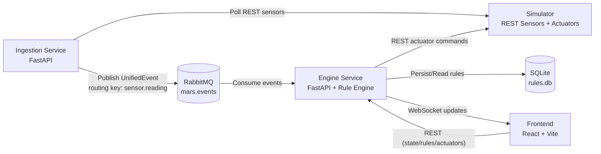
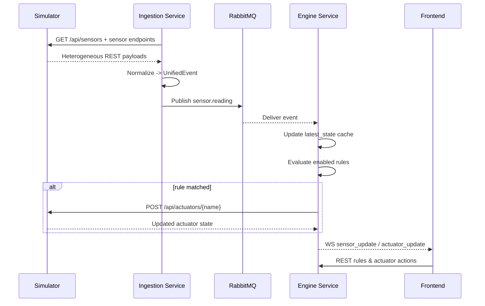
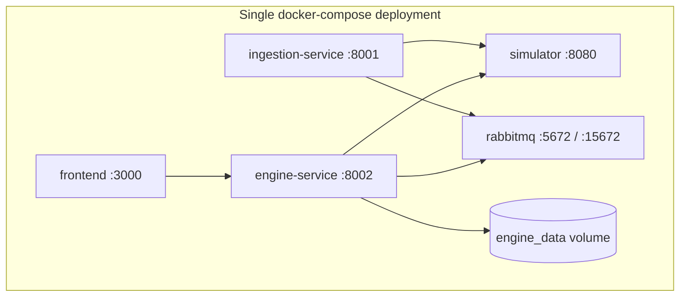

# Architecture Diagrams

## 1) Component View

## 2) Event Sequence View

## 3) Deployment View

## Notes
- Separation follows required boundaries: ingestion, processing, presentation.
- Broker is mandatory and used for internal asynchronous decoupling.
- Rule persistence survives service restart via volume-backed SQLite DB.
