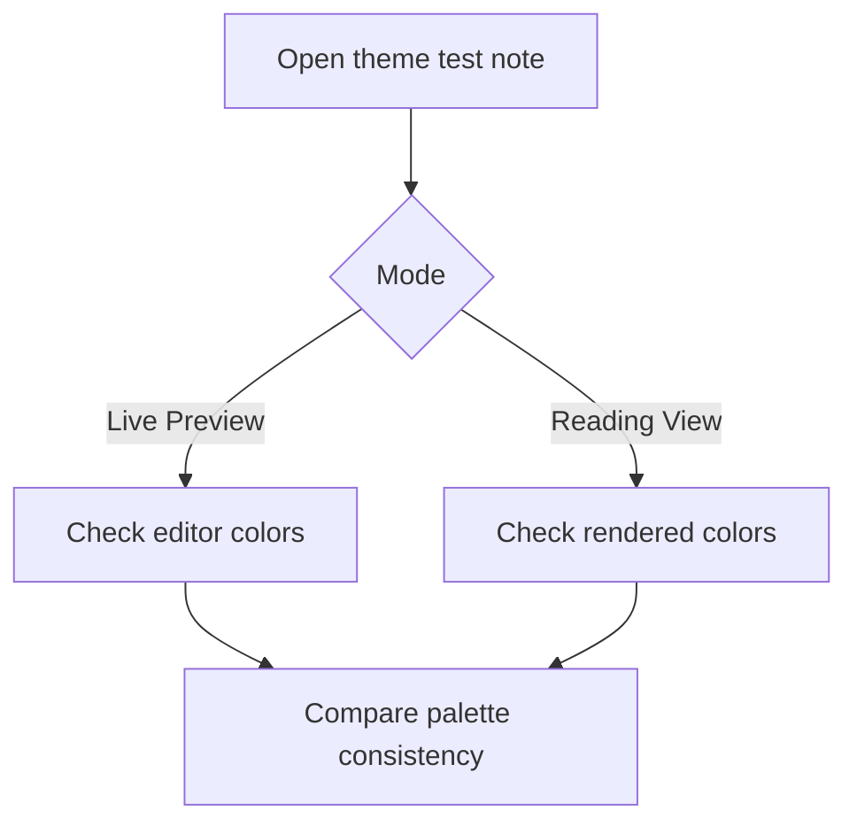

# H1 Heading: Theme Test Note

This note exercises common Obsidian markdown and UI-adjacent elements for theme review. Use it in Source mode, Live Preview, and Reading view.

## H2 Heading: Typography

Body paragraph with enough length to test rhythm, line height, wrapping, and reading comfort. Eye Safe Writer should keep text calm, readable, and consistent with selected palette in both editor and reading mode.

### H3 Heading: Inline Formatting

This sentence includes **bold text**, *italic text*, ~~strikethrough text~~, ==highlighted text==, `inline code`, an [[Internal Link]], an [[Unresolved Internal Link]], and an [external link](https://obsidian.md).

Tags: #theme-test #long-writing #ui-check

#### H4 Heading: Blockquote

> Blockquote text should feel distinct without becoming too saturated or low contrast.
> It should work with multiple lines and nested markdown like **bold** and `inline code`.

##### H5 Heading: Code

```js
function themeCheck(mode, palette) {
  return `${mode}: ${palette}`;
}

console.log(themeCheck("reading", "gruvbox"));
```

###### H6 Heading: Small Details

Horizontal rule below should be visible but quiet.

---

## Callouts

> [!note]
> Note callout content.

> [!abstract]
> Abstract callout content.

> [!info]
> Info callout content.

> [!todo]
> Todo callout content.

> [!tip]
> Tip callout content.

> [!success]
> Success callout content.

> [!question]
> Question callout content.

> [!warning]
> Warning callout content.

> [!failure]
> Failure callout content.

> [!danger]
> Danger callout content.

> [!bug]
> Bug callout content.

> [!example]
> Example callout content.

> [!quote]
> Quote callout content.

## Lists

1. Ordered item one.
2. Ordered item two with a longer line that should wrap without awkward indentation or cramped spacing in reading and editing modes.
3. Ordered item three.

- Unordered item one.
- Unordered item two.
  - Nested item level two.
    - Nested item level three.
      - Nested item level four.
- Unordered item three.

## Tasks

- [ ] Open note in Live Preview.
- [x] Check completed task styling.
- [ ] Test keyboard focus around checkboxes.
- [-] Alternate task marker if supported by plugins.

## Tables

| Component | Expected Result | Notes |
| --- | --- | --- |
| Text | High readability | Check normal, muted, faint text. |
| Code | Distinct surface | Inline and fenced code should contrast. |
| Links | Clear but calm | Internal and external links should pass contrast. |
| Callouts | Palette-aware | Border and title should not overpower content. |

## Long Table Stress Test

| Very Long Column Name For Wrapping Behavior | Another Very Long Column Name For Horizontal Stress | Numeric Value | Status | Notes |
| --- | --- | ---: | --- | --- |
| This cell contains a long sentence that should wrap cleanly without overflowing the readable line width. | This cell tests how tables behave when content is wider than the normal note width. | 123456789 | Active | Scroll and wrap behavior should remain usable. |
| Long filenames, long headings, and long table cells are common in real vaults. | The theme should not hide borders or make text unreadable. | 987654321 | Pending | Check both light and dark mode. |

## Image Placeholder

![[theme-test-placeholder.png]]

If missing, Obsidian should render a clear placeholder without breaking layout.

## Mermaid



## Math

Inline math: $E = mc^2$.

Block math:

$$
\int_0^1 x^2\,dx = \frac{1}{3}
$$

## Long Text Stress Test

This paragraph intentionally contains a long uninterrupted review sentence to test wrapping, line height, performance, and readability across different zoom levels and window widths: the theme should keep long writing sessions comfortable without introducing distracting contrast shifts, overly strong panels, broken text clipping, or palette mismatches between writing mode and reading mode.

Mixed direction sample: English text, italiano, עברית, العربية, and numbers 1234567890 should remain legible and not break layout.
